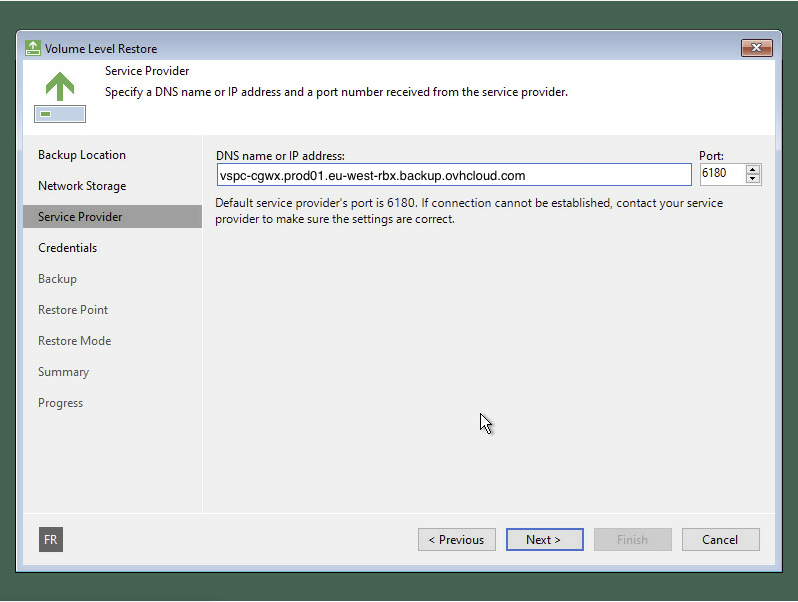

## Objective

Learn how to restore your entire system using Veeam's Bare Metal Recovery feature, with your backups stored on your Vault.

The guide will detail how to:

- Create a **recovery ISO image**: this file allows you to start your machine if the system fails to boot.
- Use your ISO image to access your latest backup and restore it from the OVHcloud infrastructure.

> [!warning]
>
> This guide is based on the Veeam Agent for Windows. If you are using the Veeam Agent for Linux, the procedure is similar, although the interface is text-based.

## Requirements

Before you begin, make sure you have:

- A [Bare Metal server](/links/bare-metal/bare-metal) running Windows or Linux with [Backup Agent](/links/storage/backup-agent) installed.
- At least one backup has been performed.
- A way to boot from the recovery ISO:
    - Use your Bare Metal server's IPMI to load the ISO.

## Instructions

### Step 1: Create the recovery ISO

If your computer no longer boots, you will need a recovery ISO image to start it again.

> [!warning]
>
> This image must be created before any incident. If your server is no longer available, you will not be able to create it.

Here is how to create it:

1\. Open the **Create Recovery Media** tool, included with the Veeam Agent, on your machine.

{.thumbnail}

2\. Veeam will ask if you want to include additional drivers.

> [!primary]
>
> If you are using specific hardware (such as a RAID controller), select the required drivers. Otherwise, the default options are usually sufficient.

{.thumbnail}

3\. Choose where to save the ISO and give it a name.

{.thumbnail}

4\. Wait until the operation completes. The ISO file will be generated.

{.thumbnail}

{.thumbnail}

You can now use this ISO to create a bootable USB key using a tool like Rufus.

### Step 2: Boot the machine from the recovery ISO

If your system no longer boots and you need to restore it:

1\. Mount the ISO in your server console, then boot the machine from it.

> [!success]
>
> **Not sure how to boot from an ISO?**
>
> Restart your physical machine and press the key indicated (usually F2, F12, ESC or DEL) to access the boot menu.

2\. Once the system has started, the Veeam recovery wizard will open. Click `Bare Metal Recovery`{.action}.

{.thumbnail}

3\. Select `Network Storage`{.action} to access your online backups.

> [!warning]
>
> If the network is not detected, you may need to configure it manually. Click `Configure network settings`{.action} and load any missing drivers.

{.thumbnail}

4\. Select `Veeam Cloud Connect repository`{.action}.

{.thumbnail}

5\. Enter the following address when prompted for the service provider:

{.thumbnail}

> [!warning]
>
> The automatic credential recovery procedure to access your restore points is not yet available. If needed, [contact our support team](/links/support-contact) to obtain them.

6\. Enter your username and password to log in.

{.thumbnail}

7\. Select the `server`{.action} you want to restore.

{.thumbnail}

8\. Choose the `restore point (date/time)`{.action} you want to go back to.

We recommend using the most recent successful backup unless you have a specific reason to go back to an earlier version.

{.thumbnail}

9\. Choose the `restore mode`{.action} that fits your situation (choose **Entire computer** for a full restore).

{.thumbnail}

10\. Review the summary, then start the `restore`{.action}.

{.thumbnail}

{.thumbnail}

> [!warning]
>
> The duration of the restore process depends on the size of your backup and your internet connection speed. Once complete, your system will reboot with the state corresponding to the selected restore point.

## Go further

Join our [community of users](/links/community).
