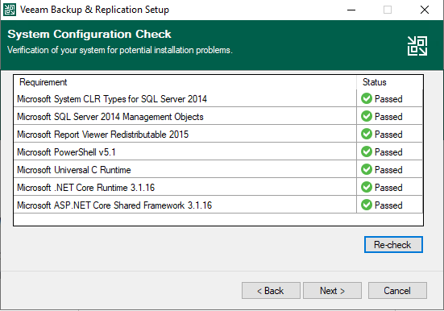
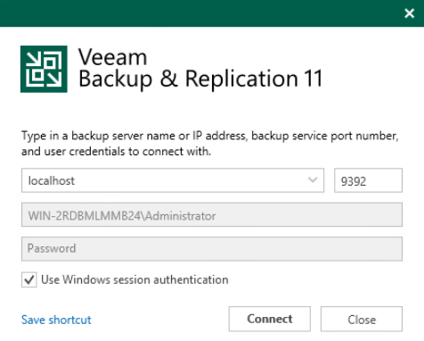
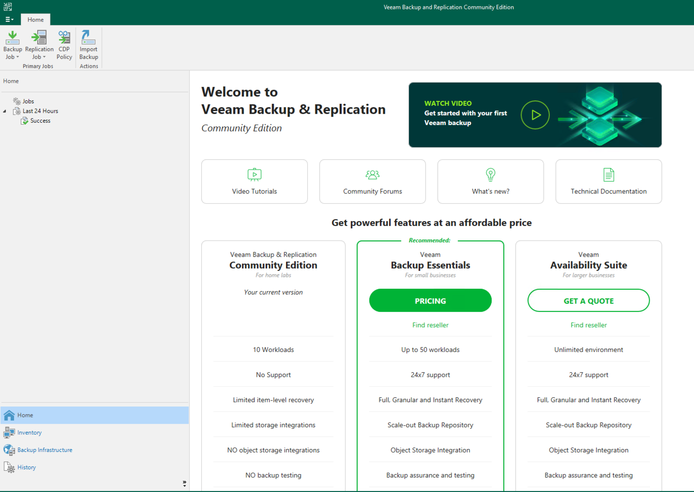
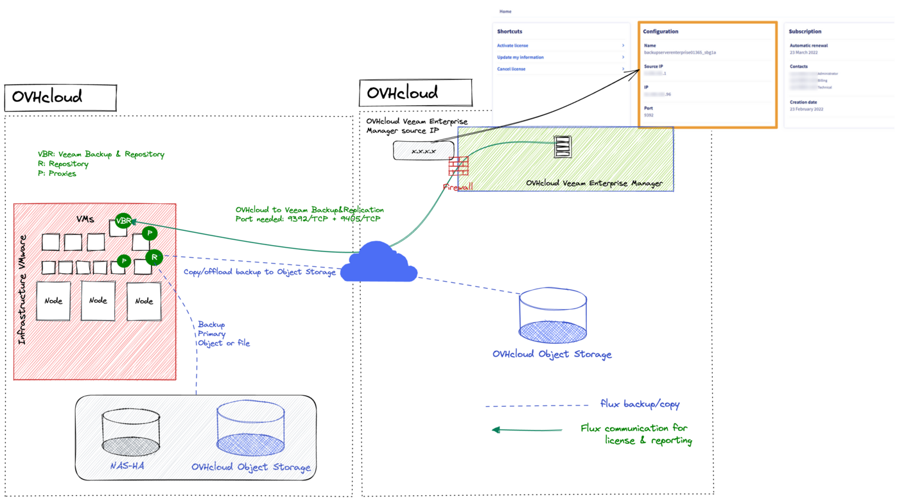
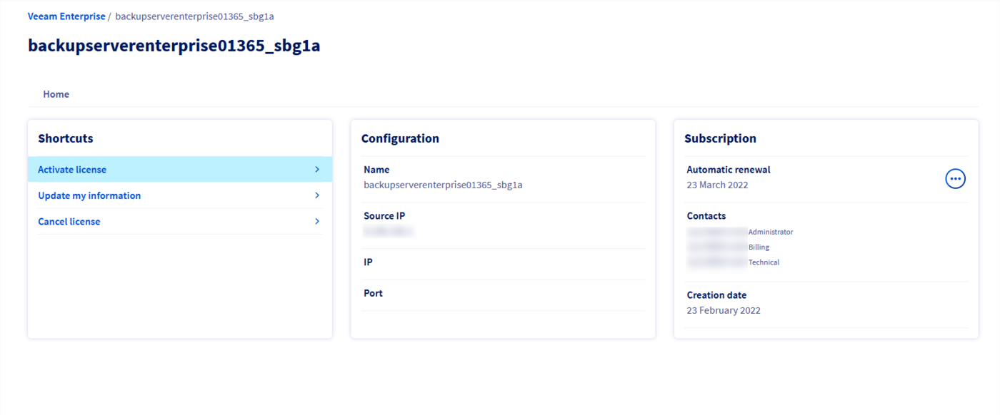
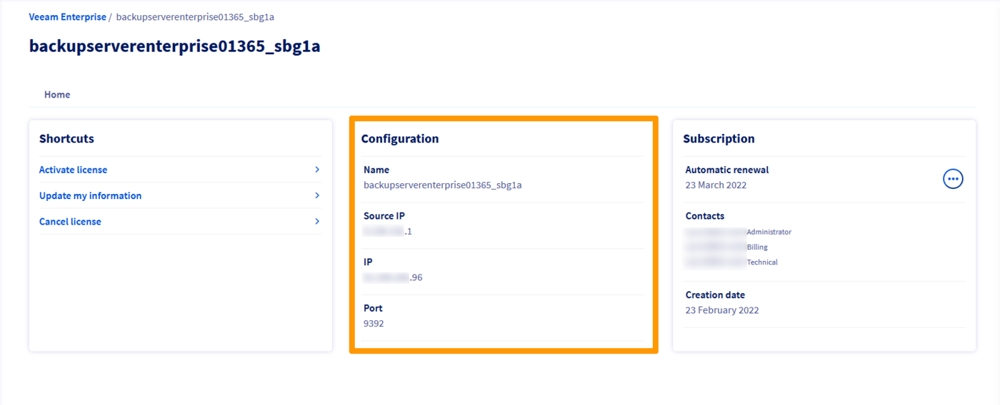
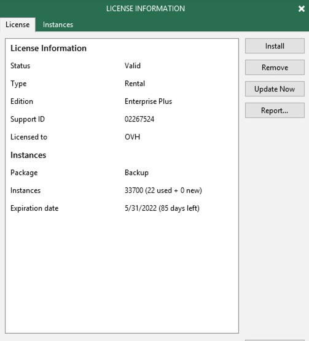

> [!primary]
> Esta traducción ha sido generada de forma automática por nuestro partner SYSTRAN. En algunos casos puede contener términos imprecisos, como en las etiquetas de los botones o los detalles técnicos. En caso de duda, le recomendamos que consulte la versión inglesa o francesa de la guía. Si quiere ayudarnos a mejorar esta traducción, por favor, utilice el botón "Contribuir" de esta página.
>

## Objetivo

Veeam Backup & Replication es un programa que permite gestionar la seguridad de los datos. Ofrece diversas posibilidades de backup, replicación y restauración.

**Esta guía explica cómo instalar un servidor Veeam Backup & Replication y cómo registrarlo en el servidor de licencias Veeam Enterprise de OVHcloud.**

## Requisitos

- Tener una [solución Veeam Enterprise](https://www.ovhcloud.com/es-es/storage-solutions/veeam-enterprise/){.external}.
- Disponer de un máquina Windows Server 2012 o de una versión superior.

## Procedimiento

### Instalar Veeam Backup & Replication

Descargue la solución **Veeam Backup & Replication** desde la [web de Veeam](https://www.veeam.com/downloads.html?ad=top-sub-menu){.external}. Si todavía no tiene una cuenta, deberá crear una (es gratuita).

El archivo es una imagen de disco en formato ISO. Después de transferirlo a su servidor, seleccione el lector de CD de la máquina y elija la imagen.

En la máquina, ejecute el instalador. Haga clic en `Install`{.action} para el componente **Veeam Backup & Replication**.

{.thumbnail}

Lea el contrato de licencia, acéptelo y haga clic en `Next`{.action}.

{.thumbnail}

Omita la introducción del archivo de licencia haciendo clic en `Next`{.action}.

{.thumbnail}

En la selección de los componentes que se van a instalar, no es necesario cambiar nada, aunque, según sus necesidades, puede cambiar la ruta de destino de la instalación. Acepte haciendo clic en `Next`{.action}.

{.thumbnail}

El instalador realizará un control de los requerimientos. Si parte de una instalación bruta de Windows, faltarán algunos componentes, pero no se preocupe: el instalador los descargará e instalará automáticamente. Acepte haciendo clic en `Next`{.action}.

{.thumbnail}

Espere mientras se instalan los requerimientos.

{.thumbnail}

A continuación, acepte la instalación de **Veeam Backup & Replication** haciendo clic en `Next`{.action}.

{.thumbnail}

En la etapa de personalización de la instalación, acepte la configuración por defecto haciendo clic en `Install`{.action}.

{.thumbnail}

Espere a que finalice la instalación.

{.thumbnail}

Cuando haya terminado, salga del instalador haciendo clic en `Finish`{.action}.

{.thumbnail}

El sistema le redirigirá al asistente de instalación. Solo tiene que cerrar la ventana.

### Crear una cuenta de servicio Veeam Enterprise

#### Paso 1 - Crear la cuenta de servicio

En primer lugar, es necesario generar una contraseña **compleja**. Para ello puede utilizar un generador de contraseñas.

En primer lugar, ejecute Windows Powershell como administrador.

A continuación, cree una cuenta de servicio introduciendo el siguiente comando desde un acceso de administrador:

```powershell
New-LocalUser "OVHVeeamEnterprise" -Password (ConvertTo-SecureString -AsPlainText "P@ssword01" -Force) -Description "OVH Service Account for Veeam Enterprise" -PasswordNeverExpires:$true -UserMayNotChangePassword:$true -AccountNeverExpires:$true
```

Tenga en cuenta que el nombre de la cuenta y la contraseña son un ejemplo y deben sustituirse:

* Nombre de la cuenta: OVHVeeamEnterprise
* Contraseña: P@ssword01

#### Paso 2 - Establecer las autorizaciones de la cuenta de servicio

Abra la consola Veeam y conéctese.

{.thumbnail}

Compruebe que se encuentre en modo **Community Edition** en la esquina inferior derecha.

{.thumbnail}

En el menú, haga clic en `Users and Roles`{.action}.

{.thumbnail}

En la ventana **Security**, haga clic en `Add...`{.action}.

{.thumbnail}

En la ventana **Add User**, introduzca la cuenta de servicio anteriormente creada. Seleccione el rol **Veeam Backup Administrator** y acepte con `OK`{.action}.

{.thumbnail}

Al volver a la ventana **Security**, compruebe que aparezca la cuenta.

{.thumbnail}

#### Paso 3 - Autorizaciones de ejecución y activación

El usuario de OVHVeeamEnterprise solo está disponible localmente. Para activar la conexión a distancia, es necesario añadir permisos en la interfaz gráfica de usuario Windows.

Desde la interfaz gráfica de usuario:

1. En la barra de búsqueda de Windows, introduzca `Component Services`{.action} e inicie el servicio.
2. En el menú de la izquierda, haga clic en `Component Services`{.action} y seleccione `Computers`{.action}. A continuación, haga clic en `My Computer`{.action}.
3. A la derecha, en la pestaña `Actions`{.action}, haga clic en `More Actions`{.action} y seleccione `Properties`{.action}.
4. Vaya a `COM Security`{.action} y, bajo la segunda opción `Launch and Activation Permissions`{.action}, haga clic en `Edit Limits`{.action}. A continuación, haga clic en `Add...`{.action}.

{.thumbnail}

<ol start="5">
 <li>Haga clic en <code class="action">Advanced...</code> para localizar la cuenta de servicio anteriormente añadida. Haga clic en <code class="action">Find Now</code> y seleccione el usuario <code class="action">OVHVeeamEnterprise</code> en la lista de usuarios.</li>
</ol>

{.thumbnail}

<ol start="6">
 <li>Haga clic en <code class="action">OK</code> para confirmar la selección y en <code class="action">OK</code> para validar. A continuación, active todos los permisos en el usuario <code class="action">OVHVeeamEnterprise</code>.</li>
</ol>

{.thumbnail}

<ol start="7">
 <li>Haga clic en <code class="action">OK</code> para confirmar y <code class="action">Apply</code> para aceptar los cambios.</li>
</ol>

Ya puede acceder a su usuario de OVHVeeamEnterprise local y a distancia.

#### Paso 4 - Registrar el servidor Veeam Backup & Replication

##### Desde el área de cliente de OVHcloud

Conéctese a su [área de cliente de OVHcloud](https://www.ovh.com/auth/?action=gotomanager&from=https://www.ovh.es/&ovhSubsidiary=es){.external}, acceda a la sección `Hosted Private Cloud`{.action} y seleccione `Plataformas y servicios`{.action}. Seleccione el servicio **backupserverenterprise** y haga clic en `Activar la licencia`{.action} en la sección `Atajos`.

Para implementar su entorno, asegúrese de haber abierto los puertos desde OVHcloud a los servidores de Veeam Backup and Replication:

- `Puerto 9392/TCP`
- `Puerto 9405/TCP`

{.thumbnail}

{.thumbnail}

En la nueva ventana, introduzca la siguiente información:

* la dirección IP pública a través de la cual es posible comunicar con el servidor **Veeam Backup & Replication**;
* el usuario de la cuenta de servicio anteriormente creada;
* la contraseña de la cuenta de servicio.

Valide haciendo clic en `OK`{.action}.

{.thumbnail}

Una vez completada la activación, podrá encontrar la información principal en la página del servicio.

{.thumbnail}

##### Utilizando la API de OVHcloud

En primer lugar, obtenga el serviceName:

> [!api]
>
> @api {v1} /veeam/veeamEnterprise GET /veeam/veeamEnterprise
>

A continuación, regístrelo:

> [!api]
>
> @api {v1} /veeam/veeamEnterprise POST /veeam/veeamEnterprise/{serviceName}/register
>

Necesitará la siguiente información:

* la dirección IP pública a través de la cual es posible comunicar con el servidor **Veeam Backup & Replication**;
* el puerto del servidor **Veeam Backup & Replication** (normalmente **9392/TCP**);
* el usuario de la cuenta de servicio anteriormente creada;
* la contraseña de la cuenta de servicio.

Puede obtener la dirección IP pública que utiliza Veeam Enterprise para comunicar con el servidor **Veeam Backup & Replication** de la siguiente forma:

> [!api]
>
> @api {v1} /veeam/veeamEnterprise GET /veeam/veeamEnterprise/{serviceName}
>

> [!primary]
> La activación del servidor Veeam Backup & Replication puede tardar varias horas.

#### Paso 5 - Comprobar el registro

Abra la consola Veeam y conéctese.

{.thumbnail}

En el menú, haga clic en `License`{.action}.

{.thumbnail}

Compruebe que la información mostrada corresponde a su licencia de OVHcloud.

Si todo ha ido bien, debería ver "Edition: Enterprise Plus".

> [!primary]
> Ahora puede desactivar el usuario que ha creado para crear el registro.

{.thumbnail}

## Más información

Interactúe con nuestra comunidad de usuarios en Discord : <https://discord.gg/ovhcloud>

Interactúe con nuestra comunidad de usuarios en <https://community.ovh.com/en/>.
