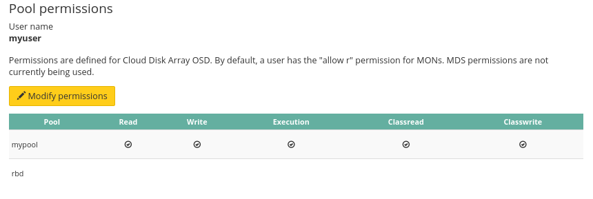
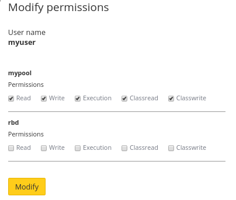

## Using web interface
Using web interface is the easiest way to change user rights.

You must first select the action icon to the right of the user.

{.thumbnail}

It will list current rights, by default there is no rights.

{.thumbnail}

Let's chose some rights for our user.

{.thumbnail}

As usual cluster status and task list changes.

## Using API

> [!api]
>
> @api {v1} /dedicated/ceph PUT /dedicated/ceph/{serviceName}/pool
>

> [!api]
>
> @api {v1} /dedicated/ceph GET /dedicated/ceph/{serviceName}/user
>
Result example:

```bash
GET /dedicated/ceph/98d166d8-7c88-47b7-9cb6-63acd5a59c15/user
[
  {
    mdsCaps: "",
    monCaps: "allow r",
    serviceName: "98d166d8-7c88-47b7-9cb6-63acd5a59c15",
    name: "myuser"
    osdCaps: "allow class-read object_prefix rbd_children, allow rwx pool=mypool",
    key: "AQA9KpdXoBrDNhAAFCM7m/XOtmWh3LMSNlHVqw==",
  }
]
```

## Go further

Visit our dedicated Discord channel: <https://discord.gg/ovhcloud>. Ask questions, provide feedback and interact directly with the team that builds our Storage and Backup services.

If you need training or technical assistance to implement our solutions, contact your sales representative or click on [this link](https://www.ovhcloud.com/en-gb/professional-services/) to get a quote and ask our Professional Services experts for assisting you on your specific use case of your project.

Join our community of users on <https://community.ovh.com/en/>.
