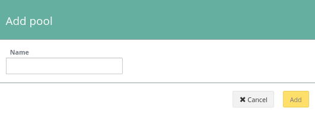
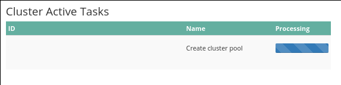

## Using web interface

> [!primary]
>
> Using web interface is the easiest way to create a pool.
>

First, connect to the [Cloud Disk Array manager](https://www.ovh.com/manager/cloud/index.html){.external}. Under 'Platforms and services' select your Ceph cluster.

On the bottom right, you will find the existing pools. Pool rbd is created by default and can be use without issue.

{.thumbnail}

Enter a poolname, your pool needs at least three characters.

{.thumbnail}

After pool creation you are back to manager, you can see that cluster status has changed because the pool is being created.

{.thumbnail}

{.thumbnail}

## Using API

> [!api]
>
> @api {v1} /dedicated/ceph POST /dedicated/ceph/{serviceName}/pool
>
serviceName is the fsid of your cluster.

You can check pool creation by listing pools.

> [!api]
>
> @api {v1} /dedicated/ceph GET /dedicated/ceph/{serviceName}/pool
>
For example:

```bash
GET /dedicated/ceph/98d166d8-7c88-47b7-9cb6-63acd5a59c15/pool
[
{
  replicaCount: 3
  serviceName: "98d166d8-7c88-47b7-9cb6-63acd5a59c15"
  name: "rbd"
  minActiveReplicas: 2
  poolType: "REPLICATED"
  backup: false
},
{
  replicaCount: 3
  serviceName: "98d166d8-7c88-47b7-9cb6-63acd5a59c15"
  name: "testpool"
  minActiveReplicas: 2
  poolType: "REPLICATED"
  backup: true
  }
]
```

## Go further

Visit our dedicated Discord channel: <https://discord.gg/ovhcloud>. Ask questions, provide feedback and interact directly with the team that builds our Storage and Backup services.

If you need training or technical assistance to implement our solutions, contact your sales representative or click on [this link](https://www.ovhcloud.com/en/professional-services/) to get a quote and ask our Professional Services experts for assisting you on your specific use case of your project.

Join our community of users on <https://community.ovh.com/en/>.
