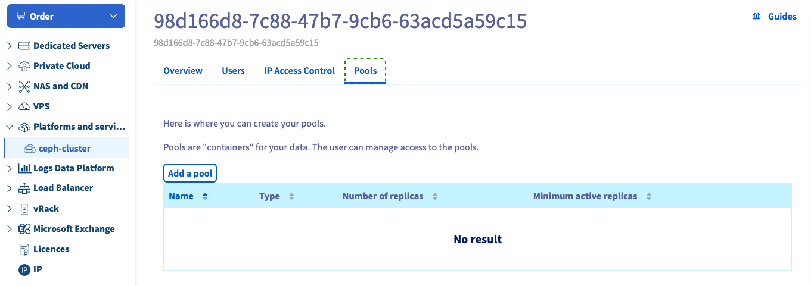
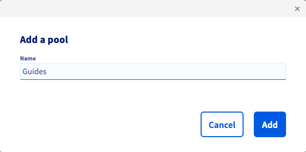
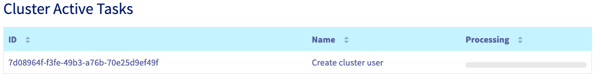

## Objective

This guide shows you how to create a pool, using the OVHcloud Control Panel or the OVHcloud API.

## Requirements

- A [Cloud Disk Array](/links/storage/cloud-disk-array) solution

<!-- CP-NAV-START:storage-cloud-disk-array -->
---

### OVHcloud Control Panel Access

- **Direct link:** [Cloud Disk Array](/links/control-panel/storage-cloud-disk-array)
- **Navigation path:** `Bare Metal Cloud`{.action} > `Cloud Disk Array`{.action} > Select your service

---
<!-- CP-NAV-END:storage-cloud-disk-array -->

## Instructions

> [!primary]
>
> Using the OVHcloud Control Panel is the easiest way to create a pool.
>

### Using the OVHcloud Control Panel

On your Cloud Disk Array service page, you will find the existing pools in `Pools`{.action}.

{.thumbnail}

Enter a poolname. It must contain at least three characters.

{.thumbnail}

You can then see that the cluster status has changed because the pool is being created.

{.thumbnail}

### Using the API

> [!success]
> If you are not familiar with the OVHcloud API, read our [First Steps with the OVHcloud API](/pages/manage_and_operate/api/first-steps) guide.

Use the following API call to create a pool:

> [!api]
>
> @api {v1} /dedicated/ceph POST /dedicated/ceph/{serviceName}/pool
>

`serviceName` is the fsid of your cluster.

You can check the pool creation by listing pools with the following endpoint:

> [!api]
>
> @api {v1} /dedicated/ceph GET /dedicated/ceph/{serviceName}/pool
>

For example:

```bash
GET /dedicated/ceph/98d166d8-7c88-47b7-9cb6-63acd5a59c15/pool
[
{
  replicaCount: 3
  serviceName: "98d166d8-7c88-47b7-9cb6-63acd5a59c15"
  name: "rbd"
  minActiveReplicas: 2
  poolType: "REPLICATED"
  backup: false
},
{
  replicaCount: 3
  serviceName: "98d166d8-7c88-47b7-9cb6-63acd5a59c15"
  name: "testpool"
  minActiveReplicas: 2
  poolType: "REPLICATED"
  backup: true
  }
]
```

## Go further

Visit our dedicated Discord channel: <https://discord.gg/ovhcloud>. Ask questions, provide feedback and interact directly with the team that builds our Storage and Backup services.

If you need training or technical assistance to implement our solutions, contact your sales representative or click on [this link](/links/professional-services) to get a quote and ask our Professional Services experts for assisting you on your specific use case of your project.

Join our [community of users](/links/community).
