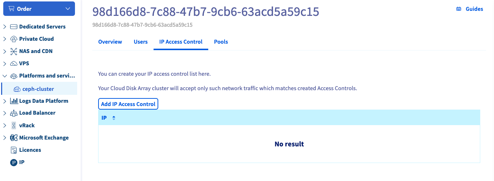
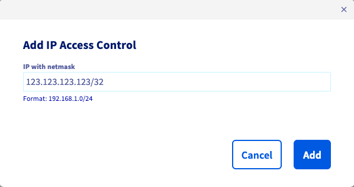

## Objective

This guide shows you how to create an IP ACL to allow access to your Ceph cluster, using the OVHcloud Control Panel or the OVHcloud API.

## Requirements

- A [Cloud Disk Array](/links/storage/cloud-disk-array) solution

<!-- CP-NAV-START:storage-cloud-disk-array -->
---

### OVHcloud Control Panel Access

- **Direct link:** [Cloud Disk Array](/links/control-panel/storage-cloud-disk-array)
- **Navigation path:** `Bare Metal Cloud`{.action} > `Cloud Disk Array`{.action} > Select your service

---
<!-- CP-NAV-END:storage-cloud-disk-array -->

## Instructions

> [!primary]
>
> Using the OVHcloud Control Panel is the easiest way to create an IP ACL.
>

### Using the OVHcloud Control Panel

On your Cloud Disk Array service page, go to the `IP Access Control`{.action} tab. By default, there is no ACL.

{.thumbnail}

Get your ip address:

```bash
admin@server:~$ ip -4 a
2: eth0: <BROADCAST,MULTICAST,UP,LOWER_UP> mtu 1500 qdisc pfifo_fast state UP group default qlen 1000
    inet 123.123.123.123/32 brd 234.234.234.234 scope global eth0
      valid_lft forever preferred_lft forever
```

Add your IP.

{.thumbnail}

Then create the IP ACL.

After the pool creation, you can see that the cluster status has changed because the ACL is being created.

### Using the API

> [!success]
> If you are not familiar with the OVHcloud API, read our [First Steps with the OVHcloud API](/pages/manage_and_operate/api/first-steps) guide.

Use the following API call:

> [!api]
>
> @api {v1} /dedicated/ceph POST /dedicated/ceph/{serviceName}/acl
>

`serviceName` is the fsid of your cluster.

You can check ACL creation by listing ACL:

> [!api]
>
> @api {v1} /dedicated/ceph GET /dedicated/ceph/{serviceName}/acl
>

Example:

```bash
GET /dedicated/ceph/98d166d8-7c88-47b7-9cb6-63acd5a59c15/acl
[
  {
    network: "123.123.123.123"
    id: 57054
    netmask: "255.255.255.255"
    family: "IPV4"
  }
]
```

## Go further

Visit our dedicated Discord channel: <https://discord.gg/ovhcloud>. Ask questions, provide feedback and interact directly with the team that builds our Storage and Backup services.

If you need training or technical assistance to implement our solutions, contact your sales representative or click on [this link](/links/professional-services) to get a quote and ask our Professional Services experts for assisting you on your specific use case of your project.

Join our [community of users](/links/community).
