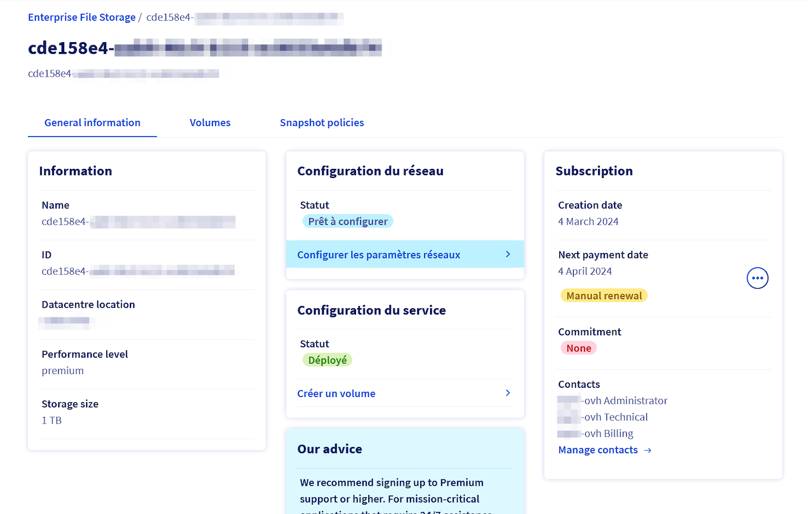
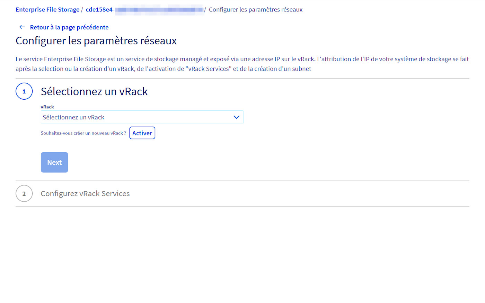
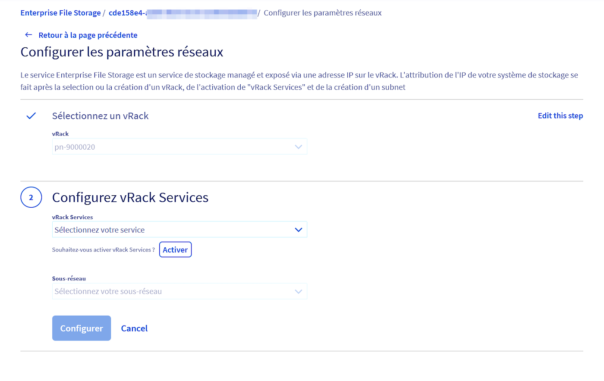
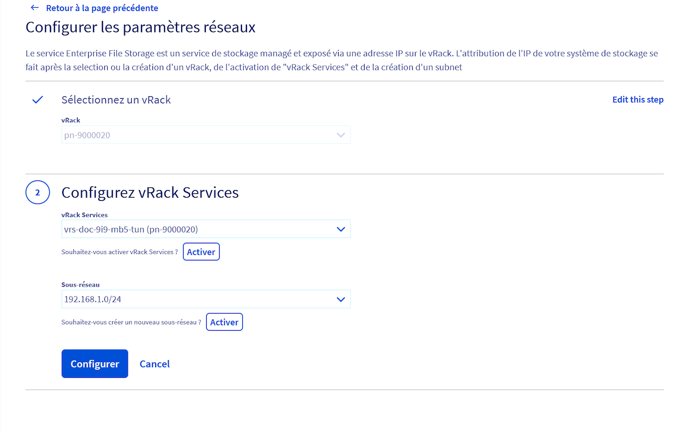
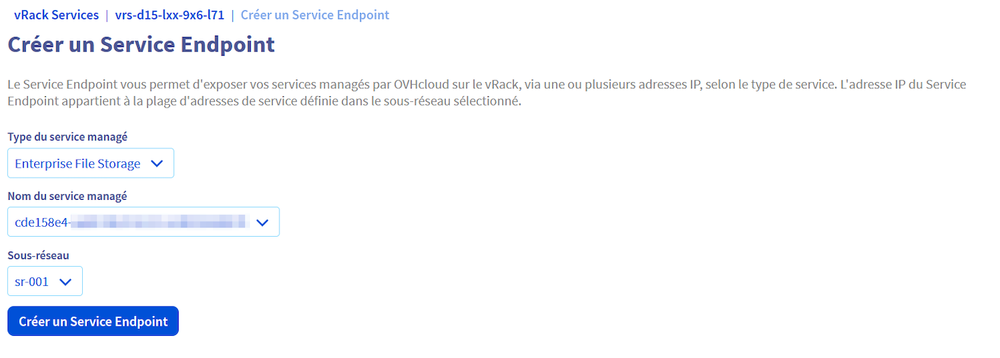

## Objective

Enterprise File Storage services can be managed [via OVHcloud APIs](/pages/storage_and_backup/file_storage/enterprise_file_storage/netapp_quick_start) or from your OVHcloud Control Panel.

This guide explains how to connect your Enterprise File Storage service to a [vRack private network](https://www.ovhcloud.com/fr/network/vrack/) using vRack Services and vRack Service Endpoint technology.

> [!primary]
>
> For more information on vRack Services, please refer to this page (link to vRack Services document).
>

## Requirements

- Have an Enterprise File Storage service in your OVHcloud account.
- Be connected to your [OVHcloud customer space](https://www.ovh.com/auth/?action=gotomanager&from=https://www.ovh.com/fr/&ovhSubsidiary=en).

## Overview

{.thumbnail}

Enterprise File Storage is a service that is exposed to the vRack via an IP address. There are three steps to assigning an IP address to your service:
1. Select or create a vRack
2. Create and activate the vRack services
3. Create a subnet

## Instructions 

Log in to your [OVHcloud Control Panel](https://www.ovh.com/auth/?action=gotomanager&from=https://www.ovh.com/fr/&ovhSubsidiary=en) and select 'Bare Metal Cloud' {.action} from the top navigation bar. Go to `Storage and Backup`{.action} then `Enterprise File Storage`{.action} in the left hand menu and select your service from the list.

{.thumbnail}

By default, the service is not connected to a private network; it is in `Ready to configure`{.action} state. This step is required before you can create your volumes and/or set your ACLs. Click on the `Configure Network Parameters`{.action} link to configure your vRack Service endpoint to enable your volumes to be consumed from your private network.

### Select or create a vRack
You must have a vRack to activate your vRack services. If you don't have one at this stage, you can order one; the vRack is a free service. Otherwise, select your vRack from the drop down list.

{.thumbnail}

### Create and Enable vRack Services

{.thumbnail}

In this second step you will create a vRack Service. You create a vRack Service by giving it a name and a region. vRack Services are regional services. You must therefore select the region in which you intend to use it. To take advantage of the Service Endpoint , you must select the region that corresponds to your Enterprise File Storage. For example, if your service is located in Roubaix (RBX), you must also create your vRack Services in Roubaix. 

{.thumbnail}

Click the `Enable vRack Services`{.action} button.

Go back to the network parameter configuration steps and we'll come to step 3.

### Create a subnet

If your subnet does not exist, you will need to create it. Click on `Activate`{.action}. You will need to enter 4 pieces of information:
- Its name
- Its address range
- The address range reserved for Managed Services. This means that the addresses in this range must not be used by other nodes connected to your vRack. The service address range must be a subset of the subnet address range and its size must be between /27 and /29.
- A VLAN on which you can expose this subnet. You can choose not to have a VLAN.

Once you've completed these three steps, click on the `Configure`{.action} button, you'll be taken to the list of vRack services and you'll find the one you've just configured. 

{.thumbnail}

Click on `Create an Endpoint Service`{.action}. Now all you need to do is fill in the following 3 pieces of information:
- The type of service to be managed -> select the Enterprise File Storage service
- The name of the managed service -> select the ID of your Enterprise File Storage service
- The desired subnet -> select the freshly configured subnet
  
{.thumbnail}

After a few moments, your new Service Endpoint will be configured and available!

Return to the Enterprise File Storage service menu. The network parameters have now been added and are available.

{.thumbnail}

You can now follow these guides to create and manage your volumes, snapshots and ACLs.

## Go further 

[Managing Enterprise File Storage from the OVHcloud Control Panel ](https://help.ovhcloud.com/csm/en-ie-public-cloud-storage-netapp-control-panel?id=kb_article_view&sysparm_article=KB0046818)

[Enterprise File Storage - API Quickstart](https://help.ovhcloud.com/csm/en-ie-public-cloud-storage-netapp-quick-start?id=kb_article_view&sysparm_article=KB0046851)

[Enterprise File Storage - Managing volumes](https://help.ovhcloud.com/csm/en-ie-public-cloud-storage-netapp-volumes?id=kb_article_view&sysparm_article=KB0046894)

[Enterprise File Storage - Managing volume ACLs](https://help.ovhcloud.com/csm/en-ie-public-cloud-storage-netapp-volume-acl?id=kb_article_view&sysparm_article=KB0046862)

[Enterprise File Storage - Managing volume snapshots ](https://help.ovhcloud.com/csm/en-ie-public-cloud-storage-netapp-volume-snapshots?id=kb_article_view&sysparm_article=KB0046880)

If you need training or technical support to implement our solutions, contact your sales representative or click [this link](https://www.ovhcloud.com/fr/professional-services/) to request a quote and a personalised analysis of your project from our Professional Services team experts.

Talk to our user community on <https://community.ovh.com/>.
