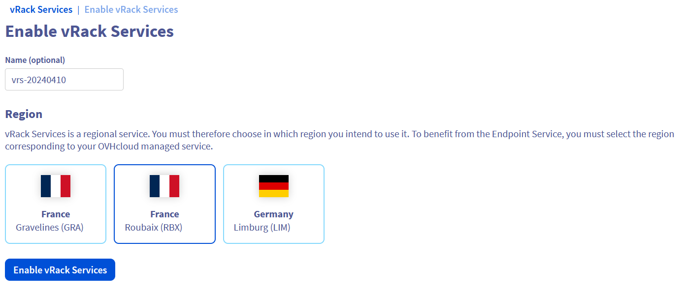

> [!warning]
> La fonctionnalité configuration du réseau privé pour Enterprise File Storage est actuellement en phase Bêta.
> Ce guide peut donc être incomplet et sera mis à jour lors de la bêta. Notre équipe reste disponible sur notre canal Discord dédié. N’hésitez pas à nous rejoindre et à nous contacter : <https://discord.gg/ovhcloud>. Posez des questions, donnez votre avis et interagissez directement avec l’équipe qui construit nos services Enterprise File Storage.

## Objectif

Les services Enterprise File Storage peuvent être gérés via [les API OVHcloud](/pages/storage_and_backup/file_storage/enterprise_file_storage/netapp_quick_start) ou depuis votre espace client OVHcloud.

Découvrez dans ce guide comment rattacher votre service Enterprise File Storage à un [réseau privé vRack](https://www.ovhcloud.com/fr/network/vrack/), via la technologie vRack Services et la fonctionnalité vRack Service Endpoint.

> [!primary]
>
> Pour plus d’informations concernant vRack Services, consultez [cette page](/pages/network/vrack_services/global).
>

## Prérequis

- Avoir un service [Enterprise File Storage](https://www.ovhcloud.com/fr/storage-solutions/enterprise-file-storage/) dans votre compte OVHcloud.
- Être connecté à votre [espace client OVHcloud](https://www.ovh.com/auth/?action=gotomanager&from=https://www.ovh.com/fr/&ovhSubsidiary=fr).

## Overview

{.thumbnail}

Enterprise File Storage est un service exposé via une adresse IP sur le vRack. L’attribution de l’IP de votre service se fait donc en trois étapes :

1. Sélection ou création d’un vRack
2. Création et activation du vRack Services
3. Création d’un sous-réseau

## En pratique 

Connectez-vous à votre [espace client OVHcloud](https://www.ovh.com/auth/?action=gotomanager&from=https://www.ovh.com/fr/&ovhSubsidiary=fr) et sélectionez `Bare Metal Cloud`{.action} dans la barre de navigation supérieure. Ouvrez `Storage et Backup`{.action} puis `Enterprise File Storage`{.action} et sélectionnez votre service dans la liste.

{.thumbnail}

Par défaut, le service n’est pas rattaché à un réseau privé, il est dans un statut `Prêt à configurer`{.action}. 

Cette étape est nécessaire avant même de pouvoir créer vos volumes et/ou de paramétrer vos ACLs.

Cliquez sur le lien `Configurer les paramètres réseaux`{.action} pour configurer votre vRack Service Endpoint et ainsi permettre à vos volumes d’être consommés depuis votre réseau privé.

### Etape 1 - Sélection ou création d’un vRack

Pour activer votre vRack Services, vous devez avoir un vRack. Si vous n'en avez pas à cette étape, il est possible d'en commander un via le bouton `Commander`{.action} de votre espace client. Le vRack est un service gratuit. Sinon, sélectionnez votre vRack dans la liste déroulante.

{.thumbnail}

### Etape 2 - Création et activation du vRack Services

{.thumbnail}

Dans cette deuxième étape, vous allez créer un vRack Services. La création d'un vRack Service se déroule en lui attribuant un nom et une région puis en choisissant dans quelle région vous comptez l'utiliser. En effet vRack Services est un service régional.

Pour bénéficier du Service Endpoint, vous devez sélectionner la région correspondante à votre Enterprise File Storage. Par exemple, si votre service est localisé à Roubaix (RBX), alors vous devez également créer votre vRack Services à Roubaix.

{.thumbnail}

Cliquez sur le bouton `Activer vRack Services`{.action}.

Retournez ensuite dans les étapes de configuration de paramètre réseaux pour la suite de la configuration.

### Etape 3 - Création d’un sous-réseau

Si votre sous-réseau n’existe pas encore, il est nécessaire de le créer. Cliquez sur `Activer`{.action}.

Il vous faudra renseigner 4 informations :

- Son nom.
- Sa plage d'adresses.
- La plage d'adresses réservée aux services managés. Par conséquent, les adresses de cette plage ne doivent pas être utilisées par d'autres nœuds connectés à votre vRack. La plage d'adresses de service doit être un sous-ensemble de la plage d'adresses du sous-réseau, et sa taille doit être comprise entre /27 et /29.
- Un VLAN sur lequel vous pouvez exposer ce sous-réseau. Vous pouvez très bien ne pas choisir de VLAN.

Une fois ces trois étapes terminées, cliquez sur le bouton `Configurer`{.action}. Vous allez être redirigé vers la liste des vRack Services et vous allez ainsi retrouver celui que vous venez de configurer. 

{.thumbnail}

Cliquez sur `Créer un Service Endpoint`{.action}. Il vous suffit désormais de renseigner les 3 informations suivantes :

- Le type du Service Managé -> choisissez le service Enterprise File Storage
- Le nom du Service Managé -> choisissez l’ID de votre service Enterprise File Storage
- Le sous-réseau souhaité -> choisissez le sous-réseau nouvellement configuré

{.thumbnail}

Après quelques instants, votre nouveau Service Endpoint est configuré et disponible.

Retournez dans le menu de service Enterprise File Storage. Les paramètres réseaux sont désormais ajoutés et disponibles

{.thumbnail}

Vous pouvez à présent suivre les guides ci-dessous pour créer et gérer vos volumes, créer et gérer vos snapshots ainsi que vos ACLs.

## Aller plus loin 

[Enterprise File Storage - Gestion depuis l'espace client OVHcloud](/pages/storage_and_backup/file_storage/enterprise_file_storage/netapp_control_panel)

[Enterprise File Storage - API Quickstart](/pages/storage_and_backup/file_storage/enterprise_file_storage/netapp_quick_start)

[Enterprise File Storage - Gestion des volumes](/pages/storage_and_backup/file_storage/enterprise_file_storage/netapp_volumes)

[Enterprise File Storage - Gestion des ACL de volume](/pages/storage_and_backup/file_storage/enterprise_file_storage/netapp_volume_acl)

[Enterprise File Storage - Gestion des snapshots de volumes](/pages/storage_and_backup/file_storage/enterprise_file_storage/netapp_volume_snapshots)

Si vous avez besoin d'une formation ou d'une assistance technique pour la mise en oeuvre de nos solutions, contactez votre commercial ou cliquez sur [ce lien](https://www.ovhcloud.com/fr/professional-services/) pour obtenir un devis et demander une analyse personnalisée de votre projet à nos experts de l’équipe Professional Services.

Échangez avec notre communauté d'utilisateurs sur <https://community.ovh.com/>.
