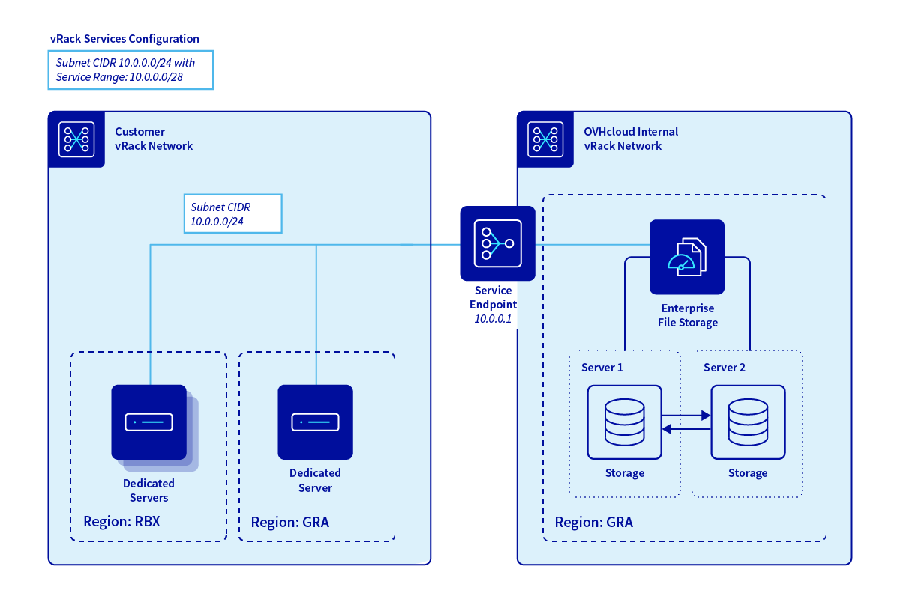
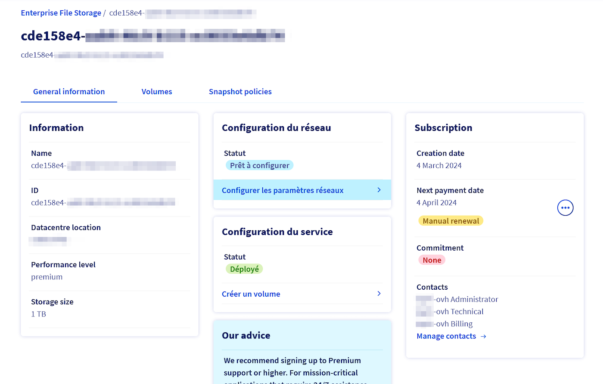
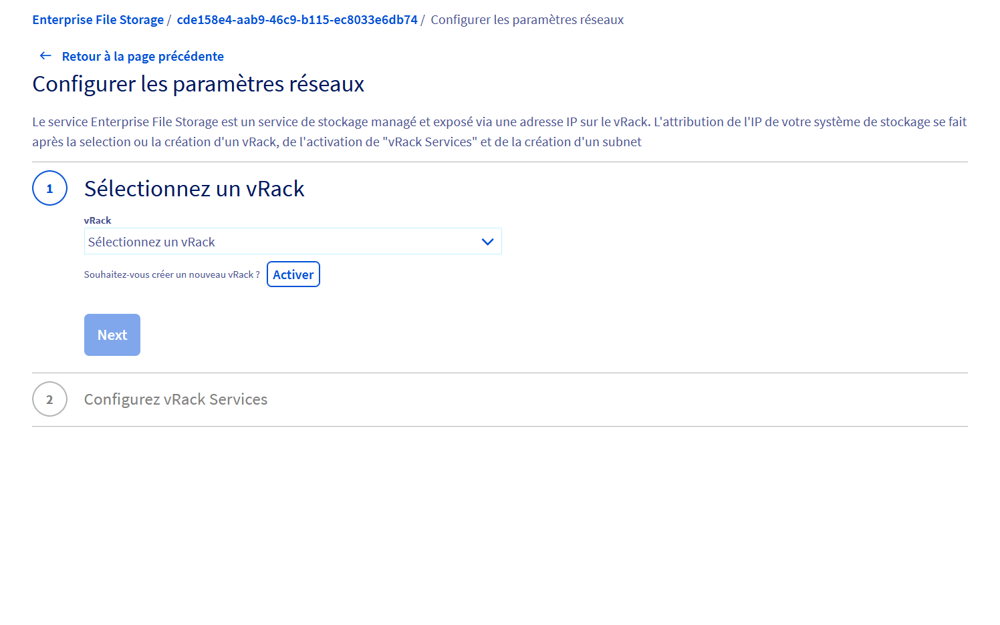
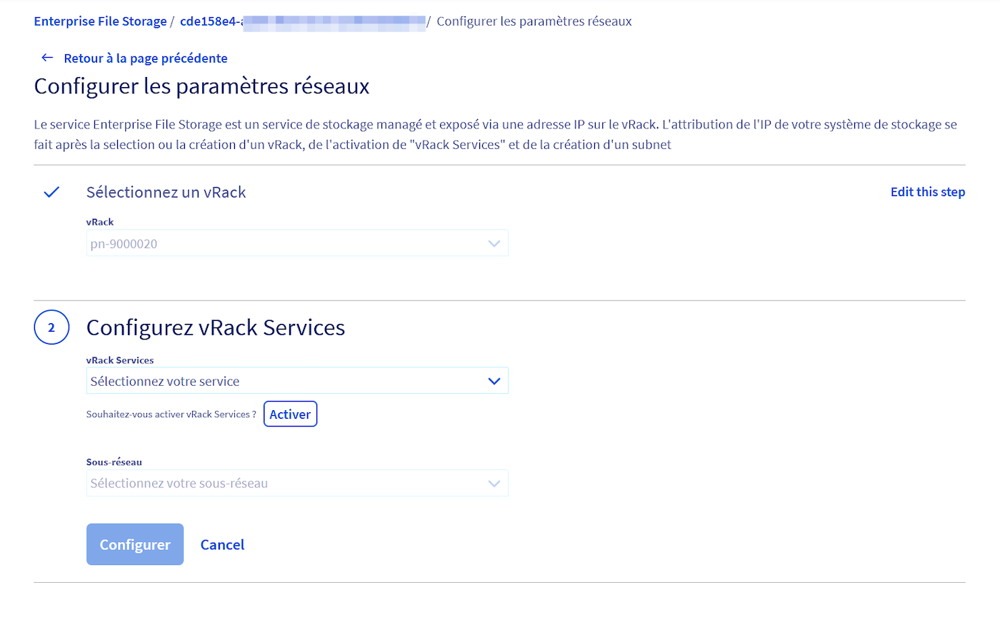
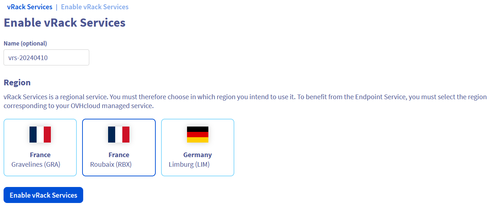
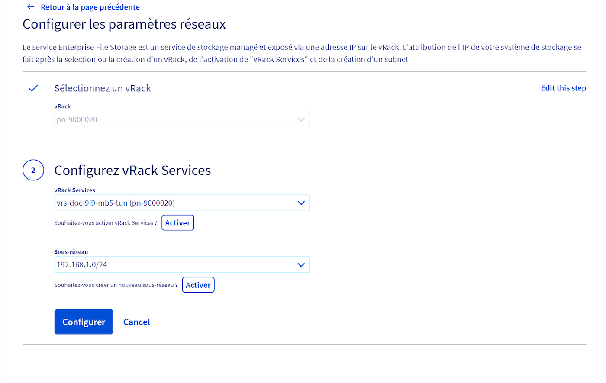
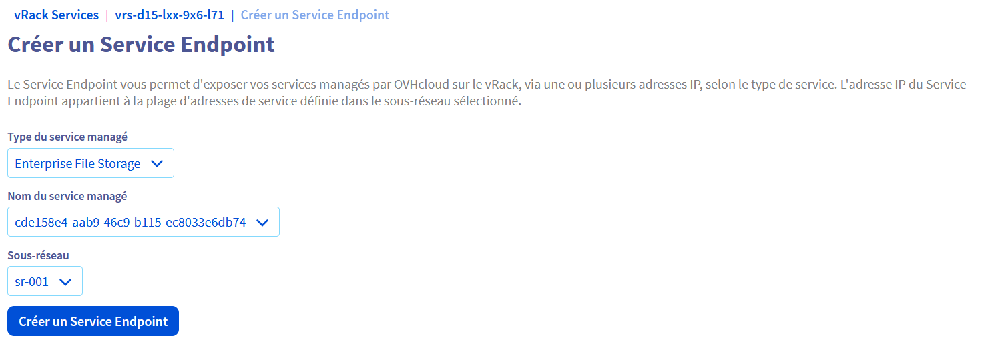
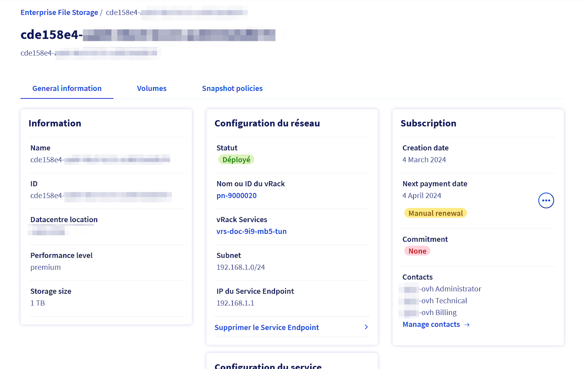

> [!warning]
> Usage of private network configuration for Enterprise File Storage is currently in Beta phase.
> This guide may be incomplete and will be extended during the Beta phase. Our team remains available on our dedicated Discord Channel, do not hesitate to join and reach us: <https://discord.gg/ovhcloud>. Ask questions, provide feedback and interact directly with the team that builds our Enterprise File Storage services.

## Objective

Enterprise File Storage services can be managed via [OVHcloud API](/pages/storage_and_backup/file_storage/enterprise_file_storage/netapp_quick_start) or from your OVHcloud Control Panel.

This guide explains how to connect your Enterprise File Storage service to a [vRack private network](https://www.ovhcloud.com/pl/network/vrack/) using vRack Services and vRack Service Endpoint technology.

> [!primary]
>
> For more information on vRack Services, please refer to [this page](/pages/network/vrack_services/global).
>

## Requirements

- An [Enterprise File Storage](https://www.ovhcloud.com/pl/storage-solutions/enterprise-file-storage/) service in your OVHcloud account
- Access to the [OVHcloud Control Panel](https://www.ovh.com/auth/?action=gotomanager&from=https://www.ovh.pl/&ovhSubsidiary=pl)

## Overview

{.thumbnail}

Enterprise File Storage is a service that is exposed to the vRack via an IP address. There are three steps to assigning an IP address to your service:

1. Selecting or creating a vRack
2. Creating and enabling vRack Services
3. Creating a subnet

## Instructions 

Log in to your [OVHcloud Control Panel](https://www.ovh.com/auth/?action=gotomanager&from=https://www.ovh.pl/&ovhSubsidiary=pl) and select `Bare Metal Cloud`{.action} from the top navigation bar. Go to `Storage and Backup`{.action} then `Enterprise File Storage`{.action} and select your service from the list.

{.thumbnail}

By default, the service is not connected to a private network, it is in `Ready to configure`{.action} state. This step is required before you can create your volumes and/or set your ACLs. 

Click the `Configure Network Parameters`{.action} link to configure your vRack Service endpoint to enable your volumes to be consumed from your private network.

### Step 1 - Selecting or creating a vRack

You must have a vRack to activate your vRack services. OVHcloud vRack is a free service. If you don't have one at this stage, you can order one using the `Order`{.action} button in the Control Panel. Otherwise, select your vRack from the drop down menu.

{.thumbnail}

### Step 2 - Creating and enabling vRack Services

{.thumbnail}

In this second step you will create a vRack Service.

You create a vRack Service by giving it a name and a region. vRack Services are regional services. You must therefore select the region in which you intend to use it. 

To take advantage of the Service Endpoint, you must select the region that corresponds to your Enterprise File Storage. For example, if your service is located in Roubaix (RBX), you must also create your vRack Services in Roubaix.

{.thumbnail}

Click the `Enable vRack Services`{.action} button.

Then go back to the `Configure Network Parameters`{.action} page for the rest of the configuration.

### Step 3 - Creating a subnet

If your subnet does not exist, you will need to create it. Click on `Activate`{.action}. You will need to enter 4 pieces of information:

- The subnet's name.
- Its address range.
- The address range reserved for Managed Services. This means that the addresses in this range must not be used by other nodes connected to your vRack. The service address range must be a subset of the subnet address range and its size must be between /27 and /29.
- A VLAN on which you can expose this subnet. You can choose not to have a VLAN.

Once you've completed these 3 steps, click the `Configure`{.action} button. This will open vRack services page on which you will find the one you've just configured.

{.thumbnail}

Click on `Create an Endpoint Service`{.action}. Now all you need to do is fill in the following 3 pieces of information:

- The type of service to be managed -> select the Enterprise File Storage service
- The name of the managed service -> select the ID of your Enterprise File Storage service
- The desired subnet -> select the freshly configured subnet

{.thumbnail}

After a few moments, your new Service Endpoint will be configured and available.

Return to the Enterprise File Storage service menu. The network parameters have now been added and are available.

{.thumbnail}

You can now follow the guides below to create and manage your volumes, snapshots and ACLs.

## Go further 

[Managing Enterprise File Storage from the OVHcloud Control Panel](/pages/storage_and_backup/file_storage/enterprise_file_storage/netapp_control_panel)

[Enterprise File Storage - API Quickstart](/pages/storage_and_backup/file_storage/enterprise_file_storage/netapp_quick_start)

[Enterprise File Storage - Managing volumes](/pages/storage_and_backup/file_storage/enterprise_file_storage/netapp_volumes)

[Enterprise File Storage - Managing volume ACLs](/pages/storage_and_backup/file_storage/enterprise_file_storage/netapp_volume_acl)

[Enterprise File Storage - Managing volume snapshots](/pages/storage_and_backup/file_storage/enterprise_file_storage/netapp_volume_snapshots)

If you need training or technical assistance to implement our solutions, contact your sales representative or click on [this link](https://www.ovhcloud.com/pl/professional-services/) to get a quote and ask our Professional Services experts for assisting you on your specific use case of your project.

Join our community of users on <https://community.ovh.com/en/>.
