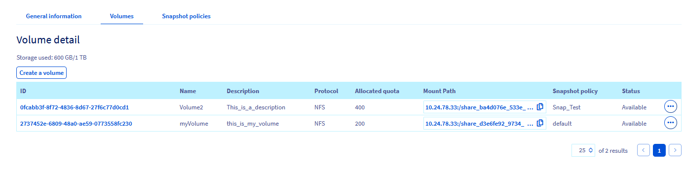
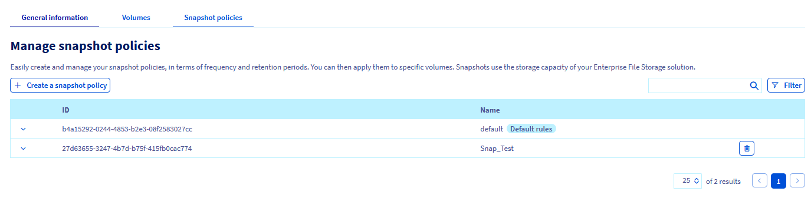
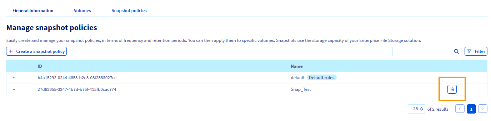

> [!primary]
> Diese Übersetzung wurde durch unseren Partner SYSTRAN automatisch erstellt. In manchen Fällen können ungenaue Formulierungen verwendet worden sein, z.B. bei der Beschriftung von Schaltflächen oder technischen Details. Bitte ziehen Sie im Zweifelsfall die englische oder französische Fassung der Anleitung zu Rate. Möchten Sie mithelfen, diese Übersetzung zu verbessern? Dann nutzen Sie dazu bitte den Button "Beitragen" auf dieser Seite.
>

## Ziel

In dieser Anleitung geben wir Ihnen einen Überblick über die Verwaltung Ihrer Snapshot-Richtlinien für die Enterprise File Storage-Volumes von OVHcloud.

**Hier erfahren Sie, wie Sie eine Snapshot-Regelung erstellen, auf Ihr Volume anwenden, diese ändern und über Ihr Kundencenter löschen.**

## Voraussetzungen

- Ein OVHcloud Enterprise File Storage-Dienst mit verfügbarem Volumen
- Sie haben Zugriff auf Ihr [OVHcloud Kundencenter](https://www.ovh.com/auth/?action=gotomanager&from=https://www.ovh.de/&ovhSubsidiary=de).

## Grundlagen

Ein Volume Snapshot ist eine schreibgeschützte Point-in-Time-Kopie eines Volumes. 
Die Snapshots werden aus einem bestehenden, betriebsbereiten Volume erstellt. Ohne sie können sie nicht existieren. 
Eine Snapshot-Regelung erlaubt es, die Erstellung von Snapshots anhand verschiedener Einstellungen zu automatisieren. Die Richtlinie kann dann geändert und gelöscht werden, wenn Sie sie nicht mehr benötigen.

## In der praktischen Anwendung

Verbinden Sie sich mit Ihrem [OVHcloud Kundencenter](https://www.ovh.com/auth/?action=gotomanager&from=https://www.ovh.de/&ovhSubsidiary=de) und wählen Sie in der oberen Navigationsleiste den Tab `Bare Metal Cloud`{.action} aus. Öffnen Sie `Storage und Backup`{.action} und dann `Enterprise File Storage`{.action} im linken Menü und wählen Sie Ihren Dienst aus der Liste aus.

### Erstellen Sie Ihre Snapshot-Regelung

Mit einer Snapshot-Regelung können Sie Snapshots automatisieren, indem Sie das Erstellungsintervall in Minuten, Stunden, Tagen, Wochen oder Monaten festlegen. 
Außerdem müssen Sie die Anzahl der Kopien angeben, die Sie aufbewahren möchten.

1\. Klicken Sie auf den Tab `Regeln für Snapshots`{.action}.

{.thumbnail}

2\. Legen Sie einen Namen und eine Beschreibung für Ihre Snapshot-Policy fest und verwenden Sie den Button `+ Eine neue Regel erstellen`{.action}, um eine oder mehrere Regeln zu der Policy hinzuzufügen.

{.thumbnail}

3\. Füllen Sie die Felder aus, um die Uhrzeit, die Tage des Monats, die Wochentage und die Monate für die Erstellung des Snapshots anzugeben. Geben Sie außerdem ein Präfix für die Snapshots ein, das für deren Benennung erforderlich ist.

Detailliertere Informationen zu jedem Wert finden Sie, indem Sie auf das Fragezeichen klicken. Durch Erweitern des Abschnitts `Beispiel`{.action} können Sie zwei Regelsätze mit einer Erläuterung ihrer Ergebnisse anzeigen.

Klicken Sie auf das Häkchen, um die neue Regel hinzuzufügen. Wenn Sie alle Regeln hinzugefügt haben, klicken Sie auf `Eine neue Regel für Snapshots erstellen`{.action}.

> [!primary]
> Sie müssen ein Präfix und eine Dauer in Minuten angeben. Optional können Sie die Stunden, Tage und Monate der Ausführung angeben, um den Zeitplan zu verfeinern.
>

Sie können eine Snapshot-Policy nicht mehr ändern, nachdem Sie sie erstellt haben. Wenn Sie neue Einstellungen für die Häufigkeit vornehmen müssen, müssen Sie die aktuelle Snapshot-Regelung löschen und eine neue erstellen. 

### Snapshot-Regeln anwenden

Nachdem Sie die Snapshot-Regelung erstellt haben, können Sie sie auf ein Volume anwenden.

1\. Gehen Sie in den Tab `Volumes`{.action} Ihres Kapazitätspools.

{.thumbnail}

2\. Wählen Sie aus der Liste das Volume aus, auf das die Snapshot-Policy angewendet werden soll.
3\. Gehen Sie in den Bereich `Snapshots`{.action} und in den Bereich `Snapshot-Regel verwalten`{.action} und wählen Sie die gewünschte Richtlinie aus. 
4\. Klicken Sie auf den Button `Regel anwenden`{.action}.

{.thumbnail}

### Snapshot-Regelung löschen

> [!warning]
>
> Eine an ein Volume angehängte Snapshot-Regelung kann nicht gelöscht werden. Wenn Sie eine Snapshot-Policy löschen möchten, die mit einem oder mehreren Volumes verknüpft ist, müssen Sie diese Policy zuerst aufheben, indem Sie diesen Volumes eine andere Snapshot-Policy zuordnen.
>

So löschen Sie eine Snapshot-Regelung:

1\. Gehen Sie in den Tab `Regeln für Snapshots`{.action} Ihres Kapazitätspools.

{.thumbnail}

2\. Wählen Sie die zu löschende Regelung aus.
3\. Klicken Sie auf die Schaltfläche zum Löschen, die durch einen `Papierkorb`{.action} dargestellt wird.

{.thumbnail}

## Weiterführende Informationen 

Wenn Sie Schulungen oder technische Unterstützung bei der Implementierung unserer Lösungen benötigen, wenden Sie sich an Ihren Vertriebsmitarbeiter oder klicken Sie auf [diesen Link](https://www.ovhcloud.com/de/professional-services/), um einen Kostenvoranschlag zu erhalten und eine persönliche Analyse Ihres Projekts durch unsere Experten des Professional Services Teams anzufordern.

Für den Austausch mit unserer User Community gehen Sie auf <https://community.ovh.com/en/>.
