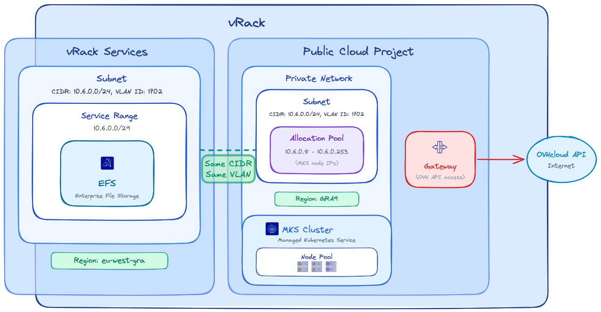

## Obiettivo

Questa guida ha l'obiettivo di fornire un riferimento chiaro e passo dopo passo per distribuire e configurare NetApp Trident CSI su OVHcloud Managed Kubernetes (MKS), permettendo un accesso fluido a Enterprise File Storage tramite il vRack. Questa guida raccoglie le best practice, i prerequisiti, la configurazione IAM, l'implementazione del backend, nonché le funzionalità avanzate come la gestione degli snapshot e dei volumi.

## Prerequisiti

- Un servizio [Enterprise File Storage](/links/storage/enterprise-file-storage) nel proprio account OVHcloud
- Un cluster [OVHcloud Managed Kubernetes](/links/public-cloud/kubernetes)
- Un [vRack](/links/network/vrack) con [vRack Services](/pages/network/vrack_services/global) configurato
- Conoscenza delle [API OVHcloud](/pages/manage_and_operate/api/first-steps) e/o della [CLI OVHcloud](/pages/manage_and_operate/cli/cli-getting-started)

Prima di iniziare, assicurati che il tuo ambiente rispetti i seguenti criteri:

**vRack**

- **Progetto Public Cloud e vRack Services** appartengono allo stesso vRack

**Regione**

- **vRack Services e EFS** si trovano nella stessa regione

**Rete**

- **Lo stesso ID VLAN** è utilizzato per la sottorete di vRack Services e la rete privata MKS
- **Lo stesso CIDR** è utilizzato per la sottorete di vRack Services e la sottorete della rete privata MKS
- Gli IP del **pool di allocazione della rete privata MKS** non si sovrappongono con il range di servizio di vRack Services

**Connettività**

- **Un gateway** è necessario affinché i nodi MKS possano raggiungere l'API OVHcloud

{.thumbnail}

> [!primary]
>
> **Nota:** Le regioni EFS e MKS possono essere diverse; tieni presente che la latenza tra regioni diverse può influire sulle prestazioni dei tuoi carichi di lavoro di storage.
>
> **Si raccomanda fortemente di mantenere le risorse di storage e di calcolo il più vicino possibile.**
>

## Procedura

### Configurazione IAM (Identity and Access Management)

Trident necessita di un account di servizio dedicato per interagire con l'API OVHcloud e gestire i volumi Enterprise File Storage. Segui le fasi seguenti per configurare correttamente l'IAM.

#### 1. Creazione dell'account di servizio (OAuth2)

Crea un client OAuth2 con l'API o la CLI OVHcloud utilizzando il flusso `CLIENT_CREDENTIALS`.

> [!tabs]
> Tramite l'API
>> Utilizza la seguente chiamata API:
>>
>> > [!api]
>> >
>> > @api {v1} /me POST /me/api/oauth2/client
>>
>> Con il seguente corpo della richiesta:
>>
>> ```json
>> {
>>   "description": "Service Account for Trident CSI",
>>   "flow": "CLIENT_CREDENTIALS",
>>   "name": "TRIDENT-CSI"
>> }
>> ```
>>
>> L'API risponderà con:
>>
>> ```json
>> {
>>   "clientId": "EU.xxxxxxxxxxxxxxxx",
>>   "clientSecret": "aaaaaaaaaaaaaaaaaaaaaaaaaaaaaaaa"
>> }
>> ```
>>
> Tramite la CLI
>> L'account di servizio può essere creato con la [CLI OVHcloud](https://github.com/ovh/ovhcloud-cli) e il seguente comando (completalo con i tuoi valori):
>>
>> ```bash
>> ovhcloud account api oauth2 client create --name "TRIDENT-CSI" --description "Service Account for Trident CSI" --flow "CLIENT_CREDENTIALS"
>> ```
>>
>> La CLI risponderà con i valori `client ID` e `client secret`:
>>
>> ```bash
>> ✅ OAuth2 client created successfully (client ID: EU.xxxxxxxxxxxxxxxx, client secret: aaaaaaaaaaaaaaaaaaaaaaaaaaaaaaaa)
>> ```
>>

> [!primary]
>
> **Nota:** Conserva con cura il `clientId` e il `clientSecret`. Saranno necessari durante la configurazione del backend Trident.
>

#### 2. Creazione della policy IAM

Configura una policy IAM che deve contenere i seguenti elementi: l'account di servizio da autorizzare, il o i servizi `Enterprise File Storage` da includere, nonché le azioni da concedere, riassunte nella tabella seguente:

| Azione                                      | Descrizione                               |
| ------------------------------------------- | ----------------------------------------- |
| storageNetApp:apiovh:get                    | Elenca i servizi                          |
| storageNetApp:apiovh:serviceInfos/get       | Recupera le informazioni su un servizio   |
| storageNetApp:apiovh:share/accessPath/get   | Ottieni il punto di montaggio di un share |
| storageNetApp:apiovh:share/acl/create       | Crea un ACL                               |
| storageNetApp:apiovh:share/acl/delete       | Elimina un ACL                            |
| storageNetApp:apiovh:share/acl/get          | Elenca gli ACL                            |
| storageNetApp:apiovh:share/create           | Crea un share                             |
| storageNetApp:apiovh:share/delete           | Elimina un share                          |
| storageNetApp:apiovh:share/edit             | Modifica un share                         |
| storageNetApp:apiovh:share/extend           | Estendi un share                          |
| storageNetApp:apiovh:share/get              | Elenca gli share                          |
| storageNetApp:apiovh:share/revertToSnapshot | Ripristina uno snapshot                   |
| storageNetApp:apiovh:share/snapshot/create  | Crea uno snapshot                         |
| storageNetApp:apiovh:share/snapshot/delete  | Elimina uno snapshot                      |
| storageNetApp:apiovh:share/snapshot/edit    | Modifica uno snapshot                     |
| storageNetApp:apiovh:share/snapshot/get     | Elenca gli snapshot                       |

> [!tabs]
> Tramite l'API
>> Utilizza la seguente chiamata API per creare la policy IAM:
>>
>> > [!api]
>> >
>> > @api {v2} /iam POST /iam/policy
>>
>> Con il seguente corpo della richiesta:
>>
>> > [!primary]
>> >
>> > Nel campo `identities`, sostituisci `xx11111-ovh` con il tuo identificativo account OVHcloud (NIC handle) e `EU.xxxxxxxxxxxxxxxx` con il `clientId` ottenuto al passo 1.
>> >
>>
>> ```json
>> {
>>   "description": "Trident CSI",
>>   "identities": [
>>     "urn:v1:eu:identity:credential:xx11111-ovh/oauth2-EU.xxxxxxxxxxxxxxxx"
>>   ],
>>   "name": "trident-policy",
>>   "permissions": {
>>     "allow": [
>>       {
>>         "action": "storageNetApp:apiovh:get"
>>       },
>>       {
>>         "action": "storageNetApp:apiovh:serviceInfos/get"
>>       },
>>       {
>>         "action": "storageNetApp:apiovh:share/accessPath/get"
>>       },
>>       {
>>         "action": "storageNetApp:apiovh:share/acl/create"
>>       },
>>       {
>>         "action": "storageNetApp:apiovh:share/acl/delete"
>>       },
>>       {
>>         "action": "storageNetApp:apiovh:share/acl/get"
>>       },
>>       {
>>         "action": "storageNetApp:apiovh:share/create"
>>       },
>>       {
>>         "action": "storageNetApp:apiovh:share/delete"
>>       },
>>       {
>>         "action": "storageNetApp:apiovh:share/edit"
>>       },
>>       {
>>         "action": "storageNetApp:apiovh:share/extend"
>>       },
>>       {
>>         "action": "storageNetApp:apiovh:share/get"
>>       },
>>       {
>>         "action": "storageNetApp:apiovh:share/revertToSnapshot"
>>       },
>>       {
>>         "action": "storageNetApp:apiovh:share/snapshot/create"
>>       },
>>       {
>>         "action": "storageNetApp:apiovh:share/snapshot/delete"
>>       },
>>       {
>>         "action": "storageNetApp:apiovh:share/snapshot/edit"
>>       },
>>       {
>>         "action": "storageNetApp:apiovh:share/snapshot/get"
>>       }
>>     ]
>>   },
>>   "resources": [
>>     {
>>       "urn": "urn:v1:eu:resource:storageNetApp:xxxxxxxx-xxxx-xxxx-xxxx-xxxxxxxxxxxx"
>>     }
>>   ]
>> }
>> ```
>>
>> L'API risponderà con i dettagli della policy creata:
>>
>> ```json
>> {
>>   "id": "xxxxxxxx-xxxx-xxxx-xxxx-xxxxxxxxxxxx",
>>   "name": "trident-policy",
>>   "description": "Trident CSI",
>>   ...
>> }
>> ```
>>
> Tramite la CLI
>> La policy IAM può essere creata con la [CLI OVHcloud](https://github.com/ovh/ovhcloud-cli) e il seguente comando (completalo con i tuoi valori):
>>
>> > [!primary]
>> >
>> > Nel campo `identities`, sostituisci `xx11111-ovh` con il tuo identificativo account OVHcloud (NIC handle) e `EU.xxxxxxxxxxxxxxxx` con il `clientId` ottenuto al passo 1.
>> >
>>
>> ```bash
>> cat <<EOF | ovhcloud iam policy create --from-file -
>> {
>>   "description": "Trident CSI",
>>   "identities": [
>>     "urn:v1:eu:identity:credential:xx11111-ovh/oauth2-EU.xxxxxxxxxxxxxxxx"
>>   ],
>>   "name": "trident-policy",
>>   "permissions": {
>>     "allow": [
>>       {
>>         "action": "storageNetApp:apiovh:get"
>>       },
>>       {
>>         "action": "storageNetApp:apiovh:serviceInfos/get"
>>       },
>>       {
>>         "action": "storageNetApp:apiovh:share/accessPath/get"
>>       },
>>       {
>>         "action": "storageNetApp:apiovh:share/acl/create"
>>       },
>>       {
>>         "action": "storageNetApp:apiovh:share/acl/delete"
>>       },
>>       {
>>         "action": "storageNetApp:apiovh:share/acl/get"
>>       },
>>       {
>>         "action": "storageNetApp:apiovh:share/create"
>>       },
>>       {
>>         "action": "storageNetApp:apiovh:share/delete"
>>       },
>>       {
>>         "action": "storageNetApp:apiovh:share/edit"
>>       },
>>       {
>>         "action": "storageNetApp:apiovh:share/extend"
>>       },
>>       {
>>         "action": "storageNetApp:apiovh:share/get"
>>       },
>>       {
>>         "action": "storageNetApp:apiovh:share/revertToSnapshot"
>>       },
>>       {
>>         "action": "storageNetApp:apiovh:share/snapshot/create"
>>       },
>>       {
>>         "action": "storageNetApp:apiovh:share/snapshot/delete"
>>       },
>>       {
>>         "action": "storageNetApp:apiovh:share/snapshot/edit"
>>       },
>>       {
>>         "action": "storageNetApp:apiovh:share/snapshot/get"
>>       }
>>     ]
>>   },
>>   "resources": [
>>     {
>>       "urn": "urn:v1:eu:resource:storageNetApp:xxxxxxxx-xxxx-xxxx-xxxx-xxxxxxxxxxxx"
>>     }
>>   ]
>> }
>> EOF
>> ```
>>
>> La CLI risponderà con il seguente messaggio:
>>
>> ```bash
>> ✅ IAM policy xxxxxxxx-xxxx-xxxx-xxxx-xxxxxxxxxxxx created successfully
>> ```

### Installazione di Trident CSI

L'installazione utilizza Helm con immagini personalizzate ospitate su Docker Hub.
Queste immagini includono un driver aggiuntivo fornito da OVHcloud che permette l'utilizzo di storage persistente tramite l'offerta OVHcloud Enterprise File Storage.

Crea un file `trident-values.yaml` per fare riferimento alle immagini ospitate da OVHcloud:

```bash
cat <<EOF > trident-values.yaml
tridentSilenceAutosupport: true
operatorImage: "ovhcom/trident-operator:25.02.1-linux-amd64"
tridentImage: "ovhcom/trident:25.02.1-linux-amd64"
EOF
```

Avvia l'installazione:

```bash
helm repo add netapp-trident https://netapp.github.io/trident-helm-chart
helm install trident-operator netapp-trident/trident-operator \
  --version 100.2502.1 \
  --create-namespace \
  --namespace trident \
  -f trident-values.yaml
```

L'output dovrebbe mostrare che il chart Helm è stato distribuito:

```bash
NAME: trident-operator
LAST DEPLOYED: Tue Feb 17 13:51:15 2026
NAMESPACE: trident
STATUS: deployed
REVISION: 1
TEST SUITE: None
NOTES:
Thank you for installing trident-operator, which will deploy and manage NetApp's Trident CSI
storage provisioner for Kubernetes.

Your release is named 'trident-operator' and is installed into the 'trident' namespace.
Please note that there must be only one instance of Trident (and trident-operator) in a Kubernetes cluster.

To configure Trident to manage storage resources, you will need a copy of tridentctl, which is
available in pre-packaged Trident releases.  You may find all Trident releases and source code
online at https://github.com/NetApp/trident.

To learn more about the release, try:

  $ helm status trident-operator
  $ helm get all trident-operator
```

Una volta completata l'installazione, verifica che tutti i pod Trident siano in stato `Running` nel namespace trident prima di procedere:

```bash
kubectl get pods -n trident
```

L'output dovrebbe mostrare tutti i pod in stato `Running`:

```bash
NAME                                  READY   STATUS    RESTARTS        AGE
trident-controller-75869d7499-ffmkt   6/6     Running   0               4m25s
trident-node-linux-4gv6w              2/2     Running   1 (4m24s ago)   4m25s
trident-node-linux-g942s              2/2     Running   1 (4m24s ago)   4m24s
trident-node-linux-tfjc2              2/2     Running   0               4m25s
trident-operator-787b98cb7c-sgtdh     1/1     Running   0               4m26s
```

### Creazione del backend Trident

Il backend Trident permette di collegare NetApp Trident al servizio OVHcloud Enterprise File Storage utilizzando le credenziali IAM create in precedenza.

#### 1. Creazione di un secret

Crea un secret contenente le informazioni di connessione che consentono a Trident di accedere all'API OVHcloud.

> [!warning]
>
> Sostituisci i valori `clientID` e `clientSecret` con le credenziali ottenute al passo 1.
>

```bash
cat <<EOF | kubectl create -n trident -f -
apiVersion: v1
kind: Secret
metadata:
  name: tbc-ovh-efs-secret
type: Opaque
stringData:
  clientID: "EU.xxxxxxxxxxxxxxxx"         # Sostituisci con il tuo clientId
  clientSecret: "aaaaaaaaaaaaaaaaaaaaaa"  # Sostituisci con il tuo clientSecret
EOF
```

L'output confermerà la creazione del secret:

```bash
secret/tbc-ovh-efs-secret created
```

#### 2. Creazione del backend Trident

Crea il tuo backend con il seguente comando:

> [!primary]
>
> Il driver di storage `ovh-efs` deve essere obbligatoriamente utilizzato. Sostituisci `exportRule`, `location` e gli altri parametri con i valori corrispondenti al tuo ambiente.
>

```bash
cat <<EOF | kubectl create -n trident -f -
apiVersion: trident.netapp.io/v1
kind: TridentBackendConfig
metadata:
  name: tbc-ovh-efs-gra
spec:
  version: 1
  backendName: backend-ovh-efs
  defaults:
    exportRule: 10.0.32.0/24    # CIDR della tua rete per le ACL NFS
  storageDriverName: ovh-efs
  clientLocation: ovh-eu
  location: eu-west-gra         # Localizzazione del tuo servizio EFS
  serviceLevel: premium
  nfsMountOptions: rw,hard,rsize=65536,wsize=65536,nfsvers=3,tcp
  credentials:
    name: tbc-ovh-efs-secret
EOF
```

L'output confermerà la creazione del backend:

```bash
tridentbackendconfig.trident.netapp.io/tbc-ovh-efs-gra created
```

Verifica che il backend sia stato creato correttamente con il seguente comando:

```bash
kubectl get tridentbackendconfig -n trident
```

L'output dovrebbe mostrare il backend in stato `Bound`:

```bash
NAME                  BACKEND NAME      BACKEND UUID                           PHASE   STATUS
tbc-ovh-efs-gra       backend-ovh-efs   xxxxxxxx-xxxx-xxxx-xxxx-xxxxxxxxxxxx   Bound   Success
```

### StorageClass e utilizzo dei volumi

Questa sezione spiega come rendere disponibile Enterprise File Storage ai carichi di lavoro Kubernetes tramite Trident.

#### 1. StorageClass

Definisci una `StorageClass` per abilitare il provisioning dinamico tramite il driver Trident CSI:

```bash
cat <<EOF | kubectl create -f -
apiVersion: storage.k8s.io/v1
kind: StorageClass
metadata:
  name: ovh-efs-gra-premium
provisioner: csi.trident.netapp.io
parameters:
  backendType: "ovh-efs"
  fsType: "nfs"
allowVolumeExpansion: true
EOF
```

L'output confermerà la creazione della `StorageClass`:

```bash
storageclass.storage.k8s.io/ovh-efs-gra-premium created
```

Questa StorageClass permette di effettuare il provisioning dei volumi su richiesta e di espanderli dinamicamente.

#### 2. Creazione di un volume (PVC)

Crea un `PersistentVolumeClaim` con accesso `ReadWriteMany` (RWX):

```bash
cat <<EOF | kubectl create -f -
apiVersion: v1
kind: PersistentVolumeClaim
metadata:
  name: premium-pvc
spec:
  accessModes:
    - ReadWriteMany
  resources:
    requests:
      storage: 100Gi
  storageClassName: ovh-efs-gra-premium
EOF
```

L'output confermerà la creazione del `PVC`:

```bash
persistentvolumeclaim/premium-pvc created
```

Verifica che il PVC sia stato creato con il seguente comando:

```bash
kubectl get pvc
```

L'output dovrebbe mostrare il PVC in stato `Bound`:

```bash
NAME         STATUS   VOLUME                                     CAPACITY   ACCESS MODES   STORAGECLASS          VOLUMEATTRIBUTESCLASS   AGE
premium-pvc  Bound    pvc-xxxxxxxx-xxxx-xxxx-xxxx-xxxxxxxxxxxx   100Gi      RWX            ovh-efs-gra-premium   <unset>                 5m34s
```

Una volta che un Pod utilizza questo PVC, il volume sarà automaticamente montato tramite il protocollo NFS.

### Funzionalità avanzate

#### Gestione degli snapshot

NetApp Trident permette di creare snapshot dei volumi su richiesta su Enterprise File Storage.

- Definire una `VolumeSnapshotClass` per gestire il ciclo di vita degli snapshot:

```bash
cat <<EOF | kubectl create -f -
apiVersion: snapshot.storage.k8s.io/v1
kind: VolumeSnapshotClass
metadata:
  name: csi-snapclass
driver: csi.trident.netapp.io
deletionPolicy: Delete
EOF
```

L'output confermerà la creazione della `VolumeSnapshotClass`:

```bash
volumesnapshotclass.snapshot.storage.k8s.io/csi-snapclass created
```

- Creare un `VolumeSnapshot` nello stesso namespace del `PersistentVolumeClaim` sorgente:

```bash
cat <<EOF | kubectl create -f -
apiVersion: snapshot.storage.k8s.io/v1
kind: VolumeSnapshot
metadata:
  name: my-snapshot
spec:
  volumeSnapshotClassName: csi-snapclass
  source:
    persistentVolumeClaimName: premium-pvc
EOF
```

L'output confermerà la creazione del `VolumeSnapshot`:

```bash
volumesnapshot.snapshot.storage.k8s.io/my-snapshot created
```

Verifica che il `VolumeSnapshot` sia stato creato con il seguente comando:

```bash
kubectl get volumesnapshot
```

L'output dovrebbe mostrare il VolumeSnapshot in stato `READYTOUSE=true`:

```bash
NAME          READYTOUSE   SOURCEPVC     SOURCESNAPSHOTCONTENT   RESTORESIZE   SNAPSHOTCLASS   SNAPSHOTCONTENT                                    CREATIONTIME   AGE
my-snapshot   true         premium-pvc                           100Gi         csi-snapclass   snapcontent-0274f0ec-e8ab-48f4-8d89-4422c3875d92   27s            30s
```

Lo snapshot viene creato sul servizio Enterprise File Storage e può essere utilizzato per workflow di backup o ripristino.

## Risoluzione dei problemi

- **Backend non associato**: Verifica che le credenziali IAM (clientId/clientSecret) siano corrette e che la policy IAM conceda tutti i permessi necessari.
- **PVC bloccato in stato Pending**: Verifica che tutti i pod Trident siano in stato `Running`, che il backend sia in stato `Bound` e che la `StorageClass` faccia riferimento al tipo di backend corretto. Consulta gli errori nei log dei pod Trident con `kubectl logs -n trident <nome-del-pod>`.
- **Problemi di connettività di rete**: Verifica che il cluster MKS possa raggiungere il servizio Enterprise File Storage tramite il vRack.

## Per saperne di più

[Enterprise File Storage - Configurazione della rete privata](/pages/storage_and_backup/file_storage/enterprise_file_storage/netapp_network_config)

[Enterprise File Storage - Connettere un'istanza Public Cloud a un volume EFS tramite la rete privata vRack](/pages/storage_and_backup/file_storage/enterprise_file_storage/netapp_pci_connection_via_vrack)

[Gestione degli account di servizio OVHcloud tramite l'API](/pages/manage_and_operate/api/manage-service-account)

[Enterprise File Storage - FAQ](/pages/storage_and_backup/file_storage/enterprise_file_storage/netapp_faq)

Se avete bisogno di formazione o di assistenza tecnica per implementare le nostre soluzioni, contattate il vostro rappresentante o cliccate su [questo link](/links/professional-services) per ottenere un preventivo e richiedere un'analisi personalizzata del vostro progetto da parte dei nostri esperti del team Professional Services.

Contatta la nostra [Community di utenti](/links/community).
