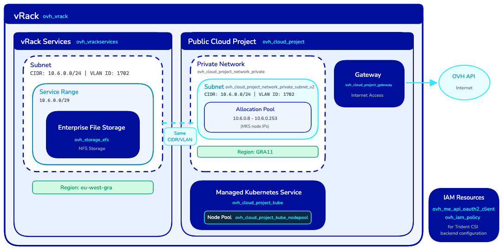

## Objetivo

Este guia explica como utilizar um módulo Terraform da OVHcloud chamado [efs-trident](https://github.com/ovh/terraform-ovh-efs/tree/main/modules/efs-trident) para aprovisionar a stack de infraestrutura completa necessária à utilização do [NetApp Trident CSI](https://docs.netapp.com/us-en/trident/index.html) com o Enterprise File Storage (EFS).

O módulo automatiza a criação de:

- Um serviço **Enterprise File Storage** (EFS)
- Um cluster **Managed Kubernetes Service** (MKS)
- Uma **vRack** e um **vRack Services**, bem como a respetiva configuração
- Um **Public Cloud Project** com uma configuração para a rede privada
- Uma **política IAM** e **credenciais OAuth2** para a autenticação do backend de armazenamento Trident CSI
- Uma **gateway** de rede para a conectividade dos nós do cluster MKS à API OVHcloud

**Saiba como implementar e configurar um conjunto de serviços OVHcloud com o Terraform para aprovisionar volumes EFS com o NetApp Trident CSI.**

## Requisitos

- [Terraform >= 1.7.0](https://www.terraform.io/)
- [Provider Terraform OVHcloud >= v2.12.0](https://github.com/ovh/terraform-provider-ovh/releases/)
- Acesso à [API OVHcloud](/links/api)
- Uma conta OVHcloud com as permissões suficientes para criar os recursos necessários

## Arquitetura

O módulo Terraform cria a seguinte infraestrutura:

{.thumbnail}

## Restrições de rede

O módulo aplica as seguintes restrições:

| Restrição | Descrição |
|------------|-------------|
| Mesma vRack | O Cloud Project e o vRack Services devem estar na mesma vRack |
| Mesma região | O vRack Services e o EFS devem estar na mesma região |
| Mesmo VLAN ID | A rede privada e a sub-rede vRack Services devem utilizar o mesmo VLAN ID |
| Mesmo CIDR | A rede privada e a sub-rede vRack Services devem utilizar o mesmo CIDR |
| Sem sobreposição de IP | O pool de alocação da sub-rede da rede privada não deve sobrepor-se ao CIDR da gama de serviços |
| Gateway obrigatória | O cluster MKS necessita de uma gateway para alcançar a API OVH |

## Instruções

### Configurar o provider Terraform OVHcloud

#### Gerar as credenciais da API

O provider Terraform OVHcloud deve ser configurado com um token de API para invocar a API OVHcloud.

O seu token de API deve dispor dos seguintes direitos:

- GET, POST, PUT, DELETE em `/storage/netapp/*`
- GET, POST, PUT, DELETE em `/vrack/*`
- GET, POST, PUT, DELETE em `/cloud/project/*`
- GET, POST, PUT, DELETE em `/me/*`
- GET, POST, PUT, DELETE em `/iam/*`
- POST em `/order/*`

Siga o guia [Primeiros passos com as APIs OVHcloud](/pages/manage_and_operate/api/first-steps) para gerar o seu token de API.

**Depois de gerado o token, guarde as suas informações para utilizá-las posteriormente com o provider Terraform OVHcloud.**

#### Configurar os parâmetros do provider

Crie um ficheiro `provider.tf` com a configuração do provider OVHcloud:

```hcl
terraform {
  required_providers {
    ovh = {
      source  = "ovh/ovh"
      version = ">= 2.12.0"
    }
  }

  required_version = ">= 1.7.0"
}

provider "ovh" {
  endpoint           = var.ovh.endpoint
  application_key    = var.ovh.application_key
  application_secret = var.ovh.application_secret
  consumer_key       = var.ovh.consumer_key
}
```

Crie em seguida um ficheiro `variables.tf` que defina as variáveis a utilizar nos seus ficheiros `.tf`:

```hcl
variable "ovh" {
  type = map(string)
  default = {
    endpoint           = "ovh-eu"
    application_key    = ""
    application_secret = ""
    consumer_key       = ""
  }
}
```

> [!primary]
> Sobre a variável `ovh.endpoint`: por predefinição, `ovh-eu` está definido, dado que efetuamos chamadas às APIs OVHcloud Europa.
>
> Existem outros endpoints, em função das suas necessidades:
>
> - `ovh-eu` para as APIs OVHcloud Europa
> - `ovh-ca` para as APIs OVHcloud América / Ásia

Crie um ficheiro `secrets.tfvars` com as suas credenciais:

> [!warning]
> Não se esqueça de substituir `<application_key>`, `<application_secret>` e `<consumer_key>` pelas informações do seu token de API obtido anteriormente.

```hcl
ovh = {
  endpoint           = "ovh-eu"
  application_key    = "<application_key>"
  application_secret = "<application_secret>"
  consumer_key       = "<consumer_key>"
}
```

### Utilizar o módulo Terraform

#### Configuração mínima

Crie um ficheiro `main.tf` que utilize o módulo com os parâmetros mínimos exigidos:

```hcl
module "ovh_efs_trident" {
  source = "ovh/efs/ovh//modules/efs-trident"

  # Region Configuration (required)
  region              = "eu-west-gra"
  public_cloud_region = "GRA9"

  # Network Configuration (required)
  vlan_id = 1234

  # Set to false and terraform apply the configuration before destroying to detach vRack Services service endpoint
  vrackservices_attach_to_efs = true
}
```

Esta configuração mínima cria todos os recursos a partir do zero com os parâmetros predefinidos.

> [!primary]
> Recomendamos escolher uma `region` EFS e uma região `public_cloud_region` MKS o mais próximas possível.
>
> A latência entre regiões pode afetar o desempenho das suas cargas de trabalho de armazenamento.
> **Mantenha o seu armazenamento e os seus recursos de computação o mais próximos possível.**
>
> Por exemplo:
>
> - `eu-west-gra` e `GRA9`
> - `eu-west-sbg` e `SBG5`
>
> Consulte a [documentação das regiões OVHcloud](/links/bare-metal/regions) para obter o mapeamento completo.

#### Exemplo de configuração completa

Para um controlo total sobre todos os recursos, utilize a configuração completa:

```hcl
module "ovh_efs_trident" {
  source = "ovh/efs/ovh//modules/efs-trident"

  # Region Configuration
  region              = "eu-west-gra"
  public_cloud_region = "GRA9"

  # Network Configuration
  vlan_id = 1234

  # Set to false and terraform apply the configuration before destroying to detach vRack Services service endpoint
  vrackservices_attach_to_efs = true

  # OAuth2 and IAM
  oauth2_client_name        = "efs-trident-client"
  oauth2_client_description = "OAuth2 client for EFS Trident integration"
  iam_policy_name           = "efs-trident-policy"
  iam_policy_description    = "IAM policy for EFS Trident access"

  # EFS
  storage_efs_name      = "my-efs-storage"
  storage_efs_plan_code = "enterprise-file-storage-premium-1tb"

  # vRack
  vrack_name        = "my-vrack"
  vrack_description = "vRack for EFS connectivity"

  # MKS Cluster
  mks_cluster_name                    = "my-mks-cluster"
  mks_cluster_node_pool_name          = "default-pool"
  mks_cluster_node_pool_flavor        = "b3-8"
  mks_cluster_node_pool_desired_nodes = 3

  # Network Configuration
  private_network_subnet_cidr             = "10.6.0.0/24"
  private_network_gateway                 = "10.6.0.254"
  vrackservices_subnet_name               = "efs-subnet"
  vrackservices_subnet_service_range_cidr = "10.6.0.0/29"

  # Public Cloud Private Network
  public_cloud_private_network_name        = "mks-private-network"
  public_cloud_private_network_subnet_name = "mks-subnet"
  public_cloud_private_network_subnet_allocation_pools = {
    start = "10.6.0.8"
    end   = "10.6.0.253"
  }

  # Gateway
  public_cloud_gateway_name  = "mks-gateway"
  public_cloud_gateway_model = "s"

  # Cloud Project
  cloud_project_description = "EFS Trident Project"
}
```

### Utilizar recursos existentes

O módulo foi concebido para ser compatível com a sua infraestrutura existente. Pode utilizar os seus recursos OVHcloud em vez de criar novos.

#### Utilizar um EFS e um vRack Services existentes ligados a uma vRack

```hcl
module "ovh_efs_trident" {
  source = "ovh/efs/ovh//modules/efs-trident"

  region              = "eu-west-gra"
  public_cloud_region = "GRA9"
  vlan_id             = 1234

  # Use existing EFS
  create_efs = false
  efs_id     = "xxxxxxxx-xxxx-xxxx-xxxx-xxxxxxxxxxxx"

  # Use existing vRack Services
  create_vrack_services = false
  vrack_services_id     = "vrs-xyz-789"

  # Use existing vRack
  create_vrack       = false
  vrack_service_name = "pn-1234567"

  # Network Configuration
  # Adjust subnet allocation pool and gateway address if your network configuration differs from example.
  # public_cloud_private_network_subnet_allocation_pools = {
  #   start = "10.7.0.8"
  #   end   = "10.7.0.253"
  # }
  # private_network_gateway = "10.7.0.254"

  # Skip binding since vRack Services is already configured
  bind_vrack_to_vrack_services = false
}
```

#### Utilizar um cluster MKS existente

Este exemplo pressupõe que apenas existem já produtos Public Cloud: um cluster MKS com conectividade em rede privada
e uma gateway para alcançar a Internet, mas sem vRack, EFS nem outros recursos.

```hcl
module "ovh_efs_trident" {
  source = "ovh/efs/ovh//modules/efs-trident"

  region              = "eu-west-gra"
  public_cloud_region = "GRA9"
  vlan_id             = 1234

  # Use existing Cloud Project
  create_cloud_project = false
  cloud_project_id     = "abc123"

  # Use existing Private Network
  create_private_network = false
  private_network_id     = "network-openstack-id"

  # Use existing Subnet
  create_private_subnet = false
  private_subnet_id     = "subnet-id"

  # Skip gateway creation (existing network already has a gateway)
  create_gateway = false

  # Use existing MKS Cluster
  create_mks_cluster = false
  mks_cluster_id     = "cluster-id"

  # Don't create a node pool for MKS cluster
  create_node_pool = false
}
```

### Implementar a infraestrutura

Crie um ficheiro `outputs.tf` que reunirá todos os outputs do módulo:

```hcl
# OAuth2 Credentials for Trident
output "client_id" {
  description = "OAuth2 client ID for EFS access"
  value       = module.ovh_efs_trident.client_id
}

output "client_secret" {
  description = "OAuth2 client secret for EFS access"
  value       = module.ovh_efs_trident.client_secret
  sensitive   = true
}

# Kubernetes Configuration
output "kubeconfig" {
  description = "Kubernetes configuration file for MKS cluster"
  value       = module.ovh_efs_trident.kubeconfig
  sensitive   = true
}

# Resource Identifiers
output "efs_id" {
  description = "EFS service name"
  value       = module.ovh_efs_trident.efs_id
}

output "vrack_service_name" {
  description = "vRack service name"
  value       = module.ovh_efs_trident.vrack_service_name
}

output "cloud_project_id" {
  description = "Cloud Project ID"
  value       = module.ovh_efs_trident.cloud_project_id
}

output "mks_cluster_id" {
  description = "MKS cluster ID"
  value       = module.ovh_efs_trident.mks_cluster_id
}

# Network Information
output "private_network_id" {
  description = "Private network OpenStack ID"
  value       = module.ovh_efs_trident.private_network_id
}

output "vlan_id" {
  description = "VLAN ID used"
  value       = module.ovh_efs_trident.vlan_id
}

# Summary
output "resources_created" {
  description = "Summary of resources that were created vs used"
  value       = module.ovh_efs_trident.resources_created
}
```

Inicialize o Terraform para descarregar os providers necessários:

```bash
terraform init
```

Crie um plano de execução para examinar as alterações:

```bash
terraform plan -var-file=secrets.tfvars -out main.tfplan
```

Examine a saída do plano para verificar os recursos que serão criados:

```bash
Terraform will perform the following actions:

  # module.ovh_efs_trident.null_resource.config_validation will be created
  # module.ovh_efs_trident.ovh_cloud_project.cloud_project[0] will be created
  # module.ovh_efs_trident.ovh_cloud_project_gateway.gateway[0] will be created
  # module.ovh_efs_trident.ovh_cloud_project_kube.mks_cluster[0] will be created
  # module.ovh_efs_trident.ovh_cloud_project_kube_nodepool.node_pool[0] will be created
  # module.ovh_efs_trident.ovh_cloud_project_network_private.network[0] will be created
  # module.ovh_efs_trident.ovh_cloud_project_network_private_subnet_v2.subnet[0] will be created
  # module.ovh_efs_trident.ovh_iam_policy.iam_policy will be created
  # module.ovh_efs_trident.ovh_me_api_oauth2_client.api_oauth2_client will be created
  # module.ovh_efs_trident.ovh_storage_efs.efs[0] will be created
  # module.ovh_efs_trident.ovh_vrack.vrack[0] will be created
  # module.ovh_efs_trident.ovh_vrack_cloudproject.vrack-cloudproject-binding[0] will be created
  # module.ovh_efs_trident.ovh_vrack_vrackservices.vrack-vrackservices-binding[0] will be created
  # module.ovh_efs_trident.ovh_vrackservices.vrackservices[0] will be created

Plan: 14 to add, 0 to change, 0 to destroy.
```

Aplique a configuração para criar os recursos:

```bash
terraform apply main.tfplan
```

```
module.ovh_efs_trident.null_resource.config_validation: Creation complete after 0s [id=xxx]
module.ovh_efs_trident.ovh_me_api_oauth2_client.api_oauth2_client: Creation complete after 0s [id=EU.xxx]
module.ovh_efs_trident.ovh_cloud_project.cloud_project[0]: Creation complete after 26s [id=xxx]
module.ovh_efs_trident.ovh_vrack.vrack[0]: Creation complete after 54s [id=pn-xxx]
module.ovh_efs_trident.ovh_vrack_cloudproject.vrack-cloudproject-binding[0]: Creation complete after 52s [id=vrack_pn-xxx-cloudproject_xxx]
module.ovh_efs_trident.ovh_cloud_project_network_private.network[0]: Creation complete after 14s [id=pn-xxx]
module.ovh_efs_trident.ovh_cloud_project_network_private_subnet_v2.subnet[0]: Creation complete after 1s [id=x-x-x-x-x]
module.ovh_efs_trident.ovh_cloud_project_gateway.gateway[0]: Creation complete after 32s [id=x-x-x-x-x]
module.ovh_efs_trident.ovh_storage_efs.efs[0]: Creation complete after 3m58s [id=x-x-x-x-x]
module.ovh_efs_trident.ovh_iam_policy.iam_policy: Creation complete after 0s [id=x-x-x-x-x]
module.ovh_efs_trident.ovh_vrackservices.vrackservices[0]: Creation complete after 56s [id=vrs-x-x-x-x]
module.ovh_efs_trident.ovh_vrack_vrackservices.vrack-vrackservices-binding[0]: Creation complete after 1m11s [id=vrack_pn-xxx-vrackServices_vrs-x-x-x-x]
module.ovh_efs_trident.ovh_cloud_project_kube.mks_cluster[0]: Creation complete after 4m11s [id=x-x-x-x-x]
module.ovh_efs_trident.ovh_cloud_project_kube_nodepool.node_pool[0]: Creation complete after 5m23s [id=x-x-x-x-x]

Apply complete! Resources: 14 added, 0 changed, 0 destroyed.
```

> [!warning]
> A criação dos recursos pode demorar vários minutos. A criação do cluster MKS é normalmente a mais longa.

### Obter os outputs

Após uma implementação bem-sucedida, obtenha os outputs necessários para a configuração do Trident:

```bash
terraform output
```

As saídas principais incluem:

| Saída | Descrição |
|--------|-------------|
| `client_id` | ID de cliente OAuth2 para o backend Trident |
| `client_secret` | Secret de cliente OAuth2 (valor sensível) |
| `efs_id` | ID do serviço Enterprise File Storage |
| `mks_cluster_id` | ID do cluster MKS |
| `kubeconfig` | Ficheiro de configuração Kubernetes (valor sensível) |
| `private_network_subnet_cidr` | CIDR da rede para a configuração do backend Trident |

Para obter os valores sensíveis:

```bash
terraform output -raw client_secret
terraform output -raw kubeconfig > kubeconfig.yaml
```

### Configurar o Trident CSI

Depois de implementada a infraestrutura com este módulo, configure o Trident CSI para utilizar o Enterprise File Storage. Siga o guia [Primeiros passos com o Trident CSI](/pages/storage_and_backup/file_storage/enterprise_file_storage/netapp_trident_csi) para obter instruções detalhadas.

Utilize os outputs do módulo para configurar o backend Trident.

Obtenha as credenciais OAuth2:

```bash
export CLIENT_ID=$(terraform output -raw client_id)
export CLIENT_SECRET=$(terraform output -raw client_secret)
```

Crie o secret Kubernetes:

> [!warning]
> Se o namespace `trident` ainda não existir, crie-o com `kubectl --kubeconfig kubeconfig.yaml create ns trident`

```bash
kubectl --kubeconfig kubeconfig.yaml create secret generic tbc-ovh-efs-secret \
  --namespace trident \
  --from-literal=clientID="$CLIENT_ID" \
  --from-literal=clientSecret="$CLIENT_SECRET"
```

### Destruir a infraestrutura

Antes de eliminar os recursos, se o vRack Services tiver sido associado ao EFS através do Terraform, comece por removê-lo definindo `vrackservices_attach_to_efs = false` e aplicando a nova configuração.

```hcl
module "ovh_efs_trident" {
  [...]
  # Set to false and terraform apply the configuration before destroying to detach vRack Services service endpoint
  vrackservices_attach_to_efs = false
  [...]
}
```

```bash
terraform apply -var-file=secrets.tfvars
```

Uma vez desanexado o vRack Services do EFS, todos os recursos podem ser eliminados.

Para eliminar todos os recursos criados pelo módulo:

> [!warning]
> Isto eliminará definitivamente todos os recursos, incluindo o cluster MKS e o armazenamento EFS. Certifique-se de que efetuou uma cópia de segurança de todos os dados importantes antes de prosseguir.

```bash
terraform destroy -var-file=secrets.tfvars
```

## Quer saber mais?

- [Primeiros passos com o Trident CSI](/pages/storage_and_backup/file_storage/enterprise_file_storage/netapp_trident_csi)
- [Gerir o Enterprise File Storage com o provider Terraform OVHcloud](/pages/storage_and_backup/file_storage/enterprise_file_storage/netapp_terraform)
- [Enterprise File Storage - FAQ](/pages/storage_and_backup/file_storage/enterprise_file_storage/netapp_faq)
- [Documentação do provider Terraform OVHcloud](https://registry.terraform.io/providers/ovh/ovh/latest/docs)

Se precisar de formação ou de assistência técnica para implementar as nossas soluções, contacte o seu representante comercial ou clique em [esta ligação](/links/professional-services) para obter um orçamento e solicitar uma análise personalizada do seu projecto aos nossos especialistas da equipa de Serviços Profissionais.

Fale com a nossa [comunidade de utilizadores](/links/community).
