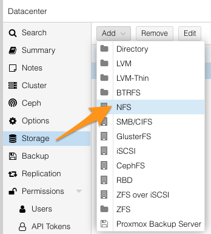
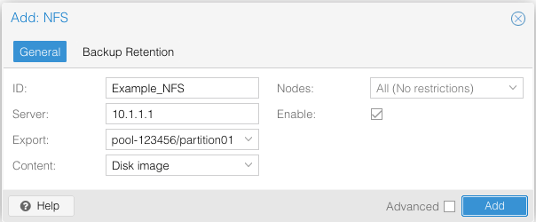
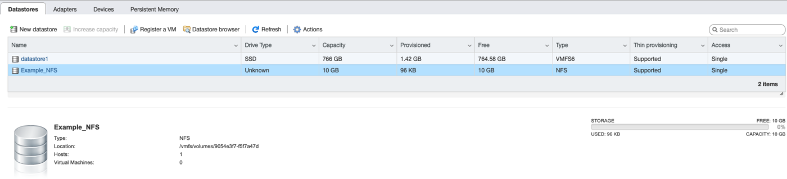

> [!primary]
> Esta traducción ha sido generada de forma automática por nuestro partner SYSTRAN. En algunos casos puede contener términos imprecisos, como en las etiquetas de los botones o los detalles técnicos. En caso de duda, le recomendamos que consulte la versión inglesa o francesa de la guía. Si quiere ayudarnos a mejorar esta traducción, por favor, utilice el botón «Contribuir» de esta página.
> 

## Objetivo 

El servicio NAS-HA de OVHcloud le permite gestionar un almacenamiento de archivos al que podrá acceder desde una red.

**Esta guía explica cómo acceder al NAS-HA a través de NFS en los sistemas operativos más habituales.**

> [!warning]
> OVHcloud le ofrece una serie de servicios cuya configuración y gestión es responsabilidad suya. Por lo tanto, es su responsabilidad asegurarse de que estos funcionan correctamente.
>
> Esta guía le ayudará a realizar las tareas más habituales. No obstante, si tiene dificultades o dudas con respecto a la administración, el uso o la instalación de servicios en un servidor, le recomendamos que contacte con un [proveedor especializado](https://partner.ovhcloud.com/es-es/directory/) o con [nuestra comunidad](https://community.ovh.com/en/).
>

## Requisitos

- Tener una solución [NAS-HA de OVHcloud](https://www.ovhcloud.com/es-es/storage-solutions/nas-ha/).
- Tener contratado un servicio de OVHcloud al que esté asociada una dirección IP pública (Hosted Private Cloud, servidor dedicado, VPS, instancia de Public Cloud, etc.).
- Tener un sistema operativo compatible con NFS instalado en el servidor.
- [Haber creado una partición en el servicio con el protocolo NFS activado](/pages/storage_and_backup/file_storage/ha_nas/nas_get_started#partition).
- [Tener un registro ACL para la dirección IP del servidor](/pages/storage_and_backup/file_storage/ha_nas/nas_get_started#addaccess).
- Tener acceso administrativo (sudo) al servidor por SSH o GUI.

## Procedimiento

Las siguientes secciones contienen ejemplos de configuración para las distribuciones y sistemas operativos más utilizados. En primer lugar, conéctese al servidor por SSH o acceda a la interfaz gráfica del sistema operativo instalado. Los siguientes ejemplos suponen que está conectado como usuario con permisos muy exigentes.

También necesitará el **nombre interno** y **la dirección IP** del servicio NAS-HA, que podrá consultar en el mensaje de correo electrónico que le enviemos después de la instalación, o en el [área de cliente de OVHcloud](https://www.ovh.com/auth/?action=gotomanager&from=https://www.ovh.es/&ovhSubsidiary=es).

Las siguientes notaciones se utilizan como argumentos en las secciones de línea de órdenes siguientes. Sustituya por los valores apropiados al introducir los comandos.

|Argumento|Descripción|
|---|---|
|IP_HA-NAS|La dirección IP del NAS-HA (Ejemplo: `10.1.1.1`)|
|NFS_PATH|Ruta de acceso a la partición NAS-HA que quiere montar, compuesta por el nombre del servicio y el nombre de las particiones (Ejemplo: `zpool-123456/partition01`)|
|MOUNTING_FOLDER|La carpeta local para la partición montada|

> [!warning]
>
> El usuario NFS es `root`, los cambios de permisos con este usuario pueden generar conflictos con los permisos CIFS/SMB existentes.
>

### Distribuciones basadas en Debian

Instale el package `nfs-common`:

```bash
ubuntu@server:~$ sudo apt install nfs-common
```

A continuación, utilice el siguiente comando para montarlo: 

```bash
ubuntu@server:~$ sudo mount -t nfs IP_HA-NAS:/NFS_PATH /MOUNTING_FOLDER
```

**Ejemplo:**

```bash
ubuntu@server:~$ sudo mount -t nfs 10.1.1.1:/zpool-123456/partition01 /mount/ha_nas
```

Ahora puede acceder a la partición montada en la carpeta especificada.

> [!primary]
>
> Para automatizar el proceso de montaje cada vez que inicie el servidor, añada la siguiente línea al archivo `/etc/fstab`:
>
> `IP_HA-NAS:/NFS_PATH /MOUNTING_FOLDER nfs rw 0 0`
>

### CentOS 7 / AlmaLinux / Rocky Linux

Compruebe que se hayan instalado las últimas versiones de los paquetes `nfs-utils` y `rpcbind`:

```bash
centos@server:~$ sudo yum install nfs-utils rpcbind
```

Reinicie el servicio `rpcbind` con el siguiente comando:

```bash
centos@server:~$ sudo systemctl restart rpcbind
```

Para montar la partición, utilice el siguiente comando:

```bash
centos@server:~$ sudo mount -t nfs IP_HA-NAS:/NFS_PATH /MOUNTING_FOLDER
```

**Ejemplo:**

```bash
centos@server:~$ sudo mount -t nfs 10.1.1.1:/zpool-123456/partition01 /mount/ha_nas
```

Ahora puede acceder a la partición montada en la carpeta especificada.

> [!primary]
>
> Para automatizar el proceso de montaje cada vez que inicie el servidor, añada la siguiente línea al archivo `/etc/fstab`:
>
> `IP_HA-NAS:/NFS_PATH /MOUNTING_FOLDER nfs rw 0 0`
>

### Fedora

Instale el package `nfs-utils` :

```bash
fedora@server:~$ sudo dnf -y install nfs-utils
```

A continuación, utilice el siguiente comando para montarlo: 

```bash
fedora@server:~$ sudo mount -t nfs IP_HA-NAS:/NFS_PATH /MOUNTING_FOLDER
```

**Ejemplo:**

```bash
fedora@server:~$ sudo mount -t nfs 10.1.1.1:/zpool-123456/partition01 /mount/ha_nas
```

Ahora puede acceder a la partición montada en la carpeta especificada.

### Proxmox

En el panel de administración de Proxmox, haga clic en `Storage`{.action} en el menú vertical.

{.thumbnail}

Haga clic en el botón `Add`{.action} y seleccione `NFS`{.action}.

Se abrirá una ventana en la que deberá introducir la siguiente información:

|Detalle|Descripción|
|---|---|
|ID|Identificador del recurso compartido|
|Server|Dirección IP del NAS-HA (Ejemplo: `10.1.1.1`)|
|Export|Ruta a la partición NAS-HA (debe ser detectada por la exploración automática: selecciónelo de la lista.)|
|Content|Tipos de contenidos para este recurso compartido por NFS (Disk image, ISO image, Container template, VZDump backup file, Container, Snippets).|

{.thumbnail}

Haga clic en `Add`{.action} para montar la partición.

### VMware ESXI

En el panel de administración VMware ESXI, haga clic en `Storage`{.action} en el menú de la izquierda.

Haga clic en el botón `New datastore`{.action} para abrir el asistente.

{.thumbnail}

En la nueva ventana, seleccione `Mount NFS datastore`{.action} y haga clic en `Next`{.action}.

{.thumbnail}

Rellene el formulario con los siguientes detalles.

|Detalle|Descripción|
|---|---|
|Name|Identificador del recurso compartido|
|NFS server|Dirección IP del NAS-HA (Ejemplo: `10.1.1.1`)|
|NFS share|Ruta a la partición NAS-HA a montar (Ejemplo: `zpool-123456/partition01`)|

{.thumbnail}

A continuación, haga clic en `Next`{.action}. Haga clic en `Finish`{.action} en el último paso.

La partición NAS-HA está ahora montada en datastores.

{.thumbnail}

### NFSv3/NFSv4

El NAS-HA soporta los protocolos NFSv3 y NFSv4. En este tutorial explicamos cómo se utilizan.

**Qué ocurre si no se especifica la versión durante el pedido NFS?**

En ese caso, el cliente NFS intentará conectarse directamente a la versión más alta de NFS.
También puede elegir si prefiere utilizar NFSv3 o NFSv4:

Para forzar el uso de NFSv3, utilice el siguiente comando:

```bash
ubuntu@server:~$ sudo mount -t nfs -o vers=3 IP_HA-NAS:/NFS_PATH /MOUNTING_FOLDER
```

- Ejemplo:

```bash
ubuntu@server:~$ sudo mount -t nfs -o vers=3 10.1.1.1:/zpool-123456/partition01 /mount/ha_nas
```

Para forzar el uso de NFSv4, utilice el siguiente comando:

```bash
ubuntu@server:~$ sudo mount -t nfs -o vers=4 IP_HA-NAS:/NFS_PATH /MOUNTING_FOLDER
```

- Ejemplo:

```bash
ubuntu@server:~$ sudo mount -t nfs -o vers=4 10.1.1.1:/zpool-123456/partition01 /mount/ha_nas
```

También puede utilizar el siguiente comando para determinar la versión utilizada en el montaje actual:

```bash
ubuntu@server:~$ nfsstat -m
```

En la respuesta, el parámetro `vers=3` o `vers=4` le indica cuál es el protocolo utilizado.

El uso de los mandos será similar para CentOS y Fedora.

**¿Se puede introducir una versión específica para el uso de NFSv4?**

Al igual que antes, el cliente NFS intentará conectarse directamente a la versión más alta que este último admita.
Si lo desea, puede elegir entre NFSv4.1 y NFSv4.2

Para forzar el uso de NFSv4.1, utilice el siguiente comando:

```bash
ubuntu@server:~$ sudo mount -t nfs -o vers=4.1 IP_HA-NAS:/NFS_PATH /MOUNTING_FOLDER
```

- Ejemplo:

```bash
ubuntu@server:~$ sudo mount -t nfs -o vers=4.1 10.1.1.1:/zpool-123456/partition01 /mount/ha_nas
```

Para forzar el uso de NFSv4.2, utilice el siguiente comando:

```bash
ubuntu@server:~$ sudo mount -t nfs -o vers=4.2 IP_HA-NAS:/NFS_PATH /MOUNTING_FOLDER
```

- Ejemplo:

```bash
ubuntu@server:~$ sudo mount -t nfs -o vers=4.2 10.1.1.1:/zpool-123456/partition01 /mount/ha_nas
```

Puede utilizar este comando para comprobar la versión de su montaje actual:

```bash
ubuntu@server:~$ nfsstat -m
```

## Consejos para optimizar el rendimiento o la estabilidad de su conexión NFS

En la mayoría de los casos, las opciones de montaje por defecto configuradas en los clientes Linux son suficientes para obtener un rendimiento aceptable. Sin embargo, en determinadas situaciones, puede ser útil activar o desactivar determinadas opciones para obtener un mejor rendimiento global.

Además, para obtener un rendimiento óptimo y evitar varios bugs identificados en el cliente NFS, le recomendamos que utilice un kernel Linux lo más reciente posible.

A continuación ofrecemos algunos consejos que le ayudarán a afinar la configuración de su cliente NFS.

### Algunas opciones de montaje a considerar

Puede conocer las opciones de montaje que aplica su cliente Linux con el comando `mount -l`.

Ejemplo de devolución de este pedido:

```bash
XX.XX.XX.XX:/zpool-XXXXXX/DIR on /mnt type nfs4 (rw,relatime,vers=4.2,rsize=131072,wsize=131072,namlen=255,hard,proto=tcp,timeo=600,retrans=2,...)
```

- `rsize=1048576`: define el número máximo de bytes de datos que el cliente NFS puede recibir por cada solicitud de LECTURA de red. Este valor se aplica cuando se leen datos de un archivo en un sistema de archivos NFS. El mayor tamaño posible (hasta 1048576) garantiza un mejor rendimiento.
- `wsize=1048576`: establece el número máximo de bytes de datos que el cliente NFS puede enviar para cada solicitud de escritura en la red. Este valor se aplica cuando se escriben datos en un archivo en un sistema de archivos NFS. El mayor tamaño posible (hasta 1048576) garantiza un mejor rendimiento.
- `hard`: define el comportamiento de recuperación del cliente NFS después de la expiración de una consulta, de modo que las consultas se reinician indefinidamente hasta que NAS-HA responde. Esta opción garantiza la integridad de los datos.
- `timeo=150`: establece el valor de tiempo de espera que el cliente NFS usa para esperar una respuesta antes de reiniciar una solicitud NFS. Utilice un valor de al menos 150, que equivale a 15 segundos, para evitar una disminución del rendimiento.
- `retrans=2`: establece en 2 el número de veces que el cliente NFS realiza una consulta antes de intentar una acción de recuperación.
- `tcp`: para acelerar el montaje del sistema de archivos en NFS v3 (no necesario para NFSv4.x que utiliza únicamente TCP).
- `_netdev`: cuando esta opción está presente en el archivo /etc/fstab, impide que el sistema operativo del cliente intente montar el sistema de archivos NFS hasta que se habilite la red.
- `nofail`: si el SO de su cliente debe poder arrancar independientemente del estado de su sistema de archivos NFS, añada la opción `nofail`.
- `actimeo=30`: la especificación `actimeo` define todos los parámetros `acregmin`, `acregmax`, `acdirmin` y `acdirmax` en el mismo valor. Si se utiliza un valor inferior a 30 segundos, el nivel de rendimiento podría degradarse, ya que las cachés de atributos de los archivos y directorios caducan demasiado rápido.
- `nfsvers`: evite utilizar la versión 4.0 de NFS si es posible. En su lugar, utilice las versiones 3, 4.1 o 4.2 (siempre que sea posible, utilice la misma versión de NFS para todos los clientes conectados a un mismo recurso compartido NFS).
- `nordirplus`: en algunos entornos con muchos directorios, donde sólo la información de un pequeño subconjunto de entradas de directorio es utilizada por un cliente NFSv3, READDIRPLUS puede hacer que el rendimiento sea más lento. La opción nordirplus permite desactivar esta funcionalidad

### Forzar el uso de NFSv3 en algunos casos

- Dado que NFSv3 no tiene estado, el rendimiento con NFSv3 puede ser significativamente mejor para determinadas cargas de trabajo, especialmente para las cargas de trabajo que hacen muchas llamadas de tipo OPEN, CLOSE, SETATTR y GETATTR.
- Si aloja una base de datos en su recurso compartido NFS, tenga en cuenta que, en caso de desconexiones de red, el mecanismo de bloqueo específico del protocolo NFS v4.x puede provocar la interrupción de la aplicación (consulte esta rfc para más detalles: <https://datatracker.ietf.org/doc/rfc3530/>).
- Si aloja máquinas virtuales VMware en su recurso compartido NFS, tenga en cuenta que el mecanismo de bloqueo integrado en la versión NFSv4.x no es compatible con el modo de clustering implementado en su NAS-HA (cluster en modo activo/pasivo explicado en [esta página](/links/storage/nas-ha)). Por lo tanto, es necesario utilizar el protocolo NFSv3. De lo contrario, perderá el acceso a su datastore durante un incidente que afecte al servidor principal o durante una operación de mantenimiento programada.

### Mejorar el rendimiento de lectura modificando el atributo read_ahead_kb

Algunos kernels Linux utilizan un valor por defecto de 128 KB de `read_ahead_kb`. Se recomienda aumentar este valor hasta 15 MB si tiene problemas de rendimiento de lectura. Para obtener más información, consulte [esta página](https://docs.kernel.org/admin-guide/abi-stable.html?highlight=read_ahead_kb#abi-sys-block-disk-queue-read-ahead-kb).

## Más información

Si necesita formación o asistencia técnica para implantar nuestras soluciones, póngase en contacto con su representante de ventas o haga clic en [este enlace](https://www.ovhcloud.com/es-es/professional-services/) para obtener un presupuesto y solicitar un análisis personalizado de su proyecto a nuestros expertos del equipo de Servicios Profesionales.

Interactúe con nuestra comunidad de usuarios en <https://community.ovh.com/en/>.
