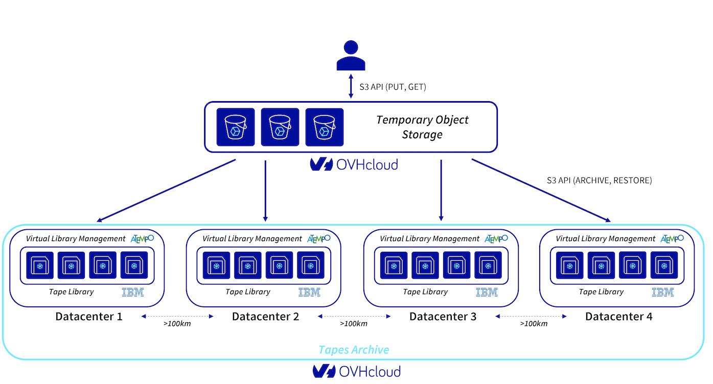

## General Information

### Which use cases are suitable for the Cold Archive storage service? 

The Cold Archive storage class is an Object Storage service adapted for long-term storage. It is suitable for the following use cases:

- Long-term storage for legal reasons.
- Strengthening resilience plans, implementing a 3+2+1 strategy.
- Large storage of video/photo media.

This storage class, easily accessible via S3 API, is recommended if your data is stored for more than 6 months without any particular need for restoration (less than one restoration per year).

Its design is highly resilient (4 datacentres), low cost, sustainable (the lifespan of a *tape* is 16 years). However, you will need to wait 48 hours for a request to restore your data.

Find an overview of the solution on [this page](/pages/storage_and_backup/object_storage/cold_archive_overview).

### How do I use the service for the first time? 

To use the service, you will need to meet the following requirements:

- You must have a [Public Cloud project](/pages/public_cloud/compute/create_a_public_cloud_project) in your OVHcloud account. 
- You must be logged in to your [OVHcloud Control Panel](/links/manager).
- You must have created a [S3 user](/pages/storage_and_backup/object_storage/s3_getting_started_with_object_storage).

### What S3 features are available with the Cold Archive storage class? 

All the features of our Object Storage - S3 API storage classes are supported by the Cold Archive service. You can find the list of functions on [this page](/pages/storage_and_backup/object_storage/s3_s3_compliancy).

Two features have been disabled (versioning and object lock) because, by design, an archived object container has a single version that cannot be modified.

4 operations are available specifically for this storage class: archiving, restoring, container status, deleting the archive.

## Archiving and restoration

### How do I download the data into a container?

You create a container, better known as a bucket, in Object Storage standards.

Please use the endpoint corresponding to this service: [https://s3.rbx-archive.io.cloud.ovh.net/](https://s3.rbx-archive.io.cloud.ovh.net/).

After it is created, a bucket is read/write.

You can then upload files to this container via S3 API, CLI or SDK.

### How do I archive a container?

You archive the container from your user interface, via S3 API, CLI or SDK. 

In the user interface, the action is carried out by activating the `Archive`{.action} button. 

After this request, the bucket is not yet archived. Archiving to tape will take some time. From this command until a restore, the bucket cannot accept any read or write requests on the objects (listing objects is always allowed).

The API commands are described in [our documentation](/pages/storage_and_backup/object_storage/cold_archive_getting_started).

### How do I restore an archive?

You can restore an archive to make the data available for reading in the original Object Storage container. This action does not delete the archive on the tapes.

In the user interface, click `Restore an archive`{.action}.

After this request, the bucket is in `restoring` status for the time it takes to restore. This can last up to 48 hours.

Once the restoration is complete, the container is in status `restored`. Access to objects will be read-only (write is not allowed). Objects are available for reading for 30 days. After this period, the container is again in the `archived` status and the objects are no longer accessible for reading.

### How do I delete an archive?

In the user interface, you delete your archive by selecting the `Empty archive`{.action} buttons.

After this request, the objects in the bucket are not yet deleted. 
Deleting objects will take some time. 
Once the objects have been deleted, the bucket can be deleted by selecting `Delete container`{.action}.

> [!alert]
> This command deletes everything on tapes and can not be canceled.

You can find the API command description in our guide on [Getting started with Cold Archive](/pages/storage_and_backup/object_storage/cold_archive_getting_started).

### How do I view the contents of my archive?

The metadata is available in read mode and not billed. You can view them at any point in the lifecycle, even when the container is archived.

### Is there a volume limitation? 

A container cannot be archived if it exceeds the size of 100 TB.

We have no limit on the number of objects. Having a lot of small objects will impact archiving/recovery time.

For an equivalent volume, a bucket with many small objects will take longer to archive/restore than a bucket with large objects.

### How long does it take to archive and restore a container?

The time it takes to archive and restore depends on the volume of data and the number of objects.

The restore time depends on the volume of data and the number of objects.

For a volume of a few TB, this may take a few minutes or a few hours.

This is why the SLA is at 48h although in reality the time can sometimes be much shorter.

## Data volume download

### Can I archive my data from another cloud provider?

Yes, you can use the Cold Archive storage class to archive your data which has been backed-up with another cloud provider.

For example, you install a server and set Rclone to synchronize your files from an Object Storage S3 (third-party cloud provider) to OVHcloud S3 Object Storage, following this guide: [Object Storage - Use S3 Object Storage with Rclone](/pages/storage_and_backup/object_storage/s3_rclone).

### How do I download large volumes?

The Object Storage service is designed to receive a high volume of data.

Since the connection is limited to 1Gbps, you must define a multipart download with 10 connections in parallel.

To download 8PB for example, it will take around 15 days with an available bandwidth of 5Gbps.

Although offering unguaranteed bandwidth, the public internet from AWS Data Centers to OVHcloud Object Storage usually provides bandwidth compatible with high volumes.

### Is it possible to receive a physical copy of the archive?

We do not offer this service. Archives are stored in *off-line* magnetic tapes, available in libraries located in 4 datacentres based in France, and dedicated to archive storage.

## Billing

### How is the Cold Archive service billed? 

Billing is done on a volume basis in GB per hour.

During the download phase, your storage volumes are billed at the price of the **Standard object storage - S3 API** storage class.

After archiving the container (*put-archive*), your data volumes are billed at the price of the **Cold Archive** storage class.

Billing stops when the archive is deleted (*delete-ovh-archive*).

A 7% discount is applied for a data volume greater than 3 PB.

You can find pricing details on [this page](https://www.ovhcloud.com/en-au/public-cloud/prices/).

### Is there a minimum commitment period?

The billing of the archive is subject to a minimum commitment of 180 days.

If the archive is deleted before 6 months, on a date between 0 days and 180 days, a penalty is charged: (180 days - date) x €1.3.

### On which volume does the volume price reduction apply? 

The volume is calculated on the total capacity of buckets in a Public Cloud project (project ID).

### Billing example

#### Use case 1

- Data volume: 10 TB . 
- I upload my data to object storage. 
- 7 days after uploading my data, I launch the archive (*put-archive*).
- After 8 months I delete my archive.
- Billing: 
    - (€7 x 7/30 + €1.3 x 21/30) x 10TB = €25 for the first month
    - then for 7 months: 1.3 € x 10 TB = 13 € /month

#### Use case 2

- Data volume: 10 TB. 
- I upload my data to object storage. 
- 7 days after uploading my data, I launch the archive (*put-archive*).
- After 4 months I delete my archive.
- Billing: 
    - (€7 x 7/30 + €1.3 x 21/30) x 10TB = €25 for the first month
    - the following months: 1.3 € x 10 TB = 13 € /month
    - the last month (month 4, i.e. 2 months before the end of the commitment period): €1.3 x 10TB = €13 + 2 months x €1.3 x 10TB = €39

### What is the bandwidth pricing?

Incoming internal traffic is free.

Outgoing internal traffic is free (traffic from an OVHcloud server to an OVHcloud server, including servers from the Public Cloud, Bare Metal Cloud and Hosted Private Cloud solutions)

External bandwidth from OVHcloud to the outside is charged. Prices are detailed on [this page](https://www.ovhcloud.com/en-au/public-cloud/prices/).

## Durability

### Why did OVHcloud choose magnetic tape as its storage medium?

Magnetic tapes are built to last for several decades (unlike an average of five years for modern disks). Cartridges do not consume power except during read and write phases. This saves more than 95% of power compared to a similar array.

### What is the tape management policy?

OVHcloud offers a managed service. OVHcloud takes care of the replacement of magnetic tapes when they reach the end of their lifecycle or generation.

## Security

### Can I protect my data in transit?

To protect data against theft, the connection between an S3 object storage (*from*) and OVHcloud object storage (*to*) is encrypted and protected by https.

In addition, we recommend that you encrypt your data before sending it.

### Is data encrypted?

Yes, data is encrypted at the source on the Object Storage server.

## Identity and role management

### What roles can be set to control access to archives?

You have 4 levels of credentials:

- The admin user (commonly known as *NIC admin*) 
- The billing user (commonly known as *NIC billing*)
- The OpenStack user
- An S3 user

| ID | Role |
| --- | --- |
| NIC admin | Administrator Billing |
| NIC billing | Billing |
| NIC technical | Administrator |
| OpenStack user | (1) Administrator (2) Object Storage |
| S3 user (S3 credentials) | 4 roles (1) Administrator (2) Read only (3) Read (4) Deny  Only the administrator role has access to tiering actions (archive, delete, restore) |

## Resilience

### What is the resilience level of the data? 

The Cold Archive storage service backs up data in a redundant manner on 4 datacentres located more than 100 km from each other in France.

The redundancy of the data is done by an 8+4 Erasure Coding mechanism. Data can be recovered after the complete loss of one datacentre and a hardware failure in a second datacentre, providing an unparalleled level of resilience on the market.

{.thumbnail}

### What is the SLA of the service?

The service’s SLA is available on [this page](https://www.ovhcloud.com/en-au/terms-and-conditions/contracts/).

It corresponds to the availability of the Object Storage service (RBX-archive endpoint) at 99.9% and the associated features (S3 API and tiering).

## Go further

Discover our dedicated Discord channel: <https://discord.gg/ovhcloud>. Ask questions, provide comments, and interact directly with the team that designs our storage and backup services.

Join our community of users on <https://community.ovh.com/en/>.