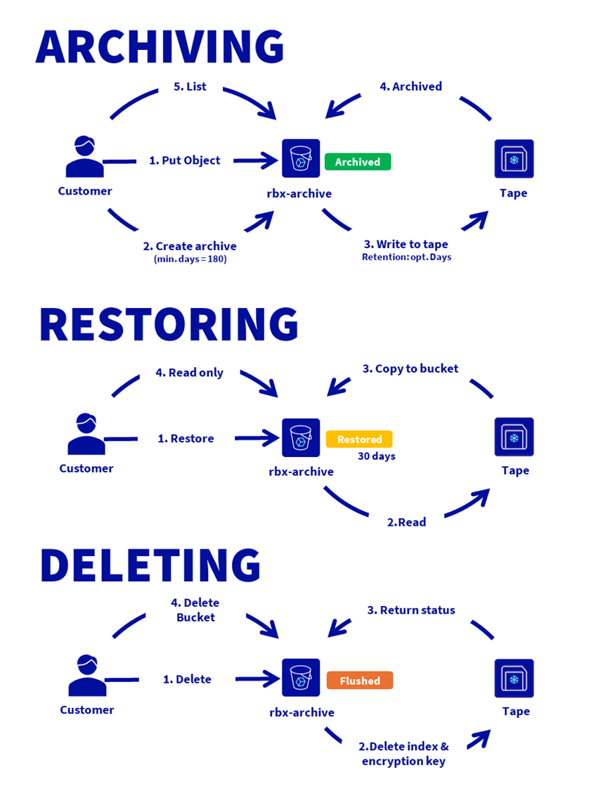
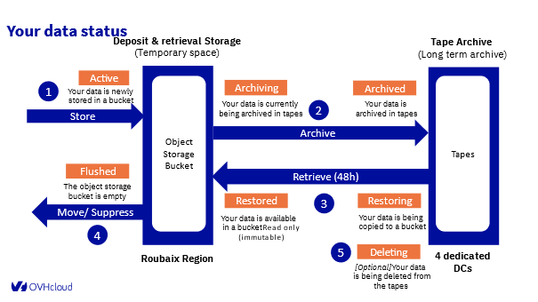

## Objectif

[OVHcloud Cold Archive](https://www.ovhcloud.com/en-gb/public-cloud/cold-archive/) est une classe de stockage conçue pour un stockage à long terme des données rarement accédées.

Ses principales caractéristiques sont :

- Rétention à long terme : conservation des données pour une durée > 8 mois
- Immuabilité des données : les données ne peuvent pas être mises à jour après archivage
- Durabilité (99,999%) et protection contre le bit-rot (dégradation des données sur de longues périodes)
- À tout moment, vous avez accès aux métadonnées toujours en ligne pour consultation. Vous pouvez récupérer les données à la demande dans un délai de 48 heures.

La conception matérielle est spécifiquement conçue pour ce cas d'utilisation, afin de fournir une plate-forme de confiance avec le meilleur rapport résilience/prix :

- Sans limite de volume, jusqu'à plusieurs pétaoctets de données
- Basée sur le stockage sur bande magnétique pour une longue durée (> 10 ans) et une faible empreinte carbone
- Au sein d'une architecture hautement résiliente de plusieurs centres de données

Ce service est adapté à votre entreprise pour les besoins suivants :

- Archivage réglementaire et de conformité
- Préservation des actifs multimédias
- Stockage de données scientifiques
- Conservation des données sensibles
- Archivage des informations de santé
- Archivage des informations financières
- Archivage des informations du secteur public

Le service vous permet de vous concentrer sur la création et le déploiement d'applications cloud tandis qu'OVHcloud s'occupe de l'infrastructure et de la maintenance du service.

**Ce guide explique les concepts de la classe de stockage Cold Archive.**

## Concepts

Le service est entièrement géré par OVHcloud et accessible via l'API S3.

{.thumbnail}

**Opération en 5 étapes**

1. **Stockage (Actif) :** Vos données sont nouvellement stockées dans un bucket au sein de l'Object Storage Bucket.
2. **Archivage (En cours d'archivage) :**
    - **Archivage :** Vos données sont en cours d'archivage sur des bandes.
    - **Archivé :** Vos données sont maintenant archivées sur des bandes, stockées dans l'Archive sur bande (archive à long terme) à travers des datacentres dédiés.
3. **Récupération (48h) ou Restauration :**
    - **Restauration :** Vos données sont en cours de copie vers un bucket.
    - **Restauré :** Vos données sont disponibles dans un bucket, en lecture seule (immuable), au sein de l'Object Storage Bucket.
4. **Déplacement / Suppression (Vidange) :** Le bucket de l'Object Storage est maintenant vide.
5. **Suppression (Optionnelle) :** Vos données sont en cours de suppression des bandes.

{.w-100}

## Téléchargement des données

Créez une archive au niveau du bucket.

Archivez et récupérez vos données avec la méthodologie de votre choix :

- par CLI
- avec rClone
- avec les outils du marché

La limite d'un bucket est de 100 To.

## Cycle de vie des données

Au cours du cycle de vie, les données sont placées au niveau d'Object Storage pour un dépôt ou une récupération ou stockées sur bande magnétique pour une archive de longue durée.

Vous pouvez suivre les différentes étapes de vos données par le statut de votre bucket

| État de l'archive (=bucket) | Description | Permissions des objets | Durée | Tarification des données |
| --- | --- | --- | --- | --- |
| **`None`** | Aucune configuration Intelligent-Tiering appliquée au bucket pour l'instant. | Tous | illimité | Standard |
| **`Archiving`** | Archivage en cours sur bandes. | Listing | <48h | Archive |
| **`Archived`** | Objets archivés sur bandes uniquement. | Listing | illimité | Archive |
| **`Restoring`** | Restauration en cours à partir des bandes. | Listing | <48h | Archive |
| **`Restored`** | Objets restaurés et accessibles. | Lecture seule + Listing | 30 jours | Archive |
| **`Deleting`** | Suppression des objets des bandes (et des disques si restaurés) en cours. | Listing | <48h | Archive |
| **`Flushed`** | Le bucket est vide et peut être supprimé en toute sécurité. | Listing (bucket vide) | N/A | Archive |

## Performances réseau, téléchargement et récupération

Cold Archive est un service basé sur Object Storage - API S3. Les performances et les limitations (nombre de buckets, compte, bande passante maximale par connexion, nombre de requêtes par seconde sur le bucket, taille maximale par objet / mpu / part, etc.) sont disponibles [ici](/pages/storage_and_backup/object_storage/s3_limitations).

Pour télécharger vos données, la bande passante maximale est de **1 Gbps par connexion logique** et le nombre de connexions utilisables en parallèle est **illimité**.

La durée de téléchargement dépend de votre connexion Internet.

Quelques exemples :

- J'ai une connexion Internet de 1 Gbps, je télécharge une archive de 1 To, cela prendra 2,2 heures.
- J'ai une connexion Internet de 5 Gbps, je télécharge une archive de 1 To, cela prendra 26 minutes.
- J'ai une connexion Internet de 5 Gbps, je télécharge une archive de 100 To, cela prendra 1,9 jours.

### Temps de récupération des données

Le délai d'accessibilité des données dépend du volume de données. Par exemple, pour une récupération de plusieurs centaines de To, le délai moyen est de 48 heures. Pour un volume de quelques To, cela peut prendre de quelques minutes à quelques heures.

## RSE, Certifications & Conformité

### Conformité

Le service est certifié HDS et ISO 27001.

### Faible empreinte carbone

En dehors des phases de lecture et d'écriture, les cartouches ne consomment pas d'électricité. Cela permet d'économiser plus de 95 % d'énergie par rapport à une baie de disques similaire.

### Durée

Les bandes magnétiques sont conçues pour durer des décennies (par opposition à une moyenne de cinq ans pour les disques modernes).

### Sécurité

L'utilisation du chiffrement côté serveur avec des clés de chiffrement fournies par le client (SSE-C) vous permet de définir vos propres clés de chiffrement.

Lorsque vous chargez un objet, Object Storage - API S3 utilise la clé de chiffrement que vous fournissez pour appliquer le chiffrement AES-256 à vos données. Lorsque vous récupérez un objet, vous devez fournir la même clé de chiffrement dans le cadre de votre demande. Object Storage - API S3 vérifie d'abord que la clé de chiffrement que vous avez fournie correspond puis déchiffre l'objet avant de vous renvoyer les données de l'objet.

### Immuabilité par WORM

Le stockage immuable est souvent obligatoire pour des raisons légales et est l'assurance de ne pas modifier ou supprimer les données après leur écriture.

Le stockage immuable est un moyen de se protéger contre les logiciels malveillants et les attaques.

Le service Cold Archive est WORM (**W**rite **O**nce, **R**ead **M**any) par conception.

### Réseau privé / public

Object Storage est disponible via un point de terminaison public (IP publique).

## Tarification

Nos tarifs sont détaillés [ici](https://www.ovhcloud.com/fr/public-cloud/prices/).

La solution Cold Archive est facturée en fonction de l'espace d'archivage utilisé (sur bandes magnétiques) et de l'espace de dépôt utilisé (espace Object Storage) avec une granularité de 1 Go. Pour assurer sa lisibilité, le prix est affiché en Go/mois, mais la granularité de facturation est au Go/heure, considérant qu'il y a en moyenne 720 heures dans un mois.

La durée minimale d'archivage est de 180 jours. En cas de suppression d'une archive dans ce délai d'engagement, le client se verra facturer un supplément calculé comme suit :

(180 jours moins le nombre de jours pendant lesquels le service a été utilisé) x prix de la classe de stockage.

Il est possible de démarrer l'archivage d'un bucket avec moins de 1 To de données, mais l'action d'archivage sera facturée au prix de 1 To.

La facturation se fait à terme échu, c'est-à-dire que le client est facturé pour le stockage consommé au cours du mois écoulé.

Il est possible de commencer à archiver un bucket avec moins de 1 To de données, mais l'action d'archivage sera facturée au prix de 1 To.

## Aller plus loin

Exploitez votre cycle de vie et apprenez à créer des buckets, archiver, récupérer des données, répertorier les métadonnées, en lisant [ce guide](/pages/storage_and_backup/object_storage/cold_archive_getting_started).

[Toute la documentation Object Storage](/products/storage-object-storage).

Rendez-vous sur notre chaîne Discord dédiée : <https://discord.gg/ovhcloud>. Posez des questions, fournissez des commentaires et interagissez directement avec l'équipe qui construit nos services de stockage et de sauvegarde.

Si vous avez besoin d'une formation ou d'une assistance technique pour la mise en œuvre de nos solutions, contactez votre commercial ou cliquez sur [ce lien](/links/professional-services) pour obtenir un devis et demander une analyse personnalisée de votre projet à nos experts de l’équipe Professional Services.

Échangez avec notre [communauté d'utilisateurs](/links/community).
