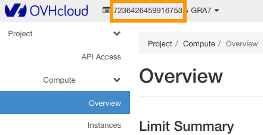
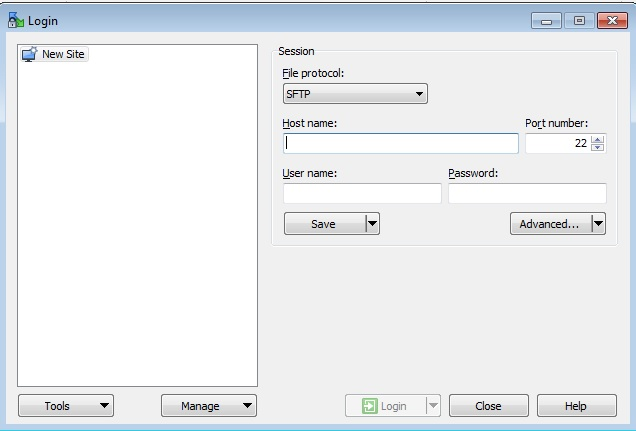
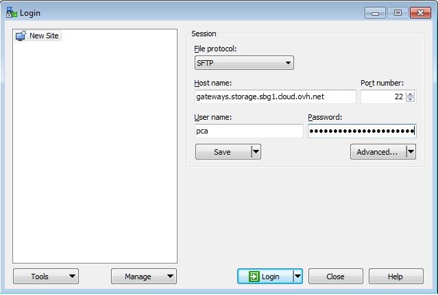
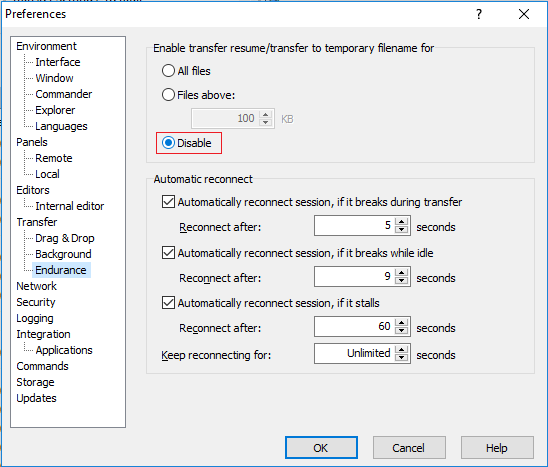
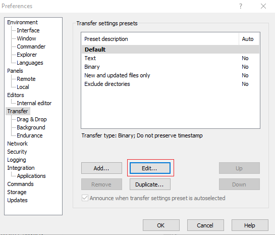
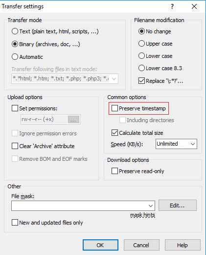

## Objective
Public Cloud Archive is a storage solution that is managed primarily through the OpenStack API. However, you might not be familiar with managing storage space via the command line. Therefore, we have developed a gateway which makes it possible to connect to your PCA container with an SFTP client.

## Requirements
- SFTP Client: [WinSCP](https://winscp.net/eng/download.php)
- OpenStack login & password
- Tenant name of the project

## Instructions

### SFTP Client
In this example, we use WinSCP but you can use any SFTP client. Configurations of SFTP clients are similar as explained here, regardless of the client.

### OpenStack ID
You can generate your OpenStack login and password using this [guide](/pages/public_cloud/public_cloud_cross_functional/create_and_delete_a_user).

### Tenant name
The tenant name corresponds to the name of your Horizon project. To get the tenant name, connect to the OpenStack web interface: <https://horizon.cloud.ovh.net/>. Once logged in, the tenant name is visible at the top of the page.

{.thumbnail}

### Connection
- Host Name: gateways.storage.<region_in_lowercase>.cloud.ovh.net
- User Name: pca
- Password: <tenant_name>.<openstack_username>.<openstack_password>
- Port: 22

{.thumbnail}

### Example
If you have created a PCA container in SBG:

- Host Name: gateways.storage.sbg.cloud.ovh.net
- User Name: pca
- Password: <tenant_name>.<openstack_username>.<openstack_password>

{.thumbnail}

### WinSCP Setting
In this part we will disable two WinSCP options:

**Transfer Resume / Transfer to Temporary Filename**: This option must be disabled because recovery is not possible with PCA and WinSCP can return an error.

- In the "Endurance" section, select "Disable".

{.thumbnail}

**Preserve Timestamp**: TimeStamp corresponds to the date of modification of the file. We disable it because on PCA we replace this data with the date of upload of the file.

- In the "Transfer" section, click on "Edit...".

{.thumbnail}

- Uncheck "Preserve timestamp".

{.thumbnail}

### Data recovery
Data recovery requires that the object be unlocked first. A GET request must be made on the object in question. If this command is not made beforehand, your SFTP client will return an error message when attempting to download a file. Consult our guide to learn how to unlock your object [here](/pages/storage_and_backup/object_storage/pca_unlock).

## Go further

If you need training or technical assistance to implement our solutions, contact your sales representative or click on [this link](/links/professional-services) to get a quote and ask our Professional Services experts for assisting you on your specific use case of your project.

Join our [community of users](/links/community).