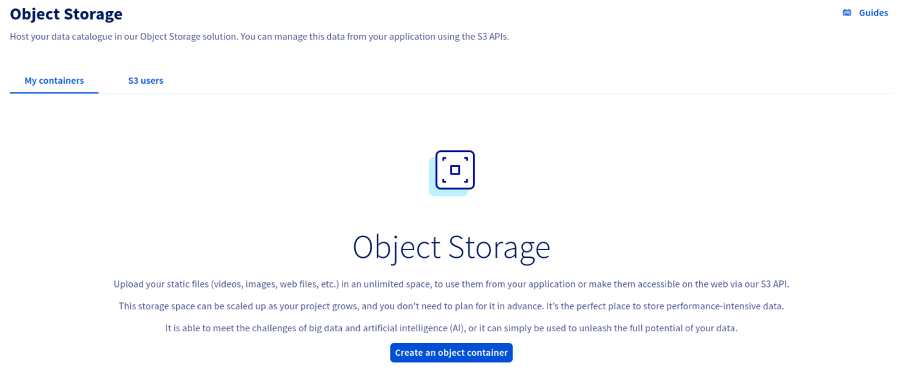
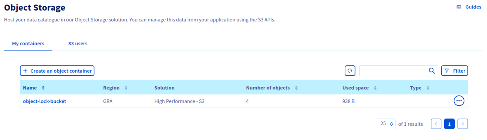
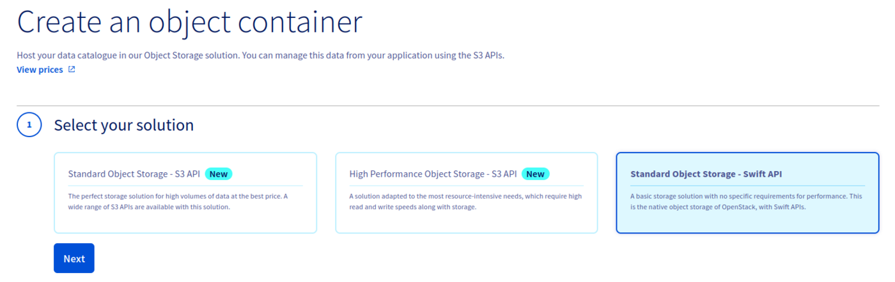
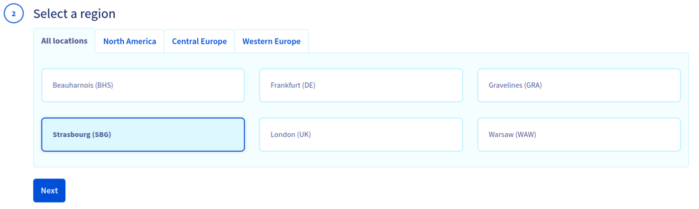
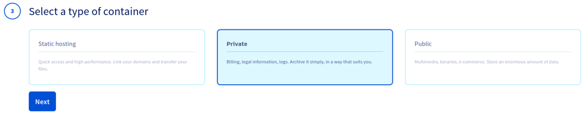
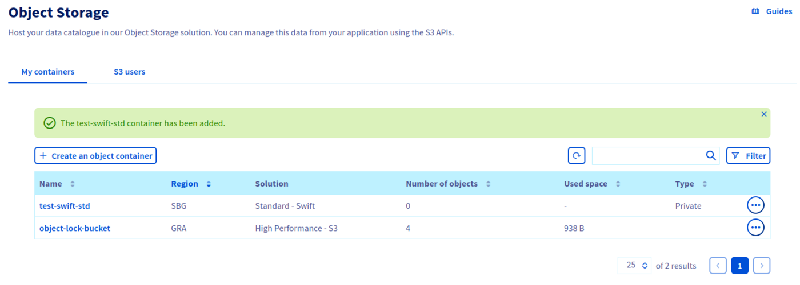
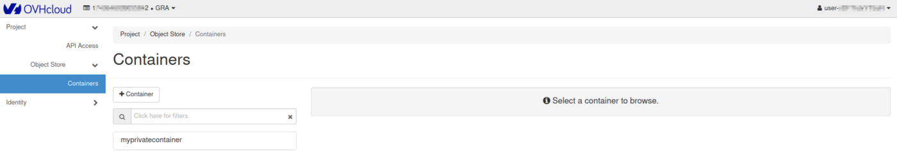
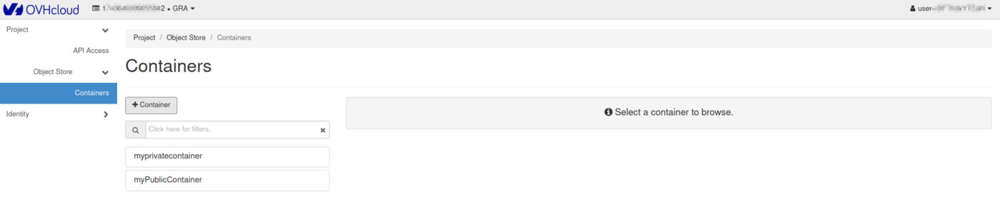
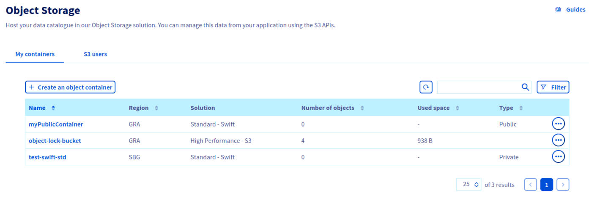

## Objectif

The Object Storage solution for Public Cloud offers an unlimited storage solution with simple billing tailored to your needs. There are many types of object containers:

- For static hosting (static website).
- For private hosting (e.g. storage of personal data).
- For public hosting (to store everything that is accessible to the public).
- For cold storage (archiving).

The first step is to create a container that will hold your files.

**This guide explains how to create it from the OVHcloud Control Panel and from the Openstack Horizon interface.**

## Requirements

- Access to the [OVHcloud Control Panel](https://ca.ovh.com/auth/?action=gotomanager&from=https://www.ovh.com/world/&ovhSubsidiary=we)

If you use Horizon :

- An [OpenStack user](/pages/public_cloud/compute/create_and_delete_a_user){.external}

## Instructions

### Creating an Object Storage container from the OVHcloud Control Panel 

Log in to the [OVHcloud Control Panel](https://ca.ovh.com/auth/?action=gotomanager&from=https://www.ovh.com/world/&ovhSubsidiary=we), go to the `Public Cloud`{.action} section and select the Public Cloud project concerned. Then, click on `Object Storage`{.action} in the left-hand navigation bar under "Storage".
Finally, click `Create an object container`{.action}.

If this is your first container:

If this is not your first container:

Select your solution and click on `Next`{.action}.

Select the region of your container, then click `Next`{.action}:

Select the container type, then click `Next`{.action}:

Name your container, then click `Create the container`{.action}:

> [!warning]
>
> If you want to link your container to a domain name, your container name must not contain the following characters:
>
> - [ . ]  
> - [ _ ]  
> - And you must not use capital letters.  
>  
> See: [Linking a container to a domain name](/pages/storage_and_backup/object_storage/pcs_link_domain)
>

Your container is now created:

### Creating an Object Storage container from Horizon 

> [!primary]
>
> It is not possible to create a Public Cloud Archive container from Horizon.
>

Log in to [Horizon](https://horizon.cloud.ovh.net){.external} :

1. Expand the `Object Store`{.action} menu, click `Containers`{.action} then click `+ Container`{.action}.

Name your container.

> [!warning]
>
> If you want to link your container to a domain name, your container name must not contain the following characters:
>
> - [ . ]  
> - [ _ ]  
> - And you must not use capital letters.  
>  
> See: [Linking a container to a domain name](/pages/storage_and_backup/object_storage/pcs_link_domain)
>

Select the access policy for your container then click `Next`{.action}.

Your container is now created:

You can also see it in your OVHcloud Control Panel.

## Go further

If you need training or technical assistance to implement our solutions, contact your sales representative or click on [this link](https://www.ovhcloud.com/en/professional-services/) to get a quote and ask our Professional Services experts for assisting you on your specific use case of your project.

Join our community of users on [https://community.ovh.com/en/](https://community.ovh.com/en/).
