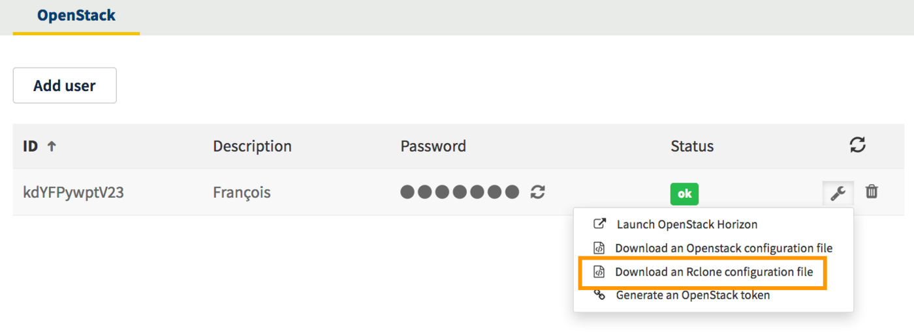

**Ostatnia aktualizacja dnia 2018-01-22**

## Wprowadzenie

Object Storage w OVH można synchronizować przy użyciu rClone. 
rClone to zewnętrzne oprogramowanie do synchronizacji, szczegółowe informacje dotyczące korzystania z tego rozwiązania znajdują się w jego [oficjalnej dokumentacji](https://Rclone.org/).

**Z tego przewodnika, dowiesz się jakie kroki należy wykonać podczas synchronizacji w Panelu klienta OVH.**

## Wymagania początkowe

- Utworzony kontener *Object Storage* (z poziomu Panelu klienta lub z poziomu [Horizon](/pages/storage_and_backup/object_storage/pcs_create_container){.external}).
- Utworzony [użytkownik OpenStack](/pages/public_cloud/compute/create_and_delete_a_user){.external}.

## W praktyce

Po utworzeniu kontenera oraz użytkownika OpenStack do wykonania pozostają dwie czynności:

### Uzyskanie pliku konfiguracyjnego do rClone:

Po utworzeniu [użytkownika OpenStack](/pages/public_cloud/compute/create_and_delete_a_user){.external} w Panelu klienta możesz uzyskać plik konfiguracyjny rClone.

W tym celu, na stronie użytkowników OpenStack w Panelu klienta, należy kliknąć ikonę klucza francuskiego, znajdującą się z prawej strony identyfikatora użytkownika, a następnie kliknąć `Pobierz plik konfiguracyjny rClone`{.external}.
{.thumbnail}


### Konfiguracja rClone:

Po pobraniu pliku, uruchom poniższe polecenie, które spowoduje dodanie nowej przestrzeni dyskowej:

```sh
Rclone config
```

Pojawi się prośba o wprowadzenie zawartych w pliku danych konfiguracyjnych.

> [!primary]
>
> Możesz również skopiować i wkleić zawartość pliku w polu przeznaczonym na konfigurację Rclone (*.config/Rclone/Rclone.conf*).
> 

Po przeprowadzeniu konfiguracji, możesz przetestować ją wywołując listę Twoich kontenerów:

```sh
Rclone lsd BackupStorage
```

*BackupStorage* odpowiada nazwie nadanej przestrzeni dyskowej.

Na oficjalnej stronie rClone znajduje się dokładna dokumentacja opisująca działania potrzebne do przeprowadzenia synchronizacji Object Storage poprzez rClone: [Oficjalna dokumentacja rClone](https://Rclone.org/swift/){.external}.


## Sprawdź również

Jeśli potrzebujesz szkolenia lub pomocy technicznej w celu wdrożenia naszych rozwiązań, skontaktuj się z przedstawicielem handlowym lub kliknij [ten link](https://www.ovhcloud.com/pl/professional-services/), aby uzyskać wycenę i poprosić o spersonalizowaną analizę projektu od naszych ekspertów z zespołu Professional Services.

Przyłącz się do społeczności naszych użytkowników na stronie <https://community.ovh.com/en/>.