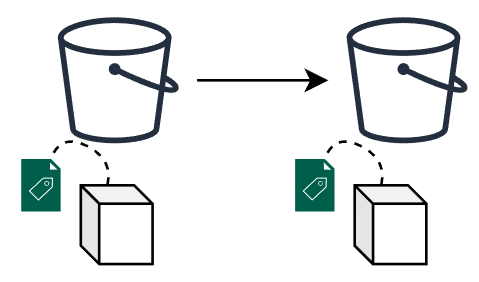
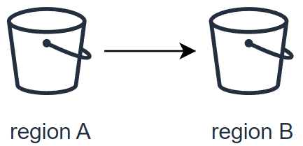

# Introduction to Object Replication

Object replication is a powerful feature that facilitates the automatic and asynchronous replication of objects within a source bucket to one or several destination buckets. This capability is crucial for maintaining data consistency, availability, and redundancy across different storage locations.

Destination buckets can reside within a single region or be dispersed across multiple regions, tailored to your specific requirements. This flexibility allows for strategic data placement and management across global infrastructure networks.

## Key Use Cases for Object Replication

- **Exact Object Copies with Metadata Replication**: Replication is not just about duplicating the object; it includes the replication of all associated metadata (e.g., object creation time, version ID, etc.). This ensures that the replicas are true copies of the source objects, maintaining integrity and consistency for critical applications.

- **Data Synchronization Across Teams**: It facilitates the seamless synchronization of data among various teams, streamlining collaboration and data sharing according to predefined access controls and policies.

- **Cost-Effective Data Storage Management**: By replicating data into different storage classes, organizations can optimize their backup and storage costs without compromising on data availability or durability.

- **Enhanced Data Resiliency Across Regions**: Enhance your data protection strategies by replicating critical data across multiple geographical regions. This increases resiliency against data loss and ensures business continuity in the face of regional disruptions.

- **Reduced Latency for Global Access**: Positioning your data closer to your end-users minimizes access latency and improves the overall user experience. Replication allows for strategic data placement in OVH regions nearest to your customer base.

- **Efficiency Boost for Computational Workloads**: By bringing your data closer to your OVH compute resources, replication enhances the efficiency and performance of your workloads, facilitating faster data processing and analysis.

- **Compliance and Regulatory Fulfillment**: Many compliance frameworks mandate that data be stored at a considerable distance from the primary location or require multiple copies of critical data. Object replication simplifies the process of meeting these requirements by enabling automatic replication across vast distances and into multiple storage mediums.

Implementing object replication ensures not only the safety and availability of your data but also enhances operational efficiency and compliance posture.

# What is Asynchronous Replication?

## Basic Concepts

At its core, the OVHcloud Object Storage S3 Asynchronous Replication is designed to facilitate several key operations in the management and safeguarding of your data. Here's what it enables you to do:

- **Exact Replica Creation**:



- **Replicate data within the same region**:


- **Replicate data to a different region**:



- **Replicate data to a different region**:


# What is Replicated vs What is Not

The following table provides the default behavior of the OVHcloud Object Storage Asynchronous Replication feature:

| What is Replicated                                           | What is Not Replicated                                       |
|--------------------------------------------------------------|--------------------------------------------------------------|
| Objects created AFTER the upload of the replication configuration | Delete marker i.e., objects deleted in the source bucket are not automatically deleted in the destination bucket |
| Unencrypted objects                                          | Object replicas i.e., objects that are the result of a previous replication operation |
| Objects encrypted with customer provided keys (SSE-C)        | Objects that have already been replicated to a previous destination |
| Object metadata from the source objects to the replicas      | Objects that are stored in the Cold Archive temporary storage |
| Objects in the source bucket the bucket owner has permissions to read and access ACLs | Bucket configurations i.e., lifecycle configuration, CORS configuration, bucket ACLs, etc. |
| Object ACL updates                                           | Actions resulting from Lifecycle Configuration actions |
| Object tags                                                  | Objects created BEFORE the upload of the replication configuration |
| S3 Object Lock retention configuration                       | Replication to a bucket in a different Public Cloud Project i.e., source and destination buckets must be in the same project |

# Replication Prerequisites

Asynchronous replication requires the following conditions to be met:

- **Public Cloud Project**: Source and destination buckets must be in the same public cloud project. This is a current limitation that may change in the future.
- **Versioning**: Versioning must be enabled in both the source and destination buckets.
- **S3 Object Lock**: If the source bucket has S3 Object Lock enabled, the destination buckets must also have this feature enabled to ensure compatibility.

# Replication Configuration

A replication configuration is defined through a set of rules within a JSON document. This document is uploaded and applied to the source bucket, detailing how objects are to be replicated.

## Each Replication Rule Defines:

- A **unique rule ID** to identify the rule.
- **Rule priority** to determine the order of execution when multiple rules exist.
- **Destination bucket** where the replicated objects will be stored.
- **Objects to be replicated**: By default, all objects are eligible for replication. However, you can specify a subset of objects by filtering them with a prefix and/or tags.
- **Optional target storage class**: By default, object replicas will inherit the same storage class as the source objects. If needed, you can specify a different storage class for the replicas.

## Replication Rule Structure

The basic structure of a replication rule within the configuration JSON document is as follows:


```json
{
  "Role": "string",
  "Rules": [
    {
      "ID": "string",
      "Priority": integer,
      "Filter": {
        "Prefix": "string",
        "Tag": {
          "Key": "string",
          "Value": "string"
        },
        "And": {
          "Prefix": "string",
          "Tags": [
            {
              "Key": "string",
              "Value": "string"
            }
          ]
        }
      },
      "Status": "Enabled"|"Disabled",
      "Destination": {
        "Bucket": "string",
        "StorageClass": "STANDARD"|"HIGH_PERF"
      },
      "DeleteMarkerReplication": {
        "Status": "Enabled"|"Disabled"
      }
    }
  ]
}
```

| Attribute               | Description                                                                                                             | Required |
|-------------------------|-------------------------------------------------------------------------------------------------------------------------|----------|
| Tag                     | Filter the objects by tag key and/or value                                                                              | No       |
| StorageClass            | The target storage class: "STANDARD" for S3 Standard and "HIGH_PERF" for S3 High Performance                            | No       |
| Status                  | Tells if your replication rule is Enabled or Disabled                                                                   | Yes      |
| Role                    | OVHcloud IAM role needed to allow OVHcloud Object Storage to access data from the source bucket & write data to destination buckets. Currently, OVHcloud has set a unique role "replicationRole" | Yes      |
| Priority                | If there are two or more rules with the same destination bucket, objects will be replicated according to the rule with the highest priority. The higher the number, the higher the priority | Yes      |
| Prefix                  | An object key name prefix that identifies the object or objects to which the rule applies. To include all objects in a bucket, specify an empty string | No       |
| ID                      | Each replication rule has a unique ID                                                                                   | Yes      |
| Filter                  | A filter that identifies the subset of objects to which the replication rule applies. To replicate all objects in the bucket, specify an empty object | Yes      |
| Destination             | A container for information about the replication destination and its configurations                                     | Yes      |
| DeleteMarkerReplication | Tells if delete operations should be replicated                                                                         | Yes      |
| Bucket                  | The destination bucket (to replicate to multiple destinations, you must create multiple replication rules)              | Yes      |
| And                     | You can apply multiple selection criteria in the filter                                                                 | No       |

# Delete Marker Replication

> :exclamation: **IMPORTANT**
>
> If you specify a `Filter` in your replication configuration, you **must** also include a `DeleteMarkerReplication` element. If your `Filter` includes a `Tag` element, the `DeleteMarkerReplication` Status **must be set to Disabled**.


### Understanding Delete Markers

When a delete object operation is performed on an object in a versioning-enabled bucket, it does not delete the object permanently but it creates a delete marker on the object. This delete marker becomes the latest and current version of the object with a new version id.

A delete marker has the following properties:

- A key and version ID like any other object.
- It does not have data associated with it, thus it does not retrieve anything from a GET request (you get a 404 error).
- By default, it is not displayed in the Control Panel UI anymore.
- The only operation you can use on a delete marker is DELETE, and only the bucket owner can issue such a request.

To permanently delete an object, you have to specify the version-id in your delete object request.

> :warning: **WARNING**
>
> By default, OVHcloud Object Storage does not replicate delete markers nor replicate the permanent deletion to destination buckets. This behavior protects your data from unauthorized or unintentional deletions.

However, you can still replicate delete markers by adding the DeleteMarkerReplication element to your replication configuration rule. DeleteMarkerReplication specifies if delete markers should or should not be replicated (when versioning is enabled, a delete operation is performed on an object it does not actually delete the object but it flags it with a delete marker)

```json
{
  "Role": "string",
  "Rules": [
    {
      ...
      "DeleteMarkerReplication": {
        "Status": "Enabled"|"Disabled"
      }
    }
  ]
}
```

# Checking the Replication Status

The replication status can be used to determine the status of an object that is being replicated. When you request a source object (using `GET object`) or source object metadata (using `HEAD object`), OVHcloud Object Storage returns the replication status via the header `x-amz-replication-status`.

> :warning: **WARNING**
> The replication status only applies to objects that are eligible for replication

The x-amz-replication-status can have the following values:


| Source object                                          | Replica Object                                      |
|--------------------------------------------------------------|--------------------------------------------------------------|
| COMPLETED | REPLICA |
| FAILED | n/a as the replica doesn't exist |
| PENDING | n/a as the replica doesn't exist yet|

> :warning: **WARNING**
> When you replicate objects to multiple destination buckets, the value of x-amz-replication-status is COMPLETED only when the source object has been successfully replicated to all the destination buckets, otherwise, the header remains at the PENDING value.
> If one or more destination fail replication, the value of the header becomes FAILED.

## Examples of replication configuration
Simple replication between 2 buckets
```json
{
  "Role": "IAM-role-ARN",
  "Rules": [
    {
      "Status": "Enabled",
      "Destination": {
        "Bucket": "arn:aws:s3:::destination-bucket"
      }
    }
  ]
}
```
This configuration will replicate all objects (indicated by the empty Filter field) to the bucket destination-bucket.

## Replication of delete markers

```json
{
  "Role": "IAM-role-ARN",
  "Rules": [
    {
      "Status": "Enabled",
      "Filter" : {
        "Prefix": "backup",
        "Tag": {"Key":"important", "Value":"true"}
      },
      "Destination": {
        "Bucket": "arn:aws:s3:::destination-bucket"
      },
      "DeleteMarkerReplication": { "Status": "Disabled" },
    }
  ]
}
```

This configuration will replicate all objects that have the prefix "backup" and the tag "important" set to "true" to the bucket destination-bucket. Additionally, we indicate that deletion operations in the source bucket should also replicated.

## Replicating source to multiple regions
```json
{
  "Role": "IAM-role-ARN",
  "Rules": [
    {
      "ID": "rule1",
      "Status": "Enabled",
      "Destination": {
        "Bucket": "arn:aws:s3:::region1-destination-bucket"
      }
    },
    {
      "ID": "rule2",
      "Status": "Enabled",
      "Destination": {
        "Bucket": "arn:aws:s3:::region2-destination-bucket"
      }
    }
  ]
}
```
Suppose the source bucket, region1-destination-bucket and region2-destination-bucket are 3 buckets in 3 OVHcloud regions, this configuration will allow you to backup all objects in the source bucket to 2 different regions.

## Replicating 2 subsets of objects to different destination buckets;

```json
{
  "Role": "IAM-role-ARN",
  "Rules": [
    {
      "ID": "rule1",
      "Status": "Enabled",
      "Filter" : {
        "Prefix": "dev"
      },
      "Destination": {
        "Bucket": "arn:aws:s3:::destination-bucket1"
      },
      "DeleteMarkerReplication": { "Status": "Disabled" },
    },
    {
      "ID": "rule2",
      "Status": "Enabled",
      "Filter" : {
        "Prefix": "prod"
      },
      "Destination": {
        "Bucket": "arn:aws:s3:::destination-bucket2"
      },
      "DeleteMarkerReplication": { "Status": "Disabled" }
    }
  ]
}
```

## This configuration contains 2 replication rules:

- rule1 will replicate all objects with prefix "dev" to bucket destination-bucket1 and additionally, will replicate also deletion operations.
- rule2 will replicate all objects with prefix "prod" to bucket destination-bucket2 without replicating deletion operations.

# In Practice

## Prerequisites

Before you begin, ensure you have the following ready:

- A Public Cloud project in your OVHcloud account.
- Access to the OVHcloud Control Panel.
- An S3 user already created within your project.
- AWS CLI installed and configured on your system. For a detailed guide on configuring the CLI, refer to the ["Getting started with Object Storage"]([https://help.ovhcloud.com/csm/en-ca-public-cloud-storage-s3-limitations?id=kb_article_view&sysparm_article=KB0034706)) documentation provided by OVHcloud.


> :exclamation: **IMPORTANT**
> Versioning must be activated in source bucket and destination bucket(s)

# Via the cli
## Create source bucket
The source bucket is the bucket whose objects are automatically replicated.

```bash
$ aws s3 mb s3://<bucket_name>
aws --endpoint-url https://s3.<region_in_lowercase>.<storage_class>.cloud.ovh.net --profile default s3 mb s3://<bucket_name>
```
**_Example:_** Creation of a source bucket in the SBG region in the Standard storage class.

```bash
$ aws s3 mb s3://my-source-bucket
aws --endpoint-url https://s3.sbg.io.cloud.ovh.net --profile default s3 mb s3://my-source-bucket
```

## Activate versioning in destination bucket
```bash
$ aws --endpoint-url https://s3.<region_in_lowercase>.<storage_class>.cloud.ovh.net --profile default s3api put-bucket-versioning --bucket my-destination-bucket --versioning-configuration Status=Enabled
```
## Apply replication configuration
Using the AWS cli, replication configuration is applied on the source bucket.
```bash
$ aws --endpoint-url https://s3.gra.io.cloud.ovh.net --profile default s3api put-bucket-replication --bucket <source> --replication-configuration <conf.json>
```

**_Example:_**: Replicate all objects with prefix "docs" having a tag "importance" with value "high" to "my-destination-bucket" and replicate the delete markers i.e objects marked as deleted in source will be marked as deleted in destination

```bash
{
   "Role": "arn:aws:iam::<your_project_id>:role/replicationRole",
   "Rules": [
    {
      "ID": "replication-rule-456",
      "Status": "Enabled",
      "Filter": {
        "And": {
          "Prefix": "docs"
        }
      },
      "Destination": {
        "Bucket": "arn:aws:s3:::my-destination-bucket"
      },
      "DeleteMarkerReplication": {
        "Status": "Enabled"
      }
    }
  ]
}
```
