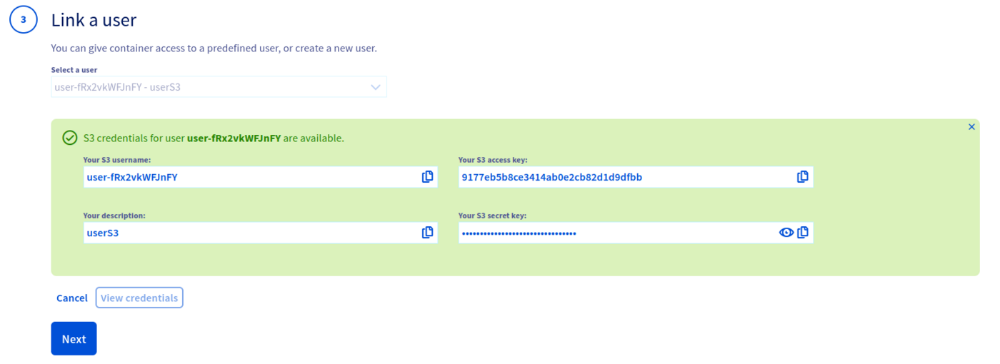

## Objective

**This guide aims to familiarise you with creating a bucket**

> [!primary]
>
> - If you are interested in storage class ***Standard object storage - SWIFT API***, please follow this [guide](/pages/storage_and_backup/object_storage/pcs_create_container)
> - If you are interested in storage class ***Cloud Archive - SWIFT API***, please follow this [guide](/pages/storage_and_backup/object_storage/pca_create_container).
>

## Requirements

- A [Public Cloud project](https://www.ovhcloud.com/es/public-cloud/) in your OVHcloud account
- Access to your [OVHcloud Control Panel](https://ca.ovh.com/auth/?action=gotomanager&from=https://www.ovh.com/world/&ovhSubsidiary=ws)

## Instructions

### Using the Control Panel

To create an Object Storage bucket, first log in to your [OVHcloud Control Panel](https://ca.ovh.com/auth/?action=gotomanager&from=https://www.ovh.com/world/&ovhSubsidiary=ws) and open your `Public Cloud`{.action} project. Click on `Object Storage`{.action} in the navigation bar on the left and then on the `My containers`{.action} tab.

Click `Create Object Container`{.action} and select your storage class:

Select a region:

> [!primary]
>
> Regions can vary depending on the storage class selected.
>

You must link a user to the bucket:

To do this, you can either link an existing S3 user:

You can view the user credentials by clicking on `View credentials`{.action}:

Or you can create a new S3 user:

The user credentials are then displayed:

Name your bucket:

Finally, decide whether or not you wish to encrypt your data using [SSE-S3 (server-side encryption with OVHcloud Managed Keys)](/pages/storage_and_backup/object_storage/s3_encrypt_your_objects_with_sse_c).

Congratulations, your bucket is created:

### Where to find the Endpoint URL of a bucket

Click on the name of your bucket to view its details and content:

## Go further

If you need training or technical assistance to implement our solutions, contact your sales representative or click on [this link](https://www.ovhcloud.com/es/professional-services/) to get a quote and ask our Professional Services experts for assisting you on your specific use case of your project.

Join our community of users on <https://community.ovh.com/en/>.
