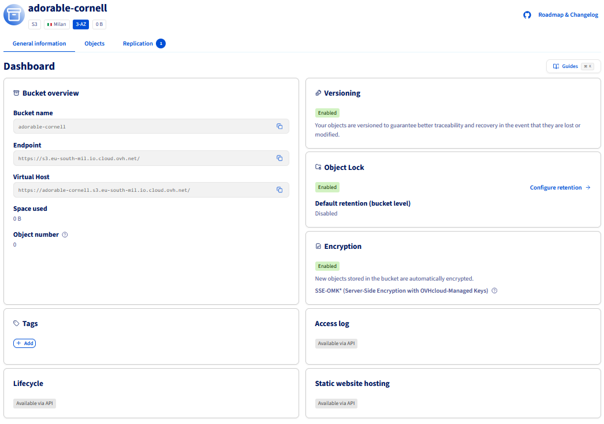
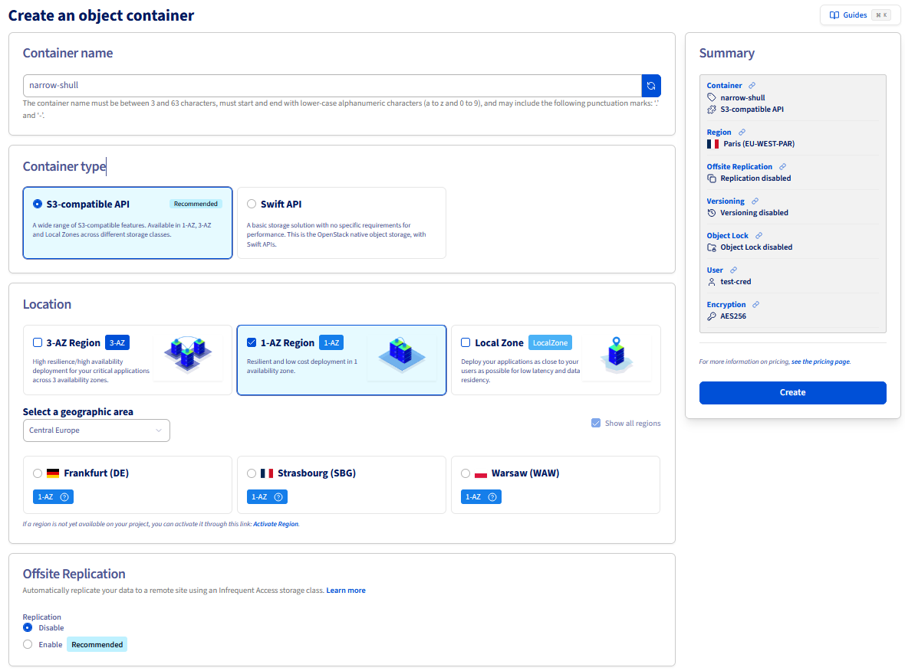
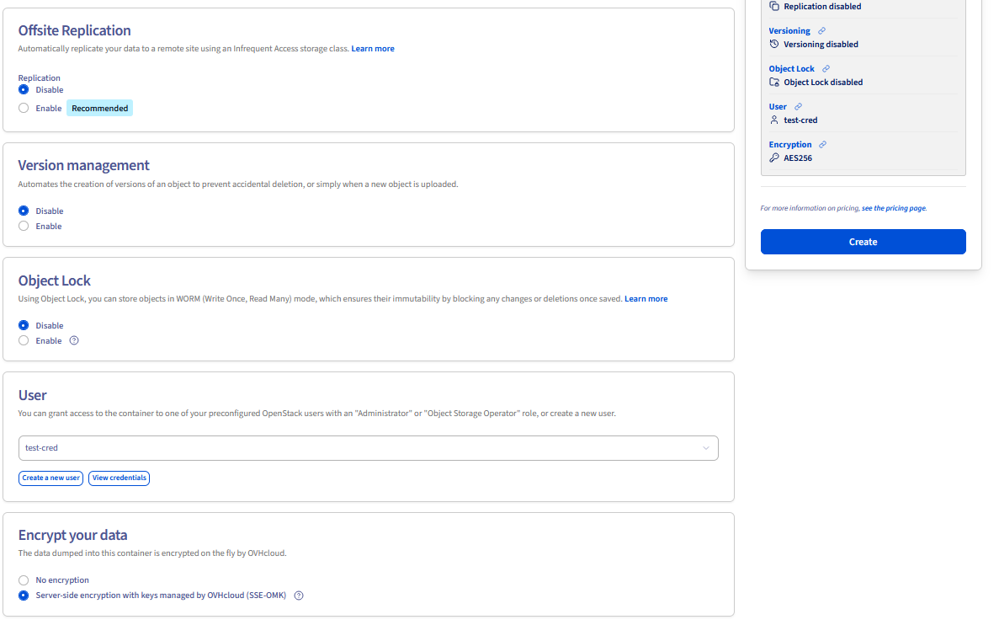

<style>
details>summary {
    color:rgb(33, 153, 232) !important;
    cursor: pointer;
}
details>summary::before {
    content:'\25B6';
    padding-right:1ch;
}
details[open]>summary::before {
    content:'\25BC';
}
</style>

## Objective

This guide helps you manage your buckets and objects.

**Learn how to create an Object Storage bucket and manage it.**

> [!primary]
>
> If you are using legacy Swift Object Storage, then:
>
> - for **Standard object storage - SWIFT API** storage class, see the [Standard object storage - SWIFT API](/pages/storage_and_backup/object_storage/pcs_create_container) guide.
> - for **Cloud Archive - SWIFT API** storage class, see the [Cloud Archive - SWIFT API](/pages/storage_and_backup/object_storage/pca_create_container) guide.
>
> For new projects, we highly recommend using our S3<sup>1</sup>-compatible Object Storage which benefits from our latest innovations and new features.
> 

## Requirements

- A [Public Cloud project](/pages/public_cloud/public_cloud_cross_functional/create_a_public_cloud_project) in your OVHcloud account
- An [Object Storage user](/pages/storage_and_backup/object_storage/s3_identity_and_access_management) already created

<!-- CP-NAV-START:publiccloud-projects -->
---

### OVHcloud Control Panel Access

- **Direct link:** [Public Cloud Projects](/links/control-panel/publiccloud-projects)
- **Navigation path:** `Public Cloud`{.action} > Select your project

---
<!-- CP-NAV-END:publiccloud-projects -->

## Instructions

> [!primary]
>
> If you wish to use the OVHcloud Terraform provider, you can see the [Terraform guide for Object Storage S3](/pages/storage_and_backup/object_storage/s3_terraform).
>

### Preparation

/// details | To use the AWS CLI

To install the AWS CLI in your environment, see [the official AWS documentation](https://docs.aws.amazon.com/cli/latest/userguide/getting-started-install.html#getting-started-install-instructions).

**Check installation**

```bash
aws --version
```

> [!primary]
>
> If you need more information about AWS CLI installation, read the [AWS documentation](https://docs.aws.amazon.com/cli/latest/userguide/getting-started-install.html).
>

#### Collect Credentials

- Retrieve your user's *Access key* and *Secret key*. You can access this information in the `Object Storage users`{.action} tab in your OVHcloud Control Panel.
- You will also need your *endpoint_url*. If you have already created your bucket, find this information in the `My containers`{.action} tab, then in the details of your bucket. If needed, see the [Object Storage - Endpoints and Object Storage geoavailability](/pages/storage_and_backup/object_storage/s3_location) guide.

#### Where to find the Endpoint URL of a bucket?

Click on the name of your bucket and view its details in the `General information`{.action} tab:

{.thumbnail}

#### Configuration

Use the interactive configuration to generate the configuration files, or create them manually.

> [!primary]
>
> To use the interactive configuration, run the following command:
> 
> `aws configure`
>
> or:
>
> `aws configure --profile <profile_name>`

The configuration file format in the AWS client is as follows:

```bash
cat ~/.aws/credentials
```

```text

[default]
aws_access_key_id = <access_key>
aws_secret_access_key = <secret_key>
```

```bash
cat ~/.aws/config
```

```text

[default]
region = <region_in_lowercase>
endpoint_url = <endpoint_url>
services = ovh-rbx-archive

[profile <profile_name>]
region = rbx
output = json
services = ovh-rbx

[services ovh-rbx-archive]
s3 =
  endpoint_url = https://s3.rbx-archive.io.cloud.ovh.net/
  signature_version = s3v4

s3api =
  endpoint_url = https://s3.rbx-archive.io.cloud.ovh.net/

[services ovh-rbx]
s3 =
  endpoint_url = https://s3.rbx.io.cloud.ovh.net/
  signature_version = s3v4

s3api =
  endpoint_url = https://s3.rbx.io.cloud.ovh.net/
```

Here are the configuration values you can set:

| Variable | Type | Value | Definition |
|------|:------|:------|:------|
| max_concurrent_requests | Integer | **Default:** 10 | The maximum number of simultaneous requests. |
| max_queue_size | Integer | **Default:** 1000 | The maximum number of tasks in the task queue. |
| multipart_threshold | Integer<br>String | **Default:** 8MB | The size threshold that the CLI uses for multipart transfers of individual files. |
| multipart_chunksize | Integer<br>String | **Default:** 8MB<br>**Minimum for uploads:** 5MB | When using multipart transfers, this is the byte size that the CLI uses for multipart transfers of individual files. |
| max_bandwidth | Integer | **Default:** None | The maximum bandwidth that will be used to load and download data to and from your buckets. |
| verify_ssl | Boolean | **Default:** true | Enable / Disable SSL certificate verification |

For a list of endpoints by region and storage class, see the [Object Storage - Endpoints and Object Storage geoavailability](/pages/storage_and_backup/object_storage/s3_location) guide.

#### Usage

> [!primary]
>
> If you have more than one profile, add `--profile <profile_name>` to the command line.
>

///

/// details | Using the OVHcloud Control Panel

To manage an Object Storage bucket, navigate to `Object Storage`{.action} in the left-hand menu.

///

#### Listing your buckets

> [!tabs]
> Via AWS CLI
>> /// details | **Via AWS s3**
>>
>> ```bash
>> aws s3 ls
>> ```
>>
>> ///
>>
>> /// details | **Via AWS S3api**
>>
>> ```bash
>> aws s3api list-buckets --query "Buckets[].Name" # Remove --query to display the full output.
>> ```
>>
>> ///
>>
> Via the OVHcloud Control Panel
>> Click on `Object Storage`{.action} in the navigation bar on the left and then on the `My containers`{.action} tab.
>>
> Via the OVHcloud CLI
>> Enter the following command:
>>
>> ```shell
>> ovhcloud cloud storage-s3 list
>> ```
>>

#### Create a bucket

> [!tabs]
> Via AWS CLI
>> /// details | **Via AWS s3**
>>
>> ```bash
>> aws s3 mb s3://<bucket_name>
>> aws --profile <profile_name> s3 mb s3://<bucket_name>
>> ```
>>
>> ///
>>
>> /// details | **Via AWS S3api**
>>
>> ```bash
>> aws s3api create-bucket --bucket <bucket_name>
>> aws --profile <profile_name> s3api create-bucket --bucket <bucket_name>
>> ```
>>
>> ///
>>
> Via the OVHcloud Control Panel
>> Click `Create Object Container`{.action}:
>>
>> {.thumbnail}
>>
>> You can enter the name of your bucket (optional) and then **select your offer**.
>>
>> **Select a deployment mode.**
>>
>> > [!primary]
>> >
>> > OVHcloud provides multiple deployment modes to meet different needs in terms of resilience, availability and performance. Each mode is optimized for specific use cases and offers varying levels of redundancy and fault tolerance.
>> >
>>
>> **Select a region.**
>>
>> > [!primary]
>> >
>> > Regions can vary depending on the chosen deployment mode.
>> >
>>
>> You can then set the configuration parameters for your bucket.
>>
>> {.thumbnail}
>>
>> > [!primary]
>> >
>> > If you have selected the 3AZ deployment mode, an additional option appears to **configure offsite replication**.
>> >
>>
>> At this stage, you can decide whether or not to enable **versioning**.
>>
>> Versioning allows you to keep multiple variants of an object in the same bucket. This feature helps **preserve, retrieve, and restore every version of every object stored in your buckets**, making it easier to recover from unintended user actions or application failures. By default, versioning is disabled on buckets; enable it explicitly if needed. For more information about versioning, see the [Object Storage - Getting Started with Versioning](/pages/storage_and_backup/object_storage/s3_versioning) guide.
>>
>> You can also enable [Object Lock](/pages/storage_and_backup/object_storage/s3_managing_object_lock) to store your objects in WORM (Write Once, Read Many) mode and guarantee their immutability for a defined retention period.
>>
>> > [!primary]
>> >
>> > **Note:** this option must be enabled when creating a bucket, it cannot be enabled later.
>> >
>>
>> You must link a user to the bucket.
>>
>> To do this, you can either:
>>
>> - Link an existing Object Storage user. To check the credentials, click on `View credentials`{.action}.
>> - Or create a new Object Storage user.
>>
>> You can now decide whether or not you wish to **encrypt your data** using [SSE-OMK (server-side encryption with OVHcloud Managed Keys)](/pages/storage_and_backup/object_storage/s3_encrypt_your_objects_with_sse_c).
>>
>> Once you have finished configuring your bucket, click `Create`{.action}.
>>
> Via the OVHcloud CLI
>> Enter the following command, replacing `<region>` with your region code (e.g. `GRA`, `BHS`) and `<bucket_name>` with the desired name:
>>
>> ```shell
>> ovhcloud cloud storage-s3 create <region> --name <bucket_name>
>> ```
>>
>> To create a bucket with versioning and encryption enabled:
>>
>> ```shell
>> ovhcloud cloud storage-s3 create <region> --name <bucket_name> --versioning-status enabled --encryption-sse-algorithm AES256
>> ```
>>
>> To create a bucket with Object Lock enabled:
>>
>> ```shell
>> ovhcloud cloud storage-s3 create <region> --name <bucket_name> --object-lock-status enabled --object-lock-rule-mode compliance --object-lock-rule-period P30D
>> ```
>>
>> > [!primary]
>> >
>> > The `--object-lock-status enabled` option must be set at bucket creation time; it cannot be enabled later.
>> >
>>

#### Uploading your files as objects in your bucket

When uploading objects, select a storage class to control availability, redundancy, and cost. To help you choose the right storage class for your needs, see the [Choosing the right storage class for your needs](/pages/storage_and_backup/object_storage/s3_choosing_the_right_storage_class_for_your_needs) guide.

> [!tabs]
> Via AWS CLI
>> **To upload an object:**
>>
>> /// details | **Via AWS s3**
>>
>>
>> ```bash
>> aws s3 cp /data/<object_name> s3://<bucket_name>
>> ```
>>
>> **By default, objects are named after files, but they can be renamed.**
>>
>> ```bash
>> aws s3 cp /data/<object_name> s3://<bucket_name>/other-filename
>> ```
>>
>> ///
>>
>> > [!primary]
>> >
>> > The `aws s3 cp` command will use STANDARD as default storage class for uploading objects.
>> > To store objects in the High Performance tier, use the `aws s3api put-object` command instead, as `aws s3 cp` does not support the EXPRESS_ONEZONE storage class which is used to map the High Performance storage tier.
>> > To learn more about the storage class mapping between OVHcloud storage tiers and AWS storage classes, you can check our documentation [here](/pages/storage_and_backup/object_storage/s3_location).
>> >
>>
>> /// details | **Via AWS s3api**
>>
>> ```bash
>> # upload an object to High Performance tier
>> aws s3api put-object --bucket <bucket_name> --key <object_name> --body /data/<object_name> --storage-class EXPRESS_ONEZONE
>>
>> # explicitly upload an object to Standard tier
>> aws s3api put-object --bucket <bucket_name> --key <object_name> --body /data/<object_name> --storage-class STANDARD
>> ```
>>
>> ///
>>
>> **By default, objects are named after files, but can be renamed.**
>>
>> ```bash
>> aws s3 cp /data/<object_name> s3://<bucket_name>/other-filename
>> ```
>>
> Via the OVHcloud Control Panel
>> Click on the `name of your container`{.action}, then click the `Add objects`{.action} button in the **Objects** tab.
>>
>> A window will appear where you can add a prefix to your object's name (the object name is the same as the file name). Select the file you are about to upload and click the `Import`{.action} button.
>>

#### Downloading an object from a bucket

> [!tabs]
> Via AWS CLI
>> /// details | **Via AWS s3**
>>
>> **Downloading an object from a bucket:**
>>
>> ```bash
>> aws s3 cp s3://<bucket_name>/<object_name> .
>> ```
>>
>> **Uploading an object from one bucket to another bucket:**
>>
>> ```bash
>> aws s3 cp s3://<bucket_name>/<object_name> s3://<bucket_name_2>/<object_name>
>> ```
>>
>> **Downloading or uploading an entire bucket to the host/bucket:**
>>
>> ```bash
>> aws s3 cp s3://<bucket_name> . --recursive
>> aws s3 cp s3://<bucket_name> s3://<bucket_name_2> --recursive
>> ```
>>
>> ///
>>
>> /// details | **Via AWS s3api**
>>
>> **Downloading an object from a bucket:**
>>
>> ```bash
>> aws s3api get-object --bucket <bucket_name> --key <object_name> <object_name>
>> ```
>>
>> **Uploading an object from one bucket to another bucket:**
>>
>> ```bash
>> aws s3api copy-object --bucket <bucket_name_2> --copy-source <bucket_name>/<object_name> --key <object_name>
>> ```
>>
>> ///
>>
> Via the OVHcloud Control Panel
>> Click on the download icon (down arrow in a blue base) on the object line.
>>

#### Synchronising buckets

> [!tabs]
> Via AWS CLI
>> ```bash
>> aws s3 sync . s3://<bucket_name> # Synchronising local directory to the S3 bucket
>> aws s3 sync s3://<bucket_name> . # Synchronising S3 bucket to the local directory
>> aws s3 sync s3://<bucket_name> s3://<bucket_name_2> # Synchronising an S3 bucket to another one
>> ```

#### Deleting objects and buckets

> [!primary]
>
> A bucket can only be deleted if it is empty.
>

> [!tabs]
> Via AWS CLI
>> /// details | **Via AWS s3**
>>
>> **Deleting objects and buckets:**
>>
>> ```bash
>> # Delete an object
>> aws s3 rm s3://<bucket_name>/<object_name>
>> # Removing all objects from a bucket
>> aws s3 rm s3://<bucket_name> --recursive
>> # Delete a bucket. To delete a bucket, it must be empty.
>> aws s3 rb s3://<bucket_name>
>> # If the bucket is not deleted, you can use the same command with the --force option.
>> # This command deletes all objects from the bucket, then deletes the bucket.
>> aws s3 rb s3://<bucket_name> --force
>> ```
>>
>> **Deleting objects and buckets with versioning enabled:**
>>
>> If versioning is enabled, a standard delete operation on your objects will not permanently remove them.
>>
>> In order to permanently delete an object, you must specify a version id:
>>
>> ```bash
>> aws s3api delete-object --bucket <NAME> --key <KEY> --version-id <VERSION_ID>
>> ```
>>
>> To list all objects and their version IDs, use the following command:
>>
>> ```bash
>> aws s3api list-object-versions --bucket <NAME>
>> ```
>>
>> With the above delete-object command, iterate over all your object versions. You can also use the following one-liner to empty your bucket:
>>
>> ```bash
>> aws s3api delete-objects --bucket <NAME> --delete "$(aws s3api list-object-versions --bucket <NAME> --query='{Objects: Versions[].{Key:Key,VersionId:VersionId}}')"
>> ```
>>
>> ///
>>
>> /// details | **Via AWS s3api**
>>
>> **Deleting objects and buckets**
>>
>> ```bash
>> # Delete an object
>> aws s3api delete-object --bucket <bucket_name> --key <object_name>
>> # Removing all objects from a bucket
>> aws s3api delete-objects --bucket <bucket_name> --delete "$(aws s3api list-objects-v2 --bucket <bucket_name> --query='{Objects: Contents[].{Key:Key}}')"
>> # Delete a bucket. To delete a bucket, it must be empty.
>> aws s3api delete-bucket --bucket <bucket_name>
>> ```
>>
>> **Deleting objects and buckets with versioning enabled**
>>
>> If versioning is enabled, a standard delete operation on your objects will not permanently delete them.
>>
>> To permanently delete an object, you need to specify a version identifier:
>>
>> ```bash
>> aws s3api delete-objects --bucket <bucket_name> --delete "$(aws s3api list-object-versions --bucket <bucket_name> --query='{Objects: Versions[].{Key:Key,VersionId:VersionId}}')"
>> ```
>>
>> ///
>>
>> > [!primary]
>> >
>> > If your bucket has Object Lock enabled, you will not be able to permanently delete your objects. See our [documentation](/pages/storage_and_backup/object_storage/s3_managing_object_lock) to learn more about Object Lock.
>> > If you use Object Lock in GOVERNANCE mode and have the permission to bypass GOVERNANCE mode, you will have to add the `--bypass-governance-retention` option to your delete commands.
>> >
>>
> Via the OVHcloud Control Panel
>> **Deleting a bucket**
>>
>> In the list of Object Storage containers, click the `...`{.action} button on the container line, then click `Delete`{.action}.
>>
>> Enter `TERMINATE` to confirm your choice and click `Confirm`{.action}.
>>
>> **Deleting objects**
>>
>> Go to the bucket and open the `Objects`{.action} tab.
>>
>> Click the delete icon (trash can) on the object line, type `PERMANENTLY DELETE`to confirm permanent deletion, then click `Delete`{.action}.
>>
> Via the OVHcloud CLI
>> **Deleting objects**
>>
>> ```shell
>> # Delete an object
>> ovhcloud cloud storage-s3 object delete <bucket_name> <object_name>
>>
>> # Delete all objects in a bucket
>> ovhcloud cloud storage-s3 bulk-delete <bucket_name> --all
>>
>> # Delete objects matching a prefix
>> ovhcloud cloud storage-s3 bulk-delete <bucket_name> --prefix <prefix>
>>
>> # Delete specific objects
>> ovhcloud cloud storage-s3 bulk-delete <bucket_name> --objects "file1.txt,file2.txt"
>> ```
>>
>> **Deleting a bucket**
>>
>> The bucket must be empty before deletion.
>>
>> ```shell
>> ovhcloud cloud storage-s3 delete <bucket_name>
>> ```
>>
>> **Deleting objects with versioning enabled**
>>
>> If versioning is enabled, specify the version ID to permanently delete an object:
>>
>> ```shell
>> ovhcloud cloud storage-s3 object version delete <bucket_name> <object_name> <version_id>
>> ```
>>
>> To delete all versions of an object, combine the version list and deletion:
>>
>> ```shell
>> ovhcloud cloud storage-s3 bulk-delete <bucket_name> --objects "myfile.txt:<version_id_1>,myfile.txt:<version_id_2>"
>> ```
>>

#### Manage tags

> [!tabs]
> Via AWS CLI
>> **Setting tags on a bucket:**
>>
>> ```bash
>> aws s3api put-bucket-tagging --bucket <bucket_name> --tagging 'TagSet=[{Key=myKey,Value=myKeyValue}]'
>> aws s3api get-bucket-tagging --bucket <bucket_name>
>> ```
>>
>> ```json
>> {
>>   "TagSet": [
>>     {
>>     "Value": "myKeyValue",
>>     "Key": "myKey"
>>     }
>>   ]
>> }
>> ```
>>
>> **Deleting tags on a bucket:**
>>
>> ```bash
>> aws s3api delete-bucket-tagging --bucket <bucket_name>
>> ```
>>
>> **Setting tags on an object:**
>>
>> ```bash
>> aws s3api put-object-tagging --bucket <bucket_name> --key <object_name> --tagging 'TagSet=[{Key=myKey,Value=myKeyValue}]'
>> aws s3api get-bucket-tagging --bucket <bucket_name>
>> ```
>>
>> ```json
>> {
>>   "TagSet": [
>>     {
>>     "Value": "myKeyValue",
>>     "Key": "myKey"
>>     }
>>   ]
>> }
>> ```
>>
>> **Deleting tags on an object:**
>>
>> ```bash
>> aws s3api delete-object-tagging --bucket <bucket_name> --key <object_name>
>> ```
>
> Via the OVHcloud CLI
>> The OVHcloud CLI lets you set tags on a bucket at **creation** time or when **editing** it via the `--tag key=value` option (repeatable for multiple tags). Individual tag management (reading, deleting) is not available via the CLI.
>>
>> **Setting tags when creating a bucket**
>>
>> ```shell
>> ovhcloud cloud storage-s3 create <region> --name <bucket_name> --tag myKey=myKeyValue --tag otherKey=otherValue
>> ```
>>
>> **Updating tags on an existing bucket**
>>
>> ```shell
>> ovhcloud cloud storage-s3 edit <bucket_name> --tag myKey=myKeyValue
>> ```

## Go further

If you need training or technical assistance to implement our solutions, contact your sales representative or click on [this link](/links/professional-services) to get a quote and ask our Professional Services experts for assisting you on your specific use case of your project.

Join our [community of users](/links/community).

<sup>1</sup>: S3 is a trademark of Amazon Technologies, Inc. OVHcloud’s service is not sponsored by, endorsed by, or otherwise affiliated with Amazon Technologies, Inc.