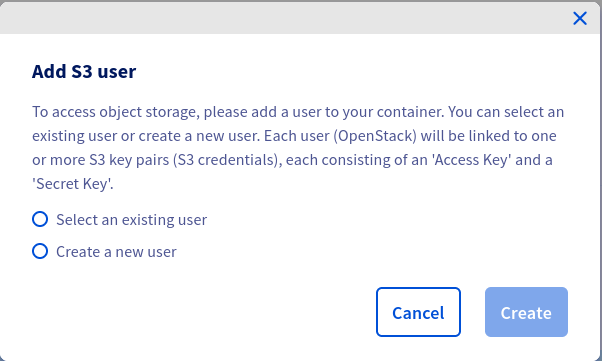
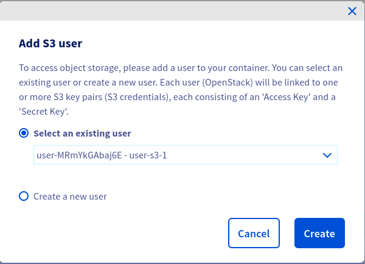
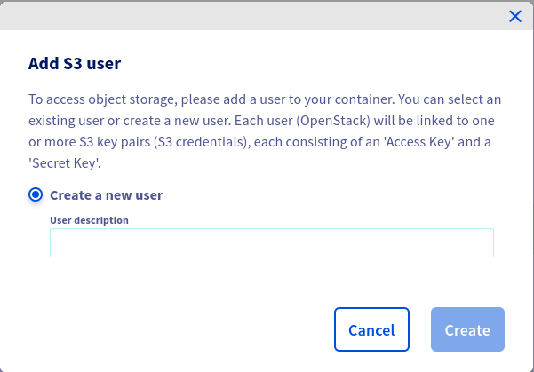
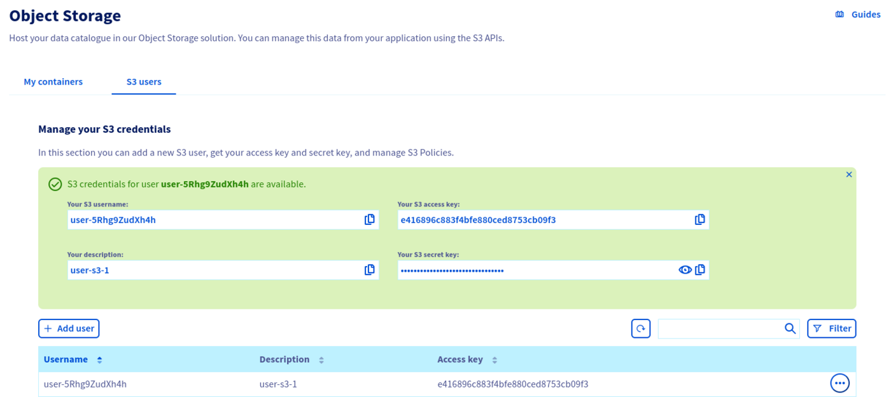
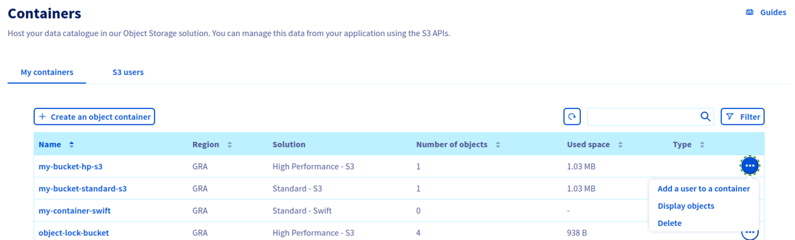
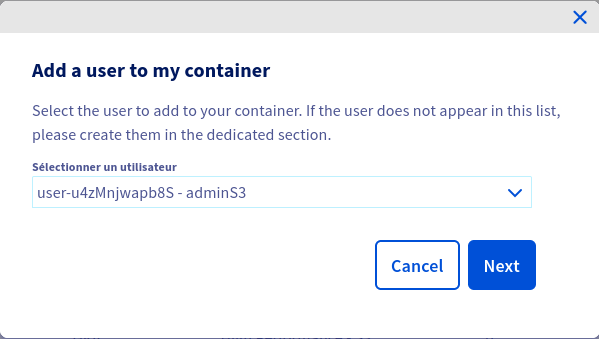
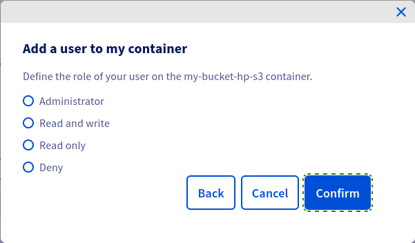
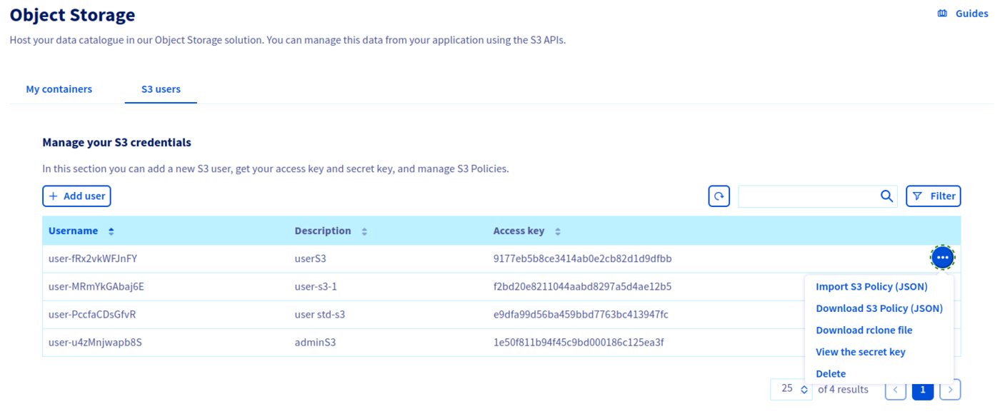

## Objective

This guide explains how to manage identities and access to your Object Storage resources.

## Requirements

- A [Public Cloud project](/links/public-cloud/public-cloud) in your OVHcloud account

<!-- CP-NAV-START:publiccloud-projects -->
---

### OVHcloud Control Panel Access

- **Direct link:** [Public Cloud Projects](/links/control-panel/publiccloud-projects)
- **Navigation path:** `Public Cloud`{.action} > Select your project

---
<!-- CP-NAV-END:publiccloud-projects -->

## Instructions

Click on `Object Storage`{.action} in the left-hand menu.

### Creating a user

Click `Create User`{.action}.

If you already have OpenStack users, you can select one of these:

{.thumbnail}

then

{.thumbnail}

> [!primary]
>
> If you choose to select an existing user, ensure that the user has an `ObjectStore operator` or `Administrator` role.
>

Otherwise, create a new user:

{.thumbnail}

Once your user has been created, you will see the credentials:

{.thumbnail}

> [!primary]
>
> By clicking on the `...`{.action} at the end of a user's line, you can, among other things, download the rclone configuration file, see the user's secret key, delete the user.
>

### Manage access to a bucket via a profile

You can define access to your buckets via predefined profiles.

Click on the `...`{.action} at the end of your bucket line, then `Add a user to a container`{.action}.

{.thumbnail}

Select the user to add to your bucket and click `Next`{.action}.

{.thumbnail}

Set access to your bucket for this user and click on `Confirm`{.action}.

{.thumbnail}

### Advanced resource access management

#### Overview

By default, all resources (buckets, objects) and sub-resources (lifecycle configuration, website configuration, etc.) are private in Object Storage. Only the resource owner, i.e., the user account that creates it, has full control.

Access to private resources can be granted via access policies. Access policies can be categorized broadly into two types:

- user-based: access policies attached to a specific user are called user policies. A user policy is evaluated using Object Storage IAM permissions and applies only to the specific user it is attached to.
- resource-based: bucket policies and ACLs are policies that are attached directly to specific resources.

> [!primary]
>
> Bucket policies are a feature that is not yet available for Object Storage. This article is about user policies.
>

You can refine your permissions by importing a JSON configuration file. To do this, go to the `Object Storage Policy Users`{.action} tab.

{.thumbnail}

Click on the `...`{.action} at the end of your user's line, then `Import JSON file`{.action}.

> [!primary]
>
> If you want to change a user's rights, you may need to download the JSON configuration file in advance by selecting `Download JSON File`{.action}.
> 

#### Understanding the user policy evaluation process

At the moment, user permissions are evaluated as follows:

1. if exists, evaluate user policy else fallback to ACLs
    1. check for an explicit deny: if there is an explicit deny, then deny permission, else, check for an explicit allow
    2. check for an explicit allow: if there is an explicit allow, then allow permission
    3. if there is no explicit deny nor explicit allow, then fallback to ACLs
2. fallback to ACLs

> [!primary]
>
> This evaluation process will be subject to change with the upcoming implementation of bucket policies.
>

#### Some examples of JSON configuration files:

**Read/write access to a bucket and its objects**

```json
{
  "Statement":[{
    "Sid": "RWContainer",
    "Effect": "Allow",
    "Action":["s3:GetObject", "s3:PutObject", "s3:DeleteObject", "s3:ListBucket", "s3:ListMultipartUploadParts", "s3:ListBucketMultipartUploads", "s3:AbortMultipartUpload", "s3:GetBucketLocation"],
    "Resource":["arn:aws:s3:::<bucket_name>", "arn:aws:s3:::<bucket_name>/*"]
  }]
}
```

**Read-only access to a bucket and its objects**

```json
{
  "Statement":[{
    "Sid": "ROContainer",
    "Effect": "Allow",
    "Action":["s3:GetObject", "s3:ListBucket", "s3:ListMultipartUploadParts", "s3:ListBucketMultipartUploads"],
    "Resource":["arn:aws:s3:::<bucket_name>", "arn:aws:s3:::<bucket_name>/*"]
  }]
}
```

**Deny listing of all buckets owned by the parent account**

> [!primary]
>
> The (`s3:ListAllMyBuckets`) action is allowed by default for a given user. Add the `Deny` effect if you want to explicitly refuse the use of the `ListBuckets` API operation.
>  

```json
{
  "Statement":[{
    "Sid": "DenyListBucket",
    "Effect": "Deny",
    "Action":["s3:ListAllMyBuckets"],
    "Resource":["*"]
  }]
}
```

**Allow all operations on all project resources**

```json
{
  "Statement":[{
    "Sid": "FullAccess",
    "Effect": "Allow",
    "Action":["s3:*"],
    "Resource":["*"]
  }]
}
```

**Read/write access to all objects in a specific folder (`/home/user2`) in a specific bucket (`<bucket_name>`)**

```json
{
  "Statement":[{
    "Sid": "RWContainer",
    "Effect": "Allow",
    "Action":["s3:GetObject", "s3:PutObject", "s3:DeleteObject", "s3:ListBucket", "s3:ListMultipartUploadParts", "s3:ListBucketMultipartUploads", "s3:AbortMultipartUpload", "s3:GetBucketLocation"],
    "Resource":["arn:aws:s3:::<bucket_name>", "arn:aws:s3:::<bucket_name>/home/user2/*"]
  }]
}
```

**Allow all operations to specific IPs by whitelisting authorized IPs**

```json
{
  "Statement": [{
    "Sid": "ExampleStatement01",
    "Effect": "Allow",
    "Action": "s3:*",
    "Resource": [
      "arn:aws:s3:::<bucket_name>",
      "arn:aws:s3:::<bucket_name>/*"
    ],
    "Condition": {
      "IpAddress": {
        "aws:SourceIp": "10.0.0.5/16"
      }
    }
  }]
} 
```

> [!primary]
>
> As a consequence of the current authorization process, **implicit** deny is **not** supported by OVHcloud Object Storage if the user is the bucket owner i.e., since ACLs are evaluated by default and since the bucket owner has FULL_CONTROL ACL, if the user is the bucket owner and even if there is no explicit allow in the policy file, the user will be authorized.
> 

The following policy to attempt to allow read access to objects only to specific IPs will **not** work under current conditions if attached to the **bucket owner** i.e., even if the bucket owner makes requests from IPs that are **not** in the specified range, the bucket owner will be **authorized**.

```json
{
  "Statement": [{
    "Sid": "ExampleStatement01",
    "Effect": "Allow",
    "Action": [
      "s3:GetObject",
      "s3:ListBucket",
      "s3:ListBucketVersions"
    ],
    "Resource": [
      "arn:aws:s3:::<bucket_name>/*"
    ],
    "Condition": {
      "IpAddress": {
        "aws:SourceIp": "10.0.0.5/16"
      }
    }
  }]
}
```

The following policy to attempt to deny read access to objects to specific IPs by blacklisting unauthorized IPs will **not** work under current conditions if attached to the **bucket owner** because there is no explicit deny and requests from the specified IPs will not match the allow, therefore, we fall back to the ACLs.

```json
{
  "Statement": [{
    "Sid": "ExampleStatement01",
    "Effect": "Allow",
    "Action": [
      "s3:GetObject",
      "s3:ListBucket",
      "s3:ListBucketVersions"
    ],
    "Resource": [
      "arn:aws:s3:::<bucket_name>/*"
    ],
    "Condition": {
      "NotIpAddress": {
        "aws:SourceIp": "10.0.0.5/16"
      }
    }
  }]
}
```

### List of supported actions

| Action | Scope |
|------|:------|
| s3:AbortMultipartUpload | Object |
| s3:BypassGovernanceRetention | Object |
| s3:CreateBucket | Bucket |
| s3:DeleteBucket | Bucket |
| s3:DeleteObject | Object |
| s3:DeleteBucketTagging | Bucket |
| s3:DeleteBucketWebsite | Bucket |
| s3:DeleteObject | Object |
| s3:DeleteObjectTagging | Object |
| s3:GetBucketAcl | Bucket |
| s3:GetBucketCORS | Bucket |
| s3:GetBucketLocation | Bucket |
| s3:GetBucketLogging" | Bucket |
| s3:GetBucketObjectLockConfiguration | Bucket |
| s3:GetBucketTagging | Bucket |
| s3:GetBucketVersioning | Bucket |
| s3:GetBucketWebsite | Bucket |
| s3:GetEncryptionConfiguration | Bucket |
| s3:GetIntelligentTieringConfiguration | Bucket |
| s3:GetLifecycleConfiguration | Bucket |
| s3:GetObject | Object |
| s3:GetObjectAcl | Object |
| s3:GetObjectLegalHold | Object |
| s3:GetObjectRetention | Object |
| s3:GetObjectTagging | Object |
| s3:GetReplicationConfiguration | Bucket |
| s3:ListAllMyBuckets | Bucket |
| s3:ListBucket | Bucket |
| s3:ListBucketMultipartUploads | Bucket |
| s3:ListMultipartUploadParts | Object |
| s3:ListBucketMultipartUploads | Bucket |
| s3:ListBucketVersions | Bucket |
| s3:ListMultipartUploadParts | Object |
| s3:PutBucketAcl | Bucket |
| s3:PutBucketCORS | Bucket |
| s3:PutBucketLogging | Bucket |
| s3:PutBucketObjectLockConfiguration | Bucket |
| s3:PutBucketTagging | Bucket |
| s3:PutBucketVersioning | Bucket |
| s3:PutBucketWebsite | Bucket |
| s3:PutEncryptionConfiguration | Bucket |
| s3:PutIntelligentTieringConfiguration | Bucket |
| s3:PutLifecycleConfiguration | Bucket |
| s3:PutObject | Object |
| s3:PutObjectAcl | Object |
| s3:PutObjectLegalHold | Object |
| s3:PutObjectRetention | Object |
| s3:PutObjectTagging | Object |
| s3:PutReplicationConfiguration | Object |
  

## Go further

If you need training or technical assistance to implement our solutions, contact your sales representative or click on [this link](/links/professional-services) to get a quote and ask our Professional Services experts for assisting you on your specific use case of your project.

Join our [community of users](/links/community).

