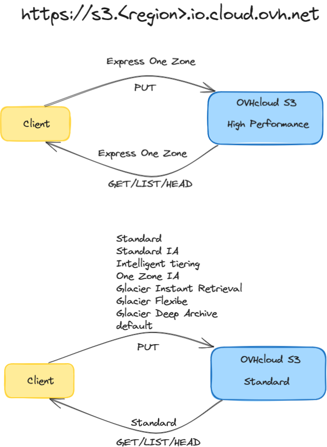
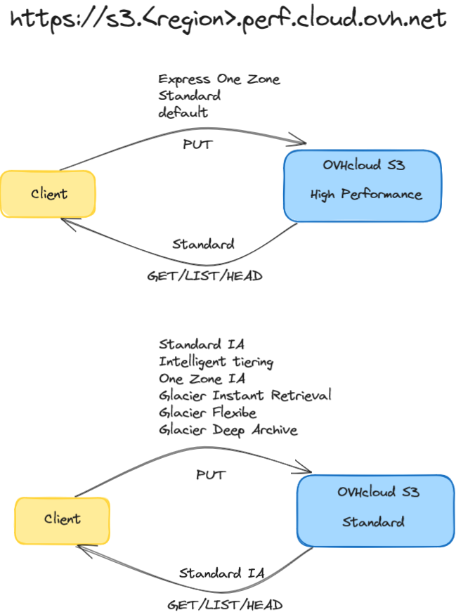

We have designed the S3 storage classes to be **compatible with the S3 API**, considered as a benchmark in the object storage market. You can therefore use Object Storage with most data management tools via the endpoints defined by region and not storage class.

## Object Storage S3

OVHcloud Object Storage S3 can be accessed through a unique endpoint: `https://s3.<region>.io.cloud.ovh.net`. This unique endpoint can address all buckets and all objects in both Standard and High Performance storage classes. All S3 API operations are supported with this unique endpoint.

### List of available regions

<table>
    <tr>
        <th>Geographic zone</th>
        <th>Region name</th>
        <th>Region <b><i>To be entered in lower case</i></b></th>
        <th>Protocol</th>
        <th>Signature version</th>
    </tr>
    <tr>
        <td rowspan=6>Europe</td>
        <td>Gravelines</td>
        <td>gra</td>
        <td>HTTPS</td>
        <td>4</td>
    </tr>
    <tr>
        <td>Roubaix</td>
        <td>rbx</td>
        <td>HTTPS</td>
        <td>4</td>
    </tr>
    <tr>
        <td>Strasbourg</td>
        <td>sbg</td>
        <td>HTTPS</td>
        <td>4</td>
    </tr>
    <tr>
        <td>Frankfurt</td>
        <td>de</td>
        <td>HTTPS</td>
        <td>4</td>
    </tr>
    <tr>
        <td>London</td>
        <td>uk</td>
        <td>HTTPS</td>
        <td>4</td>
    </tr>
    <tr>
        <td>Warsaw</td>
        <td>waw</td>
        <td>HTTPS</td>
        <td>4</td>
    </tr>
    <tr>
        <td rowspan=2>North America (excluding USA)</td>
        <td>Beauharnois</td>
        <td>bhs</td>
        <td>HTTPS</td>
        <td>4</td>
    </tr>
    <tr>
        <td>Toronto</td>
        <td>ca-east-tor</td>
        <td>HTTPS</td>
        <td>4</td>
    </tr>
    <tr>
        <td>Asia-Pacific</td>
        <td>Singapore</td>
        <td>sgp</td>
        <td>HTTPS</td>
        <td>4</td>
    </tr>
</table>

The bucket endpoint is a URL, for example `https://my-bucket.s3.gra.io.cloud.ovh.net` that represents a virtual host style endpoint.

### Mapping from AWS S3 Storage tiers to OVHcloud Storage tiers

The mapping for **WRITE(PUT)** operations on the **io** endpoint is the following:

<table>
    <tr>
        <th>AWS</th>
        <th>OVHcloud mapping before 2024-06-17</th>
        <th>OVHcloud mapping from 2024-06-17</th>
    </tr>
    <tr>
        <td>Express One Zone</td> 
        <td rowspan=9>Standard</td>
        <td>High Performance</td>
    </tr>
    <tr>
        <td>Standard</td>
        <td rowspan=8>Standard</td>
    </tr>
    <tr>
        <td>default*</td>
    </tr>
    <tr>
         <td>Standard IA</td>     
    </tr>
    <tr>
        <td>Intelligent Tiering</td>
    </tr>
    <tr>
        <td>One Zone IA</td>
    </tr>
    <tr>
        <td>Glacier Instant Retrieval</td>
    </tr>
    <tr>
        <td>Glacier Flexible</td>
    </tr>
    <tr>
        <td>Glacier Deep Archive</td>
    </tr>
</table>

_* The default storage class on the **io** endpoint will be Standard, i.e. if you don't specify a storage class, your object will be stored in our Standard tier._

The mapping for **READ(GET/LIST/HEAD)** operations on the **io** endpoint is the following:

<table>
    <tr>
        <th>AWS</th>
        <th>OVHcloud mapping from 2024-06-17</th>
    </tr>
    <tr>
        <td>Express One Zone</td> 
        <td>High Performance</td>
    </tr>
    <tr>
        <td>Standard</td>
        <td>Standard</td>
    </tr>
</table>

> [!warning]
> Unlike AWS, Express One Zone will be treated as a regular storage class by OVHcloud and all S3 features and API operations will be available.

> [!warning]
> - The storage class will no longer be defined at the bucket creation level, but at individual object upload level.
> - The **perf** endpoint will be maintained for backward compatibility purposes only, to allow tools that don't support AWS's recent Express_One_Zone storage class to continue operating on our object storage thus we strongly encourage you to migrate to the target **io** endpoint wherever possible.

### Endpoint retrocompatibility

Although the **io** endpoint is be the preferred endpoint to access the OVHcloud Object Storage service, the **legacy** endpoint `https://s3.<region>.perf.cloud.ovh.net` will still be maintained for retrocompatibility purposes for tools and applications that do not support the latest AWS Express One Zone storage class. This legacy endpoint will also be able to address all buckets and all objects in both Standard and High Performance storage classes and will support all S3 API operations including `listBucket`.

The mapping for **WRITE(PUT)** operations on the **perf** endpoint is the following:

<table>
    <tr>
        <th>AWS</th>
        <th>OVHcloud mapping before 2024-06-17</th>
        <th>OVHcloud mapping from 2024-06-17</th>
    </tr>
    <tr>
        <td>Express One Zone</td> 
        <td rowspan=9>High Performance</td>
        <td rowspan=3>High Performance</td>
    </tr>
    <tr>
        <td>Standard</td>
    </tr>
    <tr>
        <td>default*</td>
    </tr>
    <tr>
         <td>Standard IA</td>
        <td rowspan=6>Standard</td>
    </tr>
    <tr>
        <td>Intelligent Tiering</td>
    </tr>
    <tr>
        <td>One Zone IA</td>
    </tr>
    <tr>
        <td>Glacier Instant Retrieval</td>
    </tr>
    <tr>
        <td>Glacier Flexible</td>
    </tr>
    <tr>
        <td>Glacier Deep Archive</td>
    </tr>
</table>

_* The default storage tier on the **perf** endpoint will be High Performance, i.e. if you don't specify a storage class, your object will be stored in our High Performance tier._

The mapping for **READ(GET/LIST/HEAD)** operations on the **perf** endpoint is the following:

<table>
    <tr>
        <th>AWS</th>
        <th>OVHcloud mapping from 2024-06-10</th>
    </tr>
    <tr>
        <td>Standard</td> 
        <td>High Performance</td>
    </tr>
    <tr>
        <td>Standard IA</td>
        <td>Standard</td>
    </tr>
</table>

## Object Storage Swift

| Storage solution | endpoint URL | Region available <b><i>To be entered in lower case</i></b> |
| ------ | ------ | ------ |
| Object Storage SWIFT - Standard - Legacy |`https://s3.<region>.cloud.ovh.net` | Strasbourg: sbg London: uk Frankfurt: de Warsaw: waw Beauharnois: bhs Gravelines: gra |

## Go further

If you need training or technical assistance to implement our solutions, contact your sales representative or click on [this link](/links/professional-services) to get a quote and ask our Professional Services experts for assisting you on your specific use case of your project.

Join our community of users on <https://community.ovh.com/en/>.
