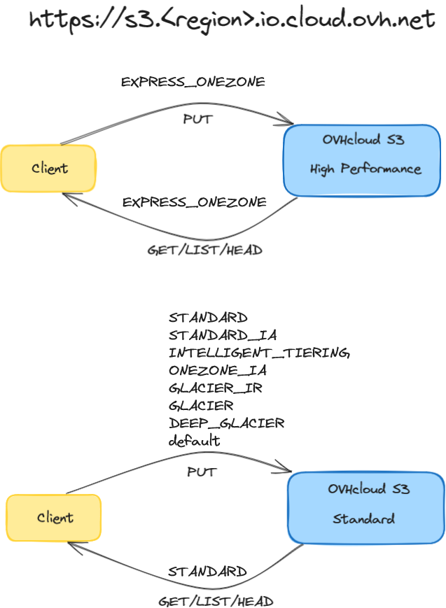
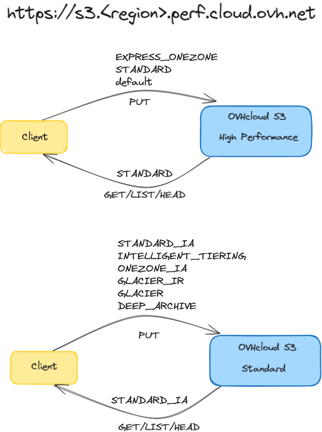

Nous avons conçu les classes de stockage S3 pour qu’elles soient **compatibles avec l’API S3**, considérée comme une référence sur le marché du stockage objet. Vous pouvez donc utiliser l'Object Storage avec la plupart des outils de gestion de données via les points de terminaison définis par région et non par classe de stockage.

## Object Storage S3

OVHcloud Object Storage S3 est accessible via un point de terminaison unique : `https://s3.<region>.io.cloud.ovh.net`. Ce point de terminaison unique peut traiter tous les buckets et tous les objets dans les classes de stockage Standard et High Performance. Toutes les opérations de l'API S3 sont prises en charge avec ce point de terminaison unique.

### Liste des régions disponibles

<table>
    <tr>
        <th>Zone géographique</th>
        <th>Nom de la région</th>
        <th>Région <b><i>A saisir en minuscules</i></b></th>
        <th>Protocole</th>
        <th>Version de la signature</th>
    </tr>
    <tr>
        <td rowspan=6>Europe</td>
        <td>Gravelines</td>
        <td>gra</td>
        <td>HTTPS</td>
        <td>4</td>
    </tr>
    <tr>
        <td>Roubaix</td>
        <td>rbx</td>
        <td>HTTPS</td>
        <td>4</td>
    </tr>
    <tr>
        <td>Strasbourg</td>
        <td>sbg</td>
        <td>HTTPS</td>
        <td>4</td>
    </tr>
    <tr>
        <td>Francfort</td>
        <td>de</td>
        <td>HTTPS</td>
        <td>4</td>
    </tr>
    <tr>
        <td>Londres</td>
        <td>uk</td>
        <td>HTTPS</td>
        <td>4</td>
    </tr>
    <tr>
        <td>Varsovie</td>
        <td>waw</td>
        <td>HTTPS</td>
        <td>4</td>
    </tr>
    <tr>
        <td rowspan=2>Amerique du nord (hors USA)</td>
        <td>Beauharnois</td>
        <td>bhs</td>
        <td>HTTPS</td>
        <td>4</td>
    </tr>
    <tr>
        <td>Toronto</td>
        <td>ca-east-tor</td>
        <td>HTTPS</td>
        <td>4</td>
    </tr>
    <tr>
        <td>Asie-Pacifique</td>
        <td>Singapour</td>
        <td>sgp</td>
        <td>HTTPS</td>
        <td>4</td>
    </tr>
</table>

Le point de terminaison de bucket est une URL, par exemple `https://my-bucket.s3.gra.io.cloud.ovh.net` qui représente un point de terminaison de style hôte virtuel.

### Mapping des niveaux de stockage AWS S3 vers les niveaux de stockage OVHcloud

Le mapping des opérations **WRITE(PUT)** sur le point de terminaison **io** est le suivant :

<table>
    <tr>
        <th>AWS</th>
        <th>Mapping OVHcloud avant le 17/06/2024</th>
        <th>Mapping OVHcloud à partir du 17/06/2024</th>
    </tr>
    <tr>
        <td>EXPRESS_ONEZONE</td> 
        <td rowspan=9>Standard</td>
        <td>High Performance</td>
    </tr>
    <tr>
        <td>STANDARD</td>
        <td rowspan=8>Standard</td>
    </tr>
    <tr>
        <td>Par défaut *</td>
    </tr>
    <tr>
         <td>STANDARD_IA</td>     
    </tr>
    <tr>
        <td>INTELLIGENT_TIERING</td>
    </tr>
    <tr>
        <td>ONEZONE_IA</td>
    </tr>
    <tr>
        <td>GLACIER_IR</td>
    </tr>
    <tr>
        <td>GLACIER</td>
    </tr>
    <tr>
        <td>DEEP_ARCHIVE</td>
    </tr>
</table>

_* La classe de stockage par défaut sur le point de terminaison **io** sera Standard, c'est-à-dire que si vous ne spécifiez pas de classe de stockage, votre objet sera stocké dans notre niveau Standard._

Le mapping des opérations **READ(GET/LIST/HEAD)** sur le point de terminaison **io** est le suivant :

<table>
    <tr>
        <th>AWS</th>
        <th>Mapping OVHcloud à partir du 17/06/2024</th>
    </tr>
    <tr>
        <td>EXPRESS_ONEZONE</td> 
        <td>High Performance</td>
    </tr>
    <tr>
        <td>STANDARD</td>
        <td>Standard</td>
    </tr>
</table>

> [!warning]
> Contrairement à AWS, Express One Zone sera traité comme une classe de stockage régulière par OVHcloud et toutes les fonctionnalités S3 et les opérations d'API seront disponibles.

> [!warning]
> - La classe de stockage ne sera plus définie au niveau de la création du bucket, mais au niveau de l'upload d'objets individuels.
> - Le point de terminaison **perf** sera maintenu à des fins de rétrocompatibilité uniquement, afin de permettre aux outils qui ne prennent pas en charge la récente classe de stockage Express_One_Zone d'AWS de continuer à fonctionner sur notre object storage. Nous vous encourageons donc fortement à migrer vers le point de terminaison **io** cible chaque fois que cela est possible.

### Rétrocompatibilité des points de terminaison

Bien que le point de terminaison **io** soit le point de terminaison préféré pour accéder au service OVHcloud Object Storage, le point de terminaison **historique** `https://s3.<region>.perf.cloud.ovh.net` sera toujours maintenu à des fins de rétrocompatibilité pour les outils et les applications qui ne prennent pas en charge la dernière classe de stockage AWS Express One Zone. Ce point de terminaison historique sera également en mesure de prendre en charge tous les buckets et tous les objets dans les classes de stockage Standard et High Performance et prendra en charge toutes les opérations d'API S3, y compris `listBucket`.

Le mapping des opérations **WRITE(PUT)** sur le point de terminaison **perf** est le suivant :

<table>
    <tr>
        <th>AWS</th>
        <th>Mapping OVHcloud avant le 17/06/2024</th>
        <th>Mapping OVHcloud à partir du 17/06/2024</th>
    </tr>
    <tr>
        <td>EXPRESS_ONEZONE</td> 
        <td rowspan=9>High Performance</td>
        <td rowspan=3>High Performance</td>
    </tr>
    <tr>
        <td>STANDARD</td>
    </tr>
    <tr>
        <td>Par défaut *</td>
    </tr>
    <tr>
         <td>STANDARD_IA</td>
        <td rowspan=6>Standard</td>
    </tr>
    <tr>
        <td>INTELLIGENT_TIERING</td>
    </tr>
    <tr>
        <td>ONEZONE_IA</td>
    </tr>
    <tr>
        <td>GLACIER_IR</td>
    </tr>
    <tr>
        <td>GLACIER</td>
    </tr>
    <tr>
        <td>DEEP_ARCHIVE</td>
    </tr>
</table>

_* Le niveau de stockage par défaut sur le point de terminaison **perf** sera High Performance, c'est-à-dire que si vous ne spécifiez pas de classe de stockage, votre objet sera stocké dans notre niveau High Performance._

Le mapping des opérations **READ(GET/LIST/HEAD)** sur le point de terminaison **perf** est le suivant :

<table>
    <tr>
        <th>AWS</th>
        <th>Mapping OVHcloud à partir du 10/06/2024</th>
    </tr>
    <tr>
        <td>STANDARD</td> 
        <td>High Performance</td>
    </tr>
    <tr>
        <td>STANDARD_IA</td>
        <td>Standard</td>
    </tr>
</table>

## Object Storage Swift

| Solution de stockage | URL du point de terminaison | Région disponible <b><i>À saisir en minuscules</i></b> |
| ----- | ----- | ----- |
| Object Storage SWIFT - Standard - Legacy |`https://s3.<region>.cloud.ovh.net` | Strasbourg : sbg Londres : uk Francfort : de Varsovie : waw Beauharnois : bhs Gravelines : gra |

## Aller plus loin

Si vous avez besoin d'une formation ou d'une assistance technique pour la mise en oeuvre de nos solutions, contactez votre commercial ou cliquez sur [ce lien](/links/professional-services) pour obtenir un devis et demander une analyse personnalisée de votre projet à nos experts de l’équipe Professional Services.

Échangez avec notre communauté d'utilisateurs sur <https://community.ovh.com>.
