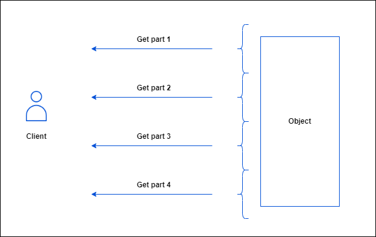
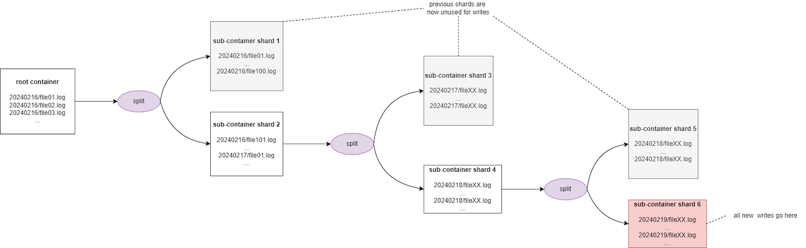
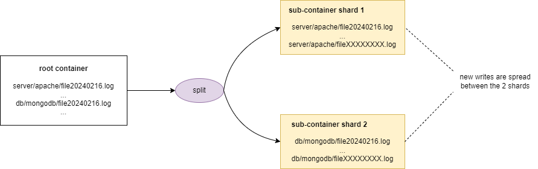

## Introduction

There are several ways you can use to optimize the performances of your buckets on OVHcloud Object Storage. The following guide will walk you through the different optimization methods.

### Using byte range fetch

OVHcloud Object Storage supports byte range fetch. The idea behind is to fetch an object chunk by chunk, each chunk being defined by a range of bytes. The main benefit is that it allows you to parallelize GET requests to download an object, each GET requesting a specific range of bytes: typical sizes for byte-range requests are 8 MB or 16 MB but you can specify any size.



To download part of an object, you must use additional parameters to specify which part of an object that you want to fetch. The following example dowloads the first part ranging from 0 to 500 bytes of an object named "filename" stored in the "test-bucket" bucket and writes the output as a file named "object_part":

```bash
user@host:~$ aws s3api get-object --bucket test-bucket --key filename --range bytes=0-500 object_part
```
### Using MPUs

You can upload a single object as a collection of parts using multipart upload. These parts are yours to upload separately and in any sequence. You can retransmit a part without affecting the others if transmission of any part fails. After you complete the upload of all parts, OVHcloud Object Storage puts the pieces together and rebuilds the object.

> [!success]
>
> You should consider using multipart uploads for objects > 100MB
> The benefits of using multipart upload are as follows:
> * Increased throughput: each part can be uploaded concurrently
> * Fast recovery from network problems: since each part can be uploaded separately and independently, you can re-upload the missing part without restarting the whole upload.


## In practice 

## Prerequisites

### Using the AWS cli 

* an OVHcloud bucket created
* the AWS cli installed and configured
* a large file split into multiple parts

  
> [!success]: **Did you know You ?**
> When you use a high level command to upload an object using the cp command, the AWS cli automatically does a multipart-upload. To better optimize the default configuration values for doing multipart uploads (multipart_threshold, multipart_chunksize), you can check this article and see the table explaining the configuration of the AWS cli.

The following section explains how to perform a multipart upload using the low level commands of the AWS cli.

First, you need to initiate a multipart upload:

```bash
user@host:~$ aws s3api create-multipart-upload --bucket test-bucket --key filename
{
    "Bucket": "test-bucket",
    "Key": "filename",
    "UploadId": "YjgxYmRmODItOWRiMi00YmI2LTk1NTMtODBhYWYwYmFjZGYx"
}
```
> [!primary]
> Do not forget to save the upload ID, key and bucket name for use with the upload-part command.

Then, for each part, you need to make an upload-part command where you specify the bucket, key and upload ID:

> [!warning] Part numbers can be any number from 1 to 10,000 inclusive. You can check the technical limitations,["here"](https://help.ovhcloud.com/csm/en-ca-public-cloud-storage-s3-limitations?id=kb_article_view&sysparm_article=KB0034706).

```bash
user@host:~$ aws s3api upload-part --bucket test-bucket --key filename --part-number 1 --body filename_part1 --upload-id "YjgxYmRmODItOWRiMi00YmI2LTk1NTMtODBhYWYwYmFjZGYx"
{
    "ETag": "\"6769849e543eeb257675b65e7a199aa2\""
}
```

> [!primary]: Save the ETag value of each part for later. They are required to complete the multipart upload.

 After, you upload all the parts, you have to call the complete-multipart-upload command in order to finish and for OVHcloud Object Storage to rebuild the final object:
 
```bash
user@host:~$ aws s3api complete-multipart-upload --bucket test-bucket --key filename --upload-id "YjgxYmRmODItOWRiMi00YmI2LTk1NTMtODBhYWYwYmFjZGYx" --multipart-upload file://mpu.json
```
Where mpu.json is:

```bash
{
    "Parts": [
        {
                "ETag": "6769849e543eeb257675b65e7a199aa2",
                "PartNumber": 1
        },
        {
                "ETag": "3617fbc52bcc2cc8a6cbfe81457c01c4",
                "PartNumber": 2
        },
        {
                "ETag": "4f8c06e93b407f1f2d6fb1614d73906d",
                "PartNumber": 3
        },
        {
                "ETag": "739213d60193c2154e74cc9895f17132",
                "PartNumber": 4
        },
        {
                "ETag": "f7551c4f2eef8b4f431ea9b89a106e66",
                "PartNumber": 5
        },
        {
                "ETag": "d1ee8ef1735cc647537dc27745a4d78f",
                "PartNumber": 6
        },
        {
                "ETag": "083560bc5d313203969979347e530816",
                "PartNumber": 7
        },
        {
                "ETag": "14614d7b76b64e455c8e53661067e2c8",
                "PartNumber": 8
        },
        {
                "ETag": "aa9bcb39247074216c7e26f90b21a71b",
                "PartNumber": 9
        },
        {
                "ETag": "9617fc9e0efb944fa3e4ba970b3ebe62",
                "PartNumber": 10
        }
    ]
}


```

> [!primary]
> If you do not complete the multipart upload, your object will not be rebuilt and will not be visible BUT you still have to pay the storage costs of the parts

### Using other third party tools

The following list describes the options to perform multipart uploads using other tools. The list is NOT exhaustive as you might want to check the relevant documentation of the tool you are using.

### s3cmd 

_--multipart-chunk-size-mb=SIZE_

Size of each chunk of a multipart upload. Files bigger than SIZE are automatically uploaded as multithreaded-multipart, smaller files are uploaded using the traditional method. SIZE is in Mega-Bytes, default chunk size is 15MB, minimum allowed chunk size is 5MB, maximum is 5GB.

<u> Example: </u>

```bash
$ s3cmd put --multipart-chunk-size-mb=500 big-file.zip s3://some-bucket/
```

For more information on s3cmd, check the official documentation,["here"](https://s3tools.org/usage).

#### rclone 

_--s3-upload-cutoff=SIZE_

Size threshold at which point rclone switches from single file upload to multipart upload

_--s3-chunk-size=SIZE_

Size of each chunk used in multipart uploads

_--s3-upload-concurrency_

Number of chunks uploaded concurrently

<u> Example: </u>

```bash
$ rclone copy --s3-upload-concurrency 300 --s3-chunk-size 100M --s3-upload-cutoff 100M testfile s3:test-bucket
```

For more information on rclone, check the official documentation ["here"](https://rclone.org/s3/).

Increasing the number of concurrent requests


Another way to improve throughput is to increase the number of concurrent requests.

To customize the default value on the AWS cli, check ["this article"](https://help.ovhcloud.com/csm/en-ie-public-cloud-storage-s3-optimise-sending-files?id=kb_article_view&sysparm_article=KB0047432).

For other tools, you should check the relevant documentation of the software you are using.

### I/O optimization

Lastly, you can also significantly optimize performances by adopting good practices to spread a much as possible the I/Os thourghout the object storage cluster by taking advantage of the sharding mechanism.

### What is sharding

OpenIO is a software defined storage solution on which OVHcloud Object Storage is based on.

In OpenIO, a __container__ is basically an internal logical entity that contains all the objects for a given bucket. Each container is associated with an internal metadata database that list all the addresses in the cluster of the objects contained in it. By default, a S3 bucket is associated with one container but this can change with the sharding mechanism.

Sharding is the mechanism by which a container is split into 2 new sub-containers (and thus its associated metadata database is also split in 2) when it reaches __a critical number of objects__ called shards.
Sharding enables :

* to optimize read/write operations by loading balancing them on multiple shards
* to spread the storage of data throughout the cluster to increase resiliency

We use the object keys (prefix/name) to determine which objects are pushed into which sub-container using the following logic:


* create 2 new shards
* find the median value of a sorted by alphabetical order list of all object keys
* copy the content of the root container to the shards
* in the first shard, keep only the first half of the objects (object with first key of the list to object with key equals to the median value) and clean the second half
* in the second shard, keep only the second half of the objects and clean the first half
* the root container then only lists the references to the shards i.e which range of objects in which shard


This logic can be summed up as follows:


### Prefix good practices

You can optimize the I/Os on the cluster by taking advantage of the sharding mechanims described before.

The main strategy is to keep the cardinality of the object keys to the left i.e using prefixes that allows the sharding to split incoming objects the most evenly as possible.

Let's consider a use case where you would want to store logs in OVHcloud Object Storage.

#### Scenario 1: bad practice by using the date as prefix : 

List of objects:

* 20240216/file01.log
* 20240216/file02.log
* 20240216/file03.log
* ...
* 20240217/file01.log
* 20240217/file02.log
* ...

Assuming the threshold is 100, after the uploading of the 100th object, the sharding is triggerd to split the objects in 2 shards:

* from 20240216/file01.log to 20240216/file100.log in the first shard
* from 20240216/file101.log and beyond to a second shard

This not optimal because since dates are incremental by nature, all new uploads will always be done on the 2nd shard which in turn will be split again after it reaches a critical size. Thus, all future write operations will always be performed on the latest shard created and the previous shards will get rarely accessed. Furthermore, you may experience some throttling as the sharding process occurs.




Scenario 2: good practice by keeping the cardinality to the right

List of objects:

    server/apache/file20240216.log
    server/apache/file20240217.log
    server/apache/file20240218.log
    ...
    db/mongodb/file20240216.log
    db/mongodb/file20240217.log
    ...

Assuming the threshold is 100, after the uploading of the 100th object, the sharding is triggerd to split the objects in 2 shards. This 2nd scenario is optimal because all new uploads will be spread on the 2 shards.



### Optimize ramp up time

When you upload a very large number of objects at once, you trigger the sharding mechanism. As the sharding process occurs, you may experience some throttling.

In order to avoid the reduced performance (503 SLOWDOWN errors), we recommand that you optimize your uploads by spreading your request over time. That spread does not have to be linear but it should give us enough time to better load balance your workload.

A simple way to achieve that lies in better 503 slowdown errors management and error recovery : ramp up your uploads until you hit 503 errors and modulate your workload to accomodate the throttling until sharding is complete and then ramp up again.

### Increase object sizes

Objects are considered to be small if their size is less than 1MB. When dealing with large volumes of data (PB scale), the total number of objects rapidly reaches billions even trillions. Managing with the metadata administration at this scale leads and dealing with the sheer number of I/O operations poses an great challenge: how to deliver a great service without losing information or comprimising performance.

When applicable, we recommand that you increase the object/part size as much as possible in order to reduce the number of objects.

Join our community of users on <https://community.ovh.com/en/>.
