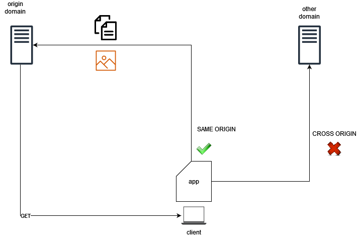

## Objectif

Par défaut, les navigateurs modernes imposent une politique de sécurité liée à l'origine des ressources. Cela signifie qu'ils empêchent une ressource chargée depuis une première origine d'interagir avec une autre ressource chargée depuis une seconde origine différente.

{.thumbnail}

Le *Cross-Origin Resource Sharing* (CORS) est une technique qui permet aux ressources d'une application web cliente chargée à partir d'un domaine d'interagir avec des ressources situées dans un domaine différent.

**Ce guide explique le concept de CORS et comment l’activer sur vos buckets S3.**

### Cas d'usage

Les cas d'usage habituels pour CORS dans l'Object Storage OVHcloud sont les suivants :

- Vous hébergez un site statique dans un bucket et vous souhaitez utiliser JavaScript pour accéder aux ressources hébergées dans le même bucket ou dans un autre bucket.
- Vous disposez d'une application frontend (par exemple une application mobile) qui a besoin d'accéder à des ressources hébergées dans un cluster S3.

### Comment ça fonctionne ?

Le client doit d'abord déterminer si CORS est activé côté serveur. Il envoie une demande de contrôle en amont (requête OPTIONS) à l'Object Storage OVHcloud pour vérifier les règles de CORS :

- Quelles origines sont acceptées ?
- Quels verbes HTTP ?
- Quels en-têtes ?
- etc.

Ensuite, selon la réponse du serveur, la requête CORS est autorisée ou non :

- L'en-tête `Origin` de la requête doit être défini dans l'élément `AllowedOrigins`.
- La méthode de requête (GET, PUT, etc.) ou l'en-tête `Access-Control-Request-Methods` (dans le cas d'une requête *preflight* OPTIONS) doit être l'un des éléments `AllowedMethods`.
- Tous les en-têtes listés dans l'en-tête `Access-Control-Request-Headers` de la requête *preflight* doivent être définis dans l'élément `AllowedHeaders`.

Les règles pour les requêtes CORS acceptées sont configurées au niveau du bucket.

## Prérequis

- Un bucket sur lequel vous pouvez configurer la règle CORS
- Disposer des identifiants et droits sur le/les bucket(s)/objects pour l'utilisateur effectuant les requêtes

## En pratique

### Configuration

A l'aide de la CLI AWS, configurez CORS sur le bucket :

```sh
aws s3api put-bucket-cors --bucket my-bucket --cors-configuration cors.json
```

Le fichier cors.json contient la configuration suivante :

```json
{
   "CORSRules": [
        {
            "AllowedHeaders": ["header1", "header2", etc.],
            "AllowedMethods": ["GET", "HEAD", etc.],
            "AllowedOrigins": ["https://<origin-domain>", etc.],
            "ExposeHeaders": ["Access-Control-Allow-Origin"]
        }
   ]
}
```

#### Exemple de configuration

Supposons que nous avons une application web frontend hébergée sur `https://my-app.xyz` qui utilise JavaScript (React, Angular ou toute autre structure frontend) pour interroger les fichiers multimédia hébergés dans un bucket S3 (`https://my-media.s3.gra.io.cloud.ovh.net/`).

Nous activons CORS sur le bucket my-media :

```sh
aws s3api put-bucket-cors --bucket my-media --cors-configuration cors.json
```

Le fichier cors.json contient la configuration suivante :

```json
{
   "CORSRules": [
        {
            "AllowedHeaders": ["Authorization"],
            "AllowedMethods": ["GET", "HEAD"],
            "AllowedOrigins": ["https://my-app.xyz"],
            "ExposeHeaders": ["Access-Control-Allow-Origin"]
        }
   ]
}
```

Ce qui a essentiellement été fait ici est d'indiquer à l'application cliente que le bucket ciblé autorise les requêtes CORS uniquement si :

- la requête contient l'entête "Authorization" ;
- la requête est limitée aux appels "GET" et "HEAD" ;
- la requête provient du domaine "my-app.xyz".

Le serveur Object Storage va exposer l'entête `Access-Control-Allow-Origin` dans ses réponses.

## Aller plus loin

Si vous avez besoin d'une formation ou d'une assistance technique pour la mise en oeuvre de nos solutions, contactez votre commercial ou cliquez sur [ce lien](https://www.ovhcloud.com/fr/professional-services/) pour obtenir un devis et demander une analyse personnalisée de votre projet à nos experts de l’équipe Professional Services.

Échangez avec notre communauté d'utilisateurs sur <https://community.ovh.com/>.
