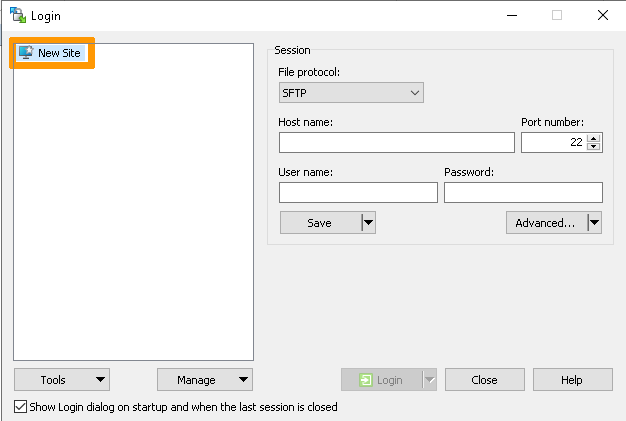
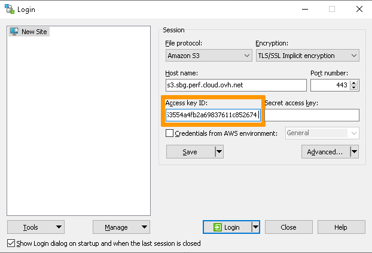
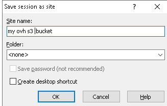
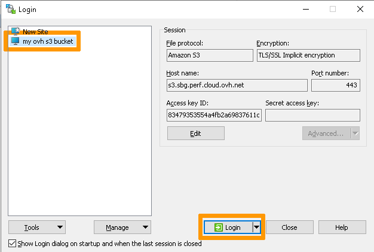
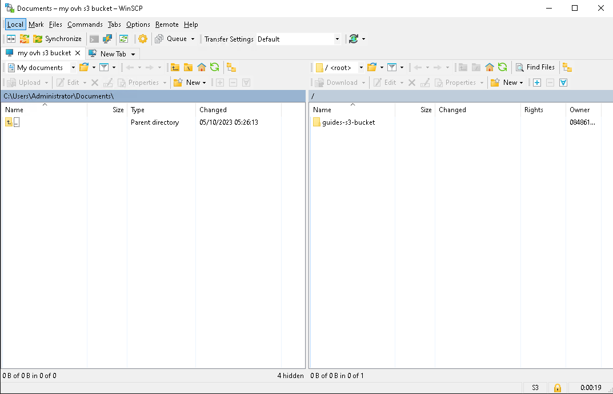

## Objectif

[WinSCP](https://winscp.net/) est un client SFTP, un client FTP, un client WebDAV, un client S3, un client SCP et un gestionnaire de fichiers pour Windows.

**Découvrez comment configurer WinSCP pour gérer vos buckets et vos objets.**

## Prérequis

- Un bucket
- Un utilisateur avec les droits d'accès requis sur le bucket
- Vos identifiants S3 (access_key et secret_access_key).

Consultez notre guide [Object Storage - Premiers pas avec Object Storage](/pages/storage_and_backup/object_storage/s3_getting_started_with_object_storage).

## En pratique

Démarrez WinSCP. La boîte de dialogue de connexion s'affiche. Dans la boîte de dialogue :

1. Assurez-vous que le nœud « Nouveau site » est sélectionné.

2. Sur le nœud Nouveau site, sélectionnez le protocole `Amazon S3`{.action}.

3. Entrez votre Endpoint (sans `https://`) correspondant à votre classe de stockage et définissez le champ `Port number` sur `443`.

> [!primary]
>
> Afin d'identifier votre Endpoint correspondant à votre classe de stockage, veuillez vous référer à ce guide : [Object Storage - Endpoints et géo-disponibilité de l’Object Storage](/pages/storage_and_backup/object_storage/s3_location)
>

4. Entrez votre `Clé d'accès`

Afin de respecter les bonnes pratiques, veuillez ne renseigner que le champ `Acces key ID`

5. Enregistrez les paramètres de votre site à l'aide du bouton `Save`{.action}.

6. Connectez-vous à l'aide du bouton `Login`{.action}.

Entrez ensuite votre `clé secrète`

7. Résultat

Une fois connecté, vous verrez une liste de vos buckets S3 sous la forme de *dossiers* dans le dossier racine.

> [!warning]
>
> La commande `Create directory` dans le dossier racine crée un nouveau bucket.
>

## Aller plus loin

Rejoignez notre communauté d’utilisateurs Discord : <https://discord.gg/ovhcloud>

Échangez avec notre communauté d’utilisateurs sur <https://community.ovh.com/>.
