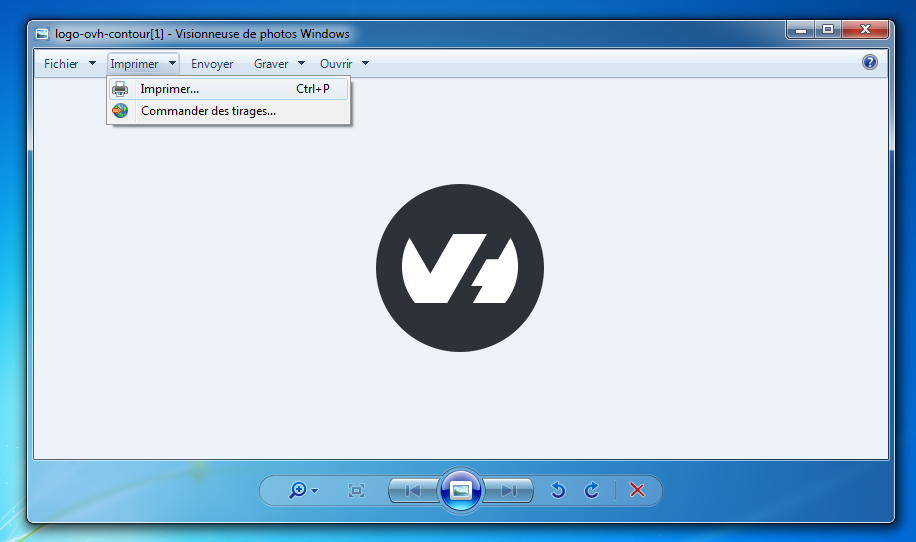

**Dernière mise à jour le 24/06/2022**

> [!alert]
> Le logiciel EcoFax n'est pas compatible avec les versions 64 bits de Windows. 
> Nous vous conseillons de priviléger la méthode d'envoi de fax par e-mail. Consultez [ce guide](https://docs.ovh.com/fr/fax/envoyer-des-fax-et-creer-des-campagnes-par-e-mail/) pour plus d'informations.

## Objectif

Vous pouvez envoyer des fax OVHcloud de différentes manières. Ce guide vous présente la méthode pour envoyer vos fax via l'imprimante virtuelle EcoFax sur Windows.

**Découvrez comment envoyer un fax via le logiciel EcoFax sur Windows.**

## Prérequis

- Disposer d’une [ligne Fax OVHcloud](https://www.ovhtelecom.fr/fax/).
- Avoir téléchargé et configuré le [logiciel EcoFax](https://www.ovhtelecom.fr/fax/logiciel-ecofax.xml).

## En pratique

Ouvrez le fichier à faxer :

{.thumbnail}

Faites `Fichier`{.action} puis `Imprimer`{.action} ou bien le raccourci clavier `Touche CMD` + `Touche P` afin d'ouvrir le gestionnaire d'impression dans votre logiciel.

{.thumbnail}

Choisissez dans la liste des imprimantes `Fax Manager`{.action}.

{.thumbnail}

Ecofax s'ouvre et vous demande d'entrer le numéro du destinataire :

{.thumbnail}

Le Fax est en cours d'envoi, il ne vous reste plus qu'à attendre le passage dans `Fax transmis`{.action}.

{.thumbnail}

## Aller plus loin

Échangez avec notre communauté d'utilisateurs sur <https://community.ovh.com>.
