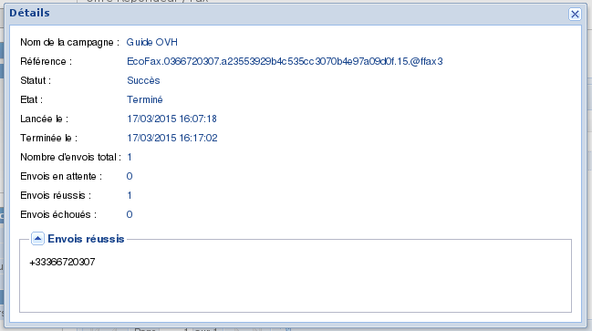

### Préambule {#préambule}

Le fait d'envoyer une campagne de fax via le Manager permet d'obtenir un suivi détaillé du déroulement de la campagne et une facilité de configuration et de mise en place de la campagne.

***{.thumbnail} Pour commander les offres Fax : <https://www.ovhtelecom.fr/fax/>***

**Sommaire :**

Niveau : Intermédiaire

------------------------------------------------------------------------

### Préparation de la campagne {#préparation-de-la-campagne}

Pour programmer la campagne, il faut se rendre dans le Manager :

-   Connectez-vous à votre Espace Client OVH : <https://www.ovhtelecom.fr/espaceclient/>
-   Cliquez sur le lien "**Accéder à l'ancienne interface**".
-   Cliquez sur l'icône "**Téléphonie**".
-   Cliquez sur la ligne de**fax** à utiliser pour la campagne.
-   Cliquez sur l'onglet **Fax** dans le menu **Navigation**.
-   Cliquez sur l'onglet **Campagnes de Fax**. L'interface de campagne se présente de cette façon : {.thumbnail}Pour créer une campagne, cliquez sur le bouton **Nouveau**. Le formulaire de campagne s'ouvre, les champs à remplir sont :
    -   **Nom de la campagne :** Le nom donné à la campagne créée.
    -   **Document à faxer :**Le document à envoyer au format **PDF**.
    -   **Qualité d’envoi :** Définit la qualité d'envoi. Normale, haute ou meilleure.
    -   **Type d'envoi :**
        -   ***Manuel :*******Le déclenchement de l'envoi se fait via le manager manuellement.
        -   ***Programmée :*** Le déclenchement de l'envoi est programmé à l'avance à la date et heure sélectionnées dans le Manager.
        -   ***Date d'envoi******:***La date de déclenchement de la campagne.
        -   ***Heure d'envoi :***L'heure de déclenchement de la campagne.
    -   **Destinataires :**
        -   ***Entrer les destinataires manuellement*****:** les destinataires sont à entrer dans le champ destiné.
        -   ***Url vers un fichier de destinataires :*** Permet de fournir un lien direct vers le fichiers au **format txt** contenant les destinataires.

            La liste doit être séparée par une virgule, point-virgule ou retour à la ligne. Les numéros doivent contenir entre 6 et 17 chiffres, avec ou sans espaces et peuvent commencer par un +.

        Cliquez sur **Créer**pour valider la création de la campagne.

------------------------------------------------------------------------

### Suivre une campagne {#suivre-une-campagne}

Lorsqu'une campagne est créée, elle se retrouve dans le tableau afin de pouvoir la lancer (dans le cadre d'une campagne avec lancement **Manuel**) ou de suivre une campagne lancée.

La fenêtre de suivi de la campagne se présente sous cette forme :

-   Le champ **Campagne** correspond au nom de la campagne créée.
-   Le champs **État** permet de connaître l'état de la campagne
-   Le champ **Statut** permet de connaître la réussite de la campagne.

{.thumbnail}

Le menu **Actions** permet d'agir sur les campagnes créées :

-   **Afficher :**permet de trier les campagnes par leurs statuts.
-   **Détails :** permet d'afficher le détail d'une campagne : les destinataires, l'état de l'envoi, la date et heure de l'envoi, la date et heure de fin de la campagne
-   **Lancer la campagne :** Permet de lancer une campagne manuelle.
-   **Stopper la campagne :** Permet de stopper une campagne en cours ou planifiée pour la lancer manuellement.
-   **Supprimer:** Permet de supprimer une campagne d'un historique.

Une campagne peut avoir plusieurs **statut**s :

-   **N/A :** Pas de statut encore disponible. Généralement sur une campagne en cours ou non envoyée.
-   **Succès:** La campagne s'est déroulée sans encombre.
-   **Succès partiel :** La campagne s'est déroulée mais certains numéros sont sûrement invalides. Vous pouvez avoir le détail de la campagne en cliquant sur le bouton **Actions** puis **Détails**.****
-   **En erreur :**La campagne n'a pu être réalisée. Consulter le détail pour obtenir les informations.

{.thumbnail}

