Connectez-vous à votre [espace client](https://www.ovhtelecom.fr/espaceclient/login/), rubrique Telecom. Sélectionnez ensuite Fax dans les menus de gauche.

Cliquez ensuite sur la ligne de Fax (pro) désirée.

{.thumbnail}

## EcoFax Pro
Vous avez la possibilité de personnaliser le mot de passe de votre offre EcoFax Pro depuis votre espace client.

Une fois votre ligne sélectionnée, rendez-vous dans la partie Fax dans la navigation, puis cliquez sur Mot de passe Fax.
Cliquez ensuite sur Gérer pour modifier le mot de passe actuel. 
Ce dernier doit comporter entre 6 et 12 caractères.

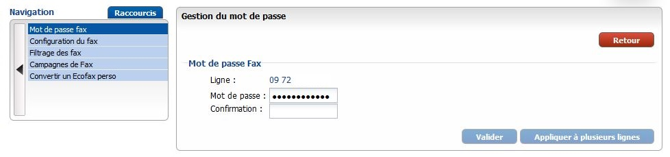{.thumbnail}
Le protocole utilisé pour le transport des données sur l'offre EcoFax Pro est l'IMAP, vous configurez donc ici le mot de passe IMAP de votre offre.
Il est nécessaire lors de l'utilisation de votre offre via votre boîte e-mail ou le logiciel [EcoFax](https://www.ovhtelecom.fr/fax/logiciel-ecofax.xml).

## Plug & Fax
L'offre Plug & Fax reprend les mêmes fonctionnalités que l'offre EcoFax Pro, en ajoutant le fait que vous avez la possibilité d'utiliser votre offre avec un télécopieur numérique ou encore analogique via un boitier adaptateur.

Vous pouvez donc, de la même manière que pour l'offre EcoFax Pro, personnaliser votre mot de passe IMAP qui sera nécessaire lors des utilisations "virtuelles" de votre offre, soit lors de la configuration du logiciel [EcoFax](https://www.ovhtelecom.fr/fax/logiciel-ecofax.xml), soit lors des envois par e-mail.  

L'offre Plug & Fax fonctionne également avec le protocole SIP de sorte que vous pouvez configurer votre ligne sur un télécopieur numérique, ou sur un boitier adaptateur type Cisco Spa112.
Pour personnaliser ce mot de passe SIP, rendez-vous dans la partie Gestion puis cliquez sur Mot de passe SIP.

Ce dernier doit contenir entre 8 et 20 caractères, dont au moins deux classes différentes (chiffres, lettres, caractères spéciaux).

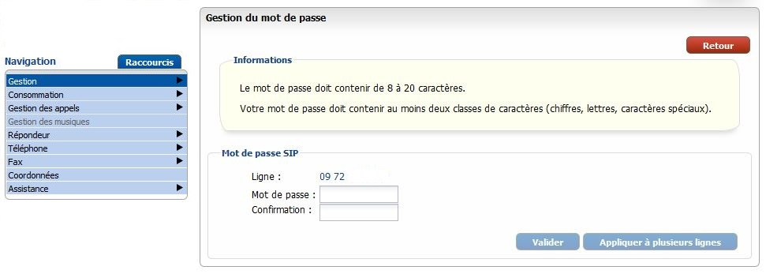{.thumbnail}
Les protocoles IMAP et SIP sont indépendants, de même que leur mot de passe. Le mot de passe SIP est utilisé pour l'enregistrement de votre ligne sur nos serveurs.

## 
Afin de mettre en place la configuration de base de votre offre, cliquez sur Fax, puis sur Configuration du Fax dans la navigation après avoir préalablement sélectionné votre ligne.

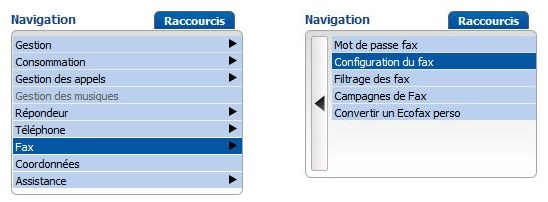{.thumbnail}

## Options générales
La qualité par défaut de vos télécopies peut avoir un impact sur la réception de certains numéros spéciaux. 
Passez la en Meilleure pour des envois vers les numéros spéciaux ou étrangers. 

Vous pouvez personnaliser l'ID des fax émis et des fax reçus.

Vous pouvez paramétrer le nombre de tentatives d'envoi maximum, dans le cas d'un échec de transmission lors de la première tentative.

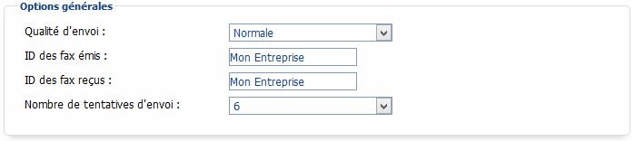{.thumbnail}

## Entête des fax émis
Vous avez la possibilité de personnaliser l'entête de vos fax selon la méthode ci-dessous.

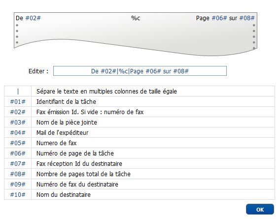{.thumbnail}

## Options de notifications
Personnalisez l'adresse e-mail et le nom de l'expéditeur des notifications que vous recevez, permettant entre autres d'éviter les filtres automatiques (type spam webmail).
Vous pouvez également définir le format Texte ou HTML de l'e-mail reçu.

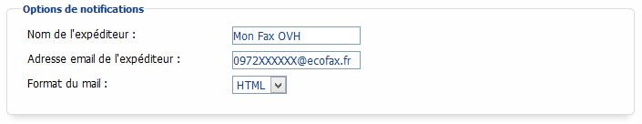{.thumbnail}

## Adresses à notifier
Configurez l'adresse e-mail sur laquelle vous recevrez les télécopies.
Vous pouvez renseigner jusqu'à 5 adresses différentes.

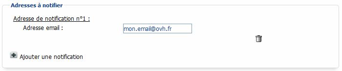{.thumbnail}

## Depuis le logiciel EcoFax
Téléchargez ce dernier ici : [EcoFax](http://www.ovhtelecom.fr/fax/logiciel-ecofax.xml).

Lors de l'installation, renseignez le numéro de votre ligne EcoFax Perso ainsi que le mot de passe.
Vous pouvez également modifier ces paramètres dans la partie Outils/Options du logiciel.

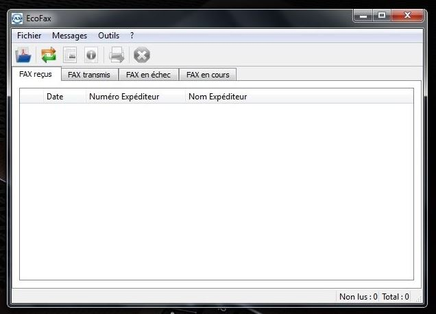{.thumbnail}
Pour envoyer un Fax, rien de plus simple :

- Sous [Windows](https://docs.ovh.com/fr/fax/envoyer_des_fax_via_limprimante_virtuelle_ecofax-_windows/).
- Sous [Mac OS X](https://docs.ovh.com/fr/fax/envoyer_des_fax_via_limprimante_virtuelle_ecofax_-_mac_os_x/).

Vous pouvez également cliquer sur la touche "Ouvrir un fichier PDF" du logiciel, sélectionnez le fichier à envoyer, puis renseignez le numéro de fax de votre destinataire.

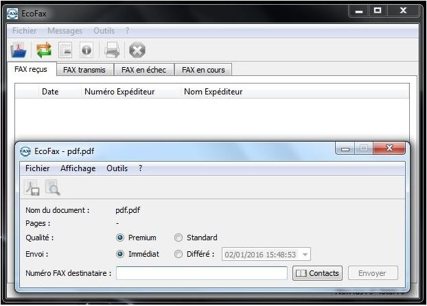{.thumbnail}

## Campagne depuis l'espace client
Vous avez la possibilité de programmer des campagnes de fax depuis votre espace client.

Après vous être rendu dans la partie Fax, cliquez sur Campagnes de Fax.

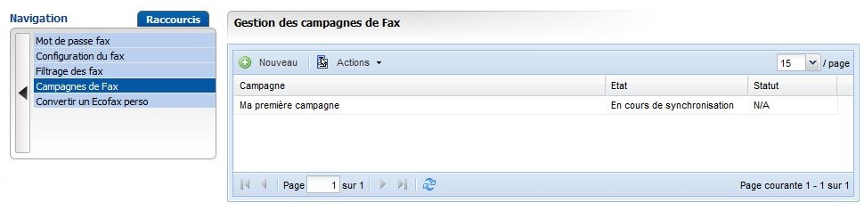{.thumbnail}
Cliquez ensuite sur Nouveau puis remplissez le formulaire correspondant.

Vous avez la possibilité de différer l'envoi de votre campagne.

Dans la partie Actions, vous pourrez suivre l'état de votre campagne, la démarrer manuellement, la stopper ou encore la supprimer.

{.thumbnail}

## Emission par adresse e-mail
Créez un nouveau message et indiquez le numéro de fax de votre destinataire suivi de « @ecofax.fr ». 
Indiquez dans l'objet de l'e-mail votre numéro de fax.
Renseignez dans le corps de l'e-mail votre mot de passe de ligne fax précédé de la mention "password :". Il ne sera pas visible par votre destinataire.
Vous pouvez insérer jusqu’à 10 pièces-jointes. Dans notre exemple, le document sélectionné est au format PDF.
Après l’envoi, un accusé de réception détaillé vous est envoyé.

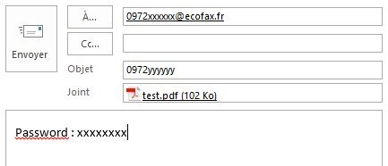{.thumbnail}
Le mot de passe à renseigner ici est le mot de passe IMAP de votre offre.
Les options :
Pour définir la qualité du fax, vous pouvez spécifier 'normal', 'high', 'premium', 'best' dans le corps du mail,
ou ne rien mettre pour utiliser la valeur par défaut définie dans le manager : 
qualite: best

Pour envoyer votre fax en différé, vous pouvez spécifier la date dans le corps du mail :
date: 21-10-2011 18:30:00

A savoir :
L'adresse e-mail de l'expéditeur d'un fax ne peut pas être en "postmaster". Exemple : postmaster@mon_domaine.tld.
Les e-mails de rapport sur la transmission de la télécopie seront envoyés à l'adresse qui a servi à l'envoi de votre fax.

Formats :
Le format à privilégier est le PDF, sinon les formats supportés sont les suivants :

|Formats de texte|Formats de tableur|Formats de présentation|Formats de dessin|Formats d'images|
|---|---|---|---|---|
|Microsoft Word (*.doc)|Microsoft Excel (*.xls)|OpenDocument Présentation (*.odp)|OpenDocument Drawing (*.odg)|Bitmap (*.bmp)|
|OpenDocument Text (*.odt)|OpenDocument Spreadsheet (*.ods)|OpenOffice.org 1.0 Présentation (*.sxi)|Scalable Vector Graphics (*.svg)|JPEG (*.jpg)|
|OpenOffice.org 1.0 Text (*.sxw)|Microsoft PowerPoint (*.ppt)|Macromedia Flash (*.swf)|PNG (*.png)|
|Rich Text Format (*.rtf)|Comma-Separated Values (*.csv)|
|WordPerfect (*.wpd)|Tab-Separated Values (*.tsv)|
|Plain Text (*.txt)|OpenOffice.org 1.0 Spreadsheet (*.sxc)|
|MediaWiki wikitext (*.wiki)|

## Envoi de fax en grand nombre depuis l'adresse e-mail
Le destinataire de l'e-mail doit être fax@ecofax.fr.
Indiquez dans l'objet de l'e-mail votre numéro de fax.
Renseignez dans le corps de l'e-mail votre mot de passe de ligne fax précédé de la mention "password :". Il ne sera pas visible par votre destinataire.
Ajoutez à votre document PDF à faxer en pièce jointe un fichier texte intitulé numbers.txt.

Ce fichier .txt ne doit contenir qu'un seul numéro par ligne et ne doit comporter aucun caractère spécial.
Si vous êtes sous |b]Windows, le document est un fichier |b]bloc Notes.
Si vous êtes sous |b]Linux, le document est un fichier |b]éditeur de texte.
Si vous êtes sous |b]Mac, le document est un fichier |b]textedit.

Vous pouvez renseigner jusqu'à 2000 numéros. Si par exemple vous souhaitez envoyer 4000 fax, il faudra passer par deux e-mails.

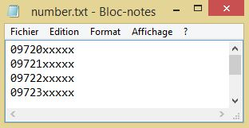{.thumbnail}

## Filtrage des fax entrants
Vous avez la possibilité de filtrer les fax entrants afin de ne pas recevoir les télécopies anonymes par exemple.

Cliquez sur Filtrage des fax dans la partie Fax de votre espace client.

Vous aurez alors la possibilité de renseigner plusieurs numéros en liste noire ou en liste blanche afin de filtrer correctement vos réceptions.

{.thumbnail}

## Activation
Il est possible de configurer votre offre EcoFax Pro ou Plug & Fax en tant que messagerie vocale.

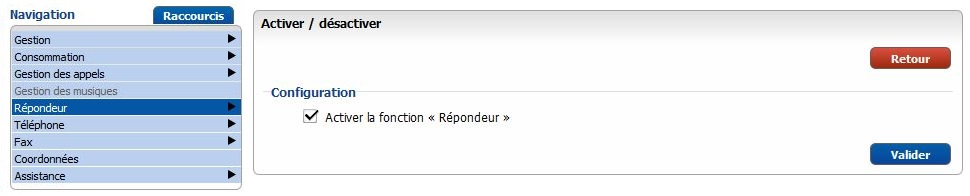{.thumbnail}
L'activation de la fonctionnalité répondeur désactive toutes les fonctionnalités fax de votre offre.

## Mot de passe
Vous pouvez consulter votre messagerie vocale depuis n'importe quel téléphone en composant le 0033979947994.

Un mot de passe d'accès est nécessaire pour cette manipulation, vous pouvez le configurer ici.

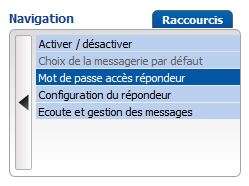{.thumbnail}

## Configuration du répondeur
Dans cet onglet vous pouvez configurer l'enregistrement des messages ainsi que le message d'accueil de votre répondeur.

Vous avez aussi la possibilité de renseigner jusqu'à 5 adresses e-mail de notification, sur lesquelles vous pourrez également recevoir les messages sur différents formats audio.

Personnalisez l'adresse e-mail et le nom de l'expéditeur des notifications que vous recevez, permettant d'éviter les filtres automatiques (type spam webmail).

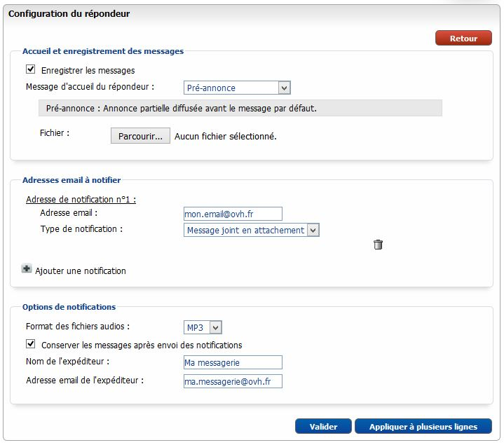{.thumbnail}

## Ecoute et gestion des messages
Dans cette dernière partie vous avez la possibilité de gérer l'historique de vos messages, de les écouter et de les télécharger.

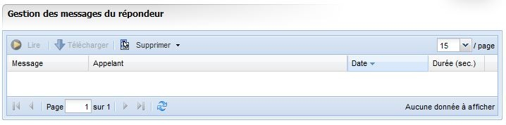{.thumbnail}
Nous conservons jusqu'à 100 messages sur votre boîte vocale pour une durée de 6 mois maximum. Ils sont effacés en dehors de ces conditions.

