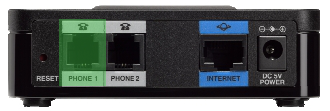

### Préambule {#préambule}

Ce guide vous permet de comprendre le fonctionnement de l'offre Plug And Fax et d'ajuster la configuration du télécopieur utilisé pour obtenir le meilleur rendu.

***{.thumbnail} Pour commander les offres Fax : <https://www.ovhtelecom.fr/fax/>***

**Sommaire :**

Niveau : Intermédiaire

------------------------------------------------------------------------

### Branchement du fax sur le PAP2T/SPA112 {#branchement-du-fax-sur-le-pap2tspa112}

Le télécopieur utilisé se branche sur la prise RJ11 "**Phone 1**" (En vert sur les images) de votre adaptateur. L'adaptateur doit également être branché en **Ethernet** sur votre routeur.

 {.thumbnail}

------------------------------------------------------------------------

### Configurer son Fax {#configurer-son-fax}

Dans le cadre de l'utilisation de votre fax physique avec l'offre Plug And Fax, il faut adapter la configuration de ce fax :

-   **La vitesse de transmission :** 9600 bauds maximum.
-   **Décroché automatique :** À activer au bout de 2 ou 3 sonneries maximum.
-   **La correction d'erreur :** À désactiver.

Sur certains fax, la correction d'erreur peut être appelée **ECM** ou **EMC**.

------------------------------------------------------------------------

### Configurer le mode de réception des fax {#configurer-le-mode-de-réception-des-fax}

L'offre**Plug And Fax** permet d'utiliser deux modes de **réception** :

-   Uniquement sur **le télécopieur** (En **secours**, réception par e-mail ou via Ecofax). Pour utiliser ce mode :

    -   Connectez-vous à votre Espace Client OVH : <https://www.ovhtelecom.fr/espaceclient/>
    -   Cliquez sur le lien "**Accéder à l'ancienne interface**".
    -   Cliquez sur l'icône "**Téléphonie**".
    -   Cliquez sur la ligne "**Plug and Fax**" à configurer.
    -   Cliquez sur "**Gestion des appels**" dans le menu "**Navigation**".
    -   Cliquez sur "**Renvoi d'appel**".

{.thumbnail}

-   -   Cliquez sur le bouton "**Gérer**".
    -   Cochez la case devant "**Si pas de réponse avant \_\_ sec:**".
        -   Définissez le nombre de secondes à 45. (Si votre fax est débranché, éteint ou en panne, vous recevrez toujours vos fax par mail ou via le logiciel Ecofax si le télécopieur n'a pas décroché après 45 secondes.)
        -   Choisissez le type de redirection vers **fax** et sélectionnez le numéro de votre ligne de **fax**.
    -   Cochez la case devant "**Si la ligne n'est pas disponible :**".
        -   Choisissez le type de redirection vers **fax** et sélectionnez le numéro de votre ligne de **fax**. Cette fonction permet de recevoir vos fax par mail ou le logiciel Ecofax en cas de non-réponse de la ligne.

    {.thumbnail}

-   Uniquement par e-mail ou via **Ecofax :**
    -   Connectez-vous à votre Espace Client OVH : <https://www.ovhtelecom.fr/espaceclient/>
    -   Cliquez sur le lien "**Accéder à l'ancienne interface**".
    -   Cliquez sur l'icône "**Téléphonie**".
    -   Cliquez sur la ligne "**Plug and Fax**" à configurer.
    -   Cliquez sur "**Gestion des appels**" dans le menu "**Navigation**".
    -   Cliquez sur "**Renvoi d'appel**".
    -   Cliquez sur le bouton "**Gérer**".
    -   Cochez la case "**Renvoyer tous les appels vers**"
    -   Sélectionnez "**Fax**" et sélectionnez le numéro de la ligne **Plug And Fax**. Dans cette configuration, tous les fax reçus seront disponibles uniquement par e-mail ou via le logiciel Ecofax.

Pour configurer les notifications par e-mail de votre ligne, reportez vous au guide [Configurer ma ligne Ecofax Pro]({originalUrl}/display/CRFAX/Configurer+ma+ligne+Ecofax+Pro).

------------------------------------------------------------------------

### Configurer la présentation du numéro en appel sortant {#configurer-la-présentation-du-numéro-en-appel-sortant}

Avec l'offre Plug And Fax, vous pouvez choisir la présentation du numéro en appel sortant. Pour configurer l'option :

-   Connectez-vous à votre Espace Client OVH : <https://www.ovhtelecom.fr/espaceclient/>
-   Cliquez sur le lien "**Accéder à l'ancienne interface**".
-   Cliquez sur l'icône "**Téléphonie**".
-   Cliquez sur la ligne "**Plug and Fax**" à configurer.
-   Cliquez sur "**Gestion des appels**" dans le menu "**Navigation**".
-   Cliquez sur "**Présentation du numéro**"
-   Cliquez sur le bouton "**Gérer**".
    -   Pour ne pas présenter de numéro, **décochez**la case "**Présenter le numéro**".
    -   Choisissez le **numéro à présenter** parmi la liste.
-   Confirmez la configuration en appuyant sur le bouton **Valider**. {.thumbnail}

