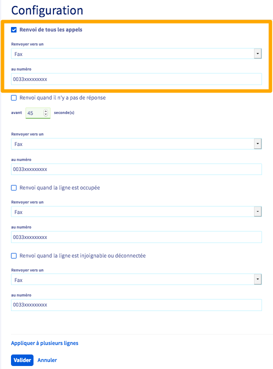
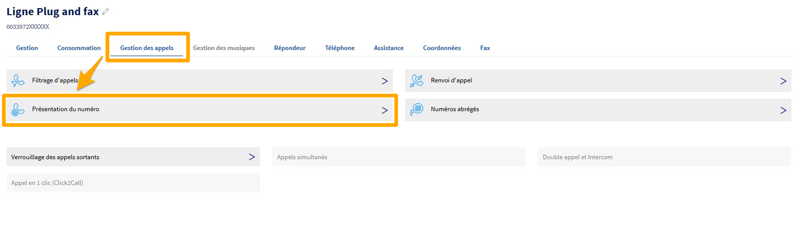

**Dernière mise à jour le 11/03/2021**

## Objectif

Vous pouvez configurer la réception de vos fax via votre espace client OVHcloud afin d'ajuster la configuration du télécopieur utilisé pour obtenir le meilleur rendu.

**Ce guide vous permet de comprendre le fonctionnement de l'offre Plug & Fax.**

## Prérequis

- Disposer d’une ligne [Plug & Fax OVHcloud](https://www.ovhtelecom.fr/fax/plug-and-fax.xml)
- Disposer d'un télécopieur
- Être connecté à votre [espace client OVHcloud](https://www.ovh.com/auth?onsuccess=https%3A%2F%2Fwww.ovhtelecom.fr%2Fmanager&ovhSubsidiary=fr)

## En pratique

Connectez-vous à votre [espace client OVHcloud](https://www.ovh.com/auth?onsuccess=https%3A%2F%2Fwww.ovhtelecom.fr%2Fmanager&ovhSubsidiary=fr) puis sélectionnez `Télécom`{.action}. Cliquez ensuite sur `Téléphonie`{.action} puis sur le groupe où se trouve votre ligne Plug & Fax. Sélectionnez la ligne Plug & Fax.

## En pratique

### Branchement du fax sur le Cisco ATA 191

Le télécopieur utilisé se branche sur la prise RJ11 « **Phone 1** » de votre adaptateur. Bien évidemment, l'adaptateur doit être raccordé au secteur et également être branché en **Ethernet** sur votre routeur.

{.thumbnail}

### Configurer votre télécopieur

Dans le cadre de l'utilisation de l'offre Plug & Fax, nous vous conseillons d'adapter la configuration de votre télécopieur. Vérifiez les paramètres suivants :

- **La vitesse de transmission** : 9600 bauds/sec maximum.
- **Décroché automatique** : à activer au bout de 2 ou 3 sonneries maximum.
- **La correction d'erreur** : à désactiver.

Sur certains télécopieurs, la correction d'erreur peut être appelée **ECM** ou **EMC**.

### Configurer le mode de réception des fax

L'offre Plug & Fax permet d'utiliser deux modes de réception, au choix :

- uniquement sur le télécopieur;
- uniquement par e-mail ou via le logiciel Ecofax.

La sélection d'un de ces deux modes s'effectue via les renvois d'appels sur votre ligne Plug & Fax.
Pour y accéder, connectez-vous à votre [espace client OVHcloud](https://www.ovh.com/auth?onsuccess=https%3A%2F%2Fwww.ovhtelecom.fr%2Fmanager&ovhSubsidiary=fr) puis sélectionnez `Télécom`{.action}. 
 Cliquez ensuite sur `Téléphonie`{.action} puis sur le groupe où se trouve votre ligne Plug & Fax. Sélectionnez la ligne concernée.
 Cliquez sur `Gestion des appels`{.action} puis sur `Renvoi d'appel`{.action}

{.thumbnail}

#### Réception via le télécopieur

Il s'agit du mode normal de réception des fax, lorsqu'un télécopieur fonctionnel est raccordé à l'adaptateur Plug & Fax. Si votre télécopieur est débranché, éteint ou en panne, les renvois d'appels décrits ci-dessous permettent d'assurer une continuité de la réception des fax. En effet, vous recevrez ainsi toujours vos fax par e-mail ou via le logiciel Ecofax.

Depuis le menu de `Renvoi d'appel`{.action}, cochez la case devant `Renvoi quand il n'y a pas de réponse`{.action} et définissez le nombre de secondes à 45.
 Ce renvoi laisse donc 45 secondes à votre télécopieur pour décrocher lors d'une réception de fax. Au delà de ce délai, le fax est renvoyé vers votre adresse e-mail ou vers le logiciel Ecofax. 
 Choisissez de `Renvoyer vers un`{.action} **Fax** et renseignez le numéro de votre ligne Plug & Fax.

De même, cochez la case devant `Renvoi quand la ligne est injoignable ou déconnectée`{.action}.
 Choisissez de `Renvoyer vers un`{.action} **Fax** et renseignez le numéro de votre ligne Plug & Fax.

Enfin, cliquez sur `Valider`{.action}.

{.thumbnail}

Pour configurer les notifications par e-mail de votre ligne, reportez vous au guide [Configurer ma ligne Ecofax Pro](/pages/telecom/fax/configuration_fax_espace_client).

#### Réception uniquement par e-mail ou Ecofax

Vous pouvez choisir de ne recevoir les fax que par e-mail, par exemple lors d'un déplacement ou en cas de panne prolongée de votre télécopieur.

Dans ce cas de figure, un renvoi d'appel inconditionnel est préconisé afin de rediriger tous les fax entrants vers votre adresse e-mail ou le logiciel Ecofax.

Depuis le menu de `Renvoi d'appel`{.action}, cochez la case devant `Renvoi de tous les appels`{.action}.
 Choisissez de `Renvoyer vers un`{.action} **Fax** et renseignez le numéro de votre ligne Plug & Fax.

Enfin, cliquez sur `Valider`{.action}.

{.thumbnail}

Pour configurer les notifications par e-mail de votre ligne, reportez vous au guide [Configurer ma ligne Ecofax Pro](/pages/telecom/fax/configuration_fax_espace_client).

### Configurer la présentation du numéro en appel sortant

Avec l'offre Plug & Fax, vous pouvez modifier la présentation du numéro lors des appels sortants.

Connectez-vous à votre [espace client OVHcloud](https://www.ovh.com/auth?onsuccess=https%3A%2F%2Fwww.ovhtelecom.fr%2Fmanager&ovhSubsidiary=fr) puis sélectionnez `Télécom`{.action}. 
 Cliquez ensuite sur `Téléphonie`{.action} puis sur le groupe où se trouve votre ligne Plug & Fax. Sélectionnez la ligne concernée.

 Cliquez sur `Gestion des appels`{.action} puis sur `Présentation du numéro`{.action}

{.thumbnail}

Le bouton `Choisir un autre numéro`{.action} vous permet d'accéder à la liste des numéros qu'il est possible de présenter depuis votre ligne Plug & Fax.

Si vous ne souhaitez pas présenter de numéro, cochez la case `Rester anonyme`{.action}.

{.thumbnail}

Validez votre choix en cliquant sur `Appliquer les modifications`{.action}.

## Aller plus loin

Échangez avec notre communauté d'utilisateurs sur <https://community.ovh.com>.
