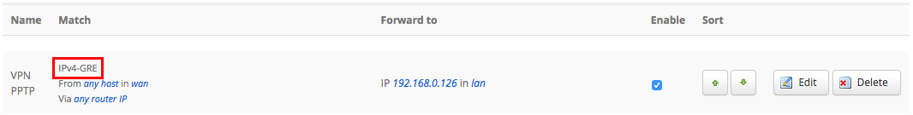

## Explications
Vous pouvez retrouver la marche à suivre pour effectuer une redirection de port standard via ce guide : [Redirection de port](https://docs.ovh.com/fr/overthebox/redirection-de-port/){.ref}.

Cependant, la configuration d'une redirection GRE sur OverTheBox est quelque peu spécifique. Veuillez suivre la procédure décrite ci-dessous.

## Manipulations
- Rendez-vous sur [http://overthebox.ovh (192.168.100.1)](http://overthebox.ovh){.external} depuis votre ordinateur connecté au modem principal.
- Cliquez sur **"Network"**.
- Cliquez sur **"Firewall"**.
- Cliquez sur **"Port Forwards"**.
- Configurez une redirection vide :
    - **Name** : Inscrivez le nom de votre choix
    - **Protocol** : laissez **TCP+UDP**
    - **External zone** : indiquez **WAN**
    - **External port** : laissez vide
    - **Internal zone** : indiquez **LAN**
    - **Internal Ip** : choisissez l'IP locale de votre serveur PPTP
    - **Internal port** : laissez vide
- Cliquez sur **"Add"**.

{.thumbnail}

- Cliquez ensuite sur **"Edit"**.

{.thumbnail}

- Pour l'option Protocol, choisissez **"Custom"** puis inscrivez la valeur **47**.

{.thumbnail}

- Cliquez enfin sur **"Save & Apply"**.

Voici ce que vous devriez obtenir:

{.thumbnail}
