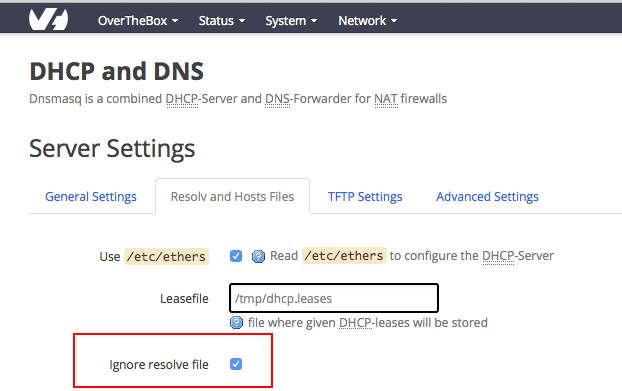

## Configuration
- Connectez vous sur [http://overthebox.ovh (192.168.100.1)](http://overthebox.ovh){.external} en tant qu'administrateur,
- Rendez vous dans l'onglet **" Network > DHCP and DNS "**
- Dans le champ "DNS forwardings", ajoutez les IP de vos serveurs DNS

{.thumbnail}

- Rendez-vous ensuite dans l'onglet "Resolv and Hosts Files"
- Cochez la case "Ignore resolve file"

{.thumbnail}

- Enfin cliquez sur "Save & Apply"