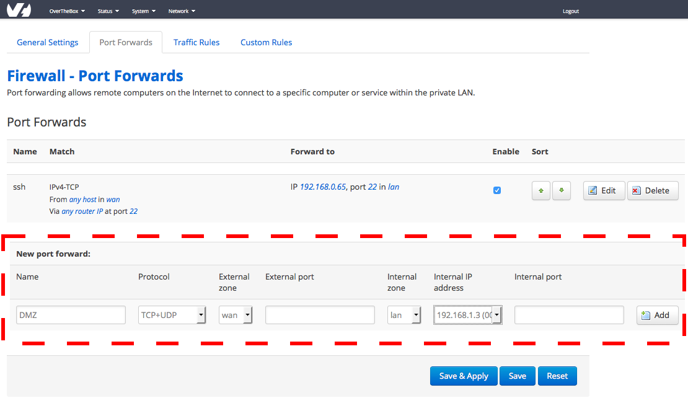

## Prérequis
L'intégralité de votre réseau **LAN** sera géré par votre routeur personel. Cela comprend le **serveur DHCP**. Veuillez donc d'abord désactiver le **serveur DHCP** de votre **OverTheBox** comme indiqué sur le guide suivant :

[Désactiver le serveur DHCP d’OverTheBox](https://docs.ovh.com/fr/overthebox/desactiver-votre-serveur-dhcp/){.ref}

## Configuration
- Rendez-vous sur [http://overthebox.ovh (192.168.100.1)](http://overthebox.ovh){.external} depuis votre ordinateur connecté au modem principal.
- Cliquez sur **"Network"**
- Cliquez sur **"Firewall"**
- Cliquez sur **"Port Forwards"**
- Configurez votre redirection
    - **Name** : DMZ
    - **Protocol** : TCP + UDP
    - **External zone** : indiquez **TUN**
    - **External port** : laissez vide
    - **Internal zone** : indiquez **LAN**
    - **Internal Ip** : Indiquer l'adresse IP de votre routeur
    - **Internal port** : laissez vide
- Cliquez d'abord sur **"Add"**
- Cliquez ensuite sur **"Save & Apply"**

{.thumbnail}
