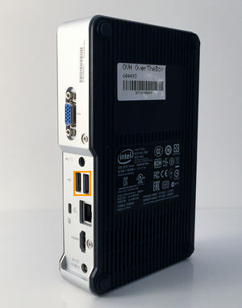
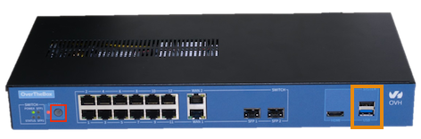

**Dernière mise à jour le 08/11/2022**

## Objectif

Découvrez comment installer ou mettre à jour votre matériel en installant manuellement l'image OverTheBox

## Prérequis

- Une **OverTheBox** fournie par OVHcloud ou un matériel compatible avec la solution OverTheBox (plateforme x86_64 avec un processeur Intel ou AMD)

## En pratique

Dans le cas où votre matériel est une **OverTheBox** fournie par OVHcloud, vous pouvez suivre la [méthode n°1](#method1) à l'aide d'une clé USB bootable. Pour les autres matériels, suivez la [méthode n°2](#method2).

### Méthode n°1 : installation automatique à l'aide d'une clé USB <a name="method1"></a>

Vous pouvez créer une clé USB bootable contenant l'image OverTheBox afin d'installer complétement le système.

#### Création d'une clé USB bootable sous windows

- Téléchargez la dernière image **OverTheBox** sur votre ordinateur : [http://downloads.overthebox.ovh/stable/targets/x86/64/latest.img.gz](http://downloads.overthebox.ovh/stable/targets/x86/64/latest.img.gz){.external}.
- Décompressez l'image grâce à un logiciel tel que [WinRAR](https://www.rarlab.com/download.htm){.external} afin d'obtenir le fichier **.img**.
- Branchez la clé USB sur l'ordinateur.
- Téléchargez le logiciel [Win32 Disk Imager](https://win32diskimager.org/#download){.external} et ouvrez le.
- Cliquez sur `Parcourir`{.action} pour retrouver le fichier **.img**.
- Sélectionnez la clé USB dans le champ **Device**.
- Cliquez sur `Write`{.action}.
- Une fois la procédure terminée, cliquez sur `Exit`{.action}.

{.thumbnail}

> [!success]
>
> La clé USB est maintenant prête à être utilisée pour flasher l'OverTheBox.
>

#### Création d'une clé USB bootable sous macOS

Toute l'opération se fera en ligne de commande, veuillez donc ouvrir le **Terminal**.

- Téléchargez la dernière image **OverTheBox** sur votre ordinateur, grâce à la commande suivante :

```bash
curl -C - -O http://downloads.overthebox.ovh/stable/targets/x86/64/latest.img.gz
```

Il est ensuite impératif de connaître le dossier désignant les partitions de votre clé USB.

- Branchez la clé USB puis entrez la commande suivante :

```bash
diskutil list
```

Vous obtiendrez plusieurs rubriques /dev/disk**X** (où **X** est remplacé par un chiffre).

Le dossier correspondant à votre clé doit être le dernier et être désigné ainsi : « /dev/disk **X**  (external, physical) ».

{.thumbnail}

Maintenant que vous connaissez l'emplacement de votre clé USB, vous pouvez flasher cette dernière.

- Tapez la commande suivante (**en remplaçant X par le bon chiffre de votre clé**) :

```bash
gunzip -c latest.img.gz | dd of=/dev/diskX
```

Veuillez patienter le temps de l’exécution, **cela peut durer plusieurs minutes**.

> [!success]
>
> La clé USB est maintenant prête à être utilisée pour flasher l'OverTheBox.
>

#### Création d'une clé USB bootable sous Linux

Toute l'opération se fera en ligne de commande, veuillez donc ouvrir le **Terminal**.

- Téléchargez la dernière image **OverTheBox** sur votre ordinateur, grâce à la commande suivante :

```bash
wget http://downloads.overthebox.ovh/stable/targets/x86/64/latest.img.gz
```

Il est ensuite impératif de connaitre le dossier désignant les partitions de votre clé USB.

- Branchez la clé USB puis tapez la commande suivante :

```bash
df -h
```

Vous obtiendrez plusieurs rubriques /dev/sd**X** (où **X** est remplacé par une lettre)
Le dossier correspondant à votre clé doit être le dernier. Vous pouvez vous en assurer en vérifiant que le nom de votre clé est bien affiché dans les dernières lignes.
Maintenant que vous connaissez l'emplacement de votre clé USB, vous pouvez flasher cette dernière.

- Tapez la commande suivante (**en remplaçant X par la bonne lettre de votre clé**) :

```bash
gunzip -c latest.img.gz | dd of=/dev/sdX
```

Veuillez patienter le temps de l’exécution, **cela peut durer plusieurs minutes**.

> [!success]
>
> La clé USB est maintenant prête à être utilisée pour flasher l'OverTheBox.
>

#### Utilisation de la clé USB bootable

- Débranchez l'**OverTheBox** du courant électrique.
- Branchez la clé USB bootable sur un des ports USB de l'**OverTheBox**.

Dans le cas de l'OverTheBox Intel, la clé USB doit être branchée sur un des ports USB **au dos** de l'appareil.

{.thumbnail}

Dans le cas d'une OverTheBox IT v1, la clé USB doit être branchée sur un des ports USB **noirs** :

{.thumbnail}

Dans le cas d'une OverTheBox Plus, la clé USB doit être branchée sur un des ports USB **en façade** :

{.thumbnail}

Dans le cas d'une OverTheBox IT v2, la clé USB doit être branchée sur un des ports USB **au dos** :

{.thumbnail}

- Branchez l'**OverTheBox** sur le courant électrique, le boitier commence sa réinitialisation.
- Dans le cas de l'OverTheBox Intel, attendez que le **voyant de façade Power** soit éteint (cela peut prendre quelque minutes).
- Dans le cas de l'OverTheBox IT v1, attendez que le **voyant de façade Power** s'éteigne puis se rallume automatiquement (cela peut prendre quelque minutes).
- Dans le cas de l'OverTheBox Plus, attendez que le **voyant de façade Power** s'éteigne puis se rallume automatiquement (cela peut prendre quelque minutes).
- Dans le cas de l'OverTheBox IT v2, attendez que le **voyant de façade Power** s'éteigne puis se rallume automatiquement (cela peut prendre quelque minutes).
- Débranchez la clé USB puis redémarrez votre **OverTheBox** .

> [!success]
>
> Votre OvertheBox est maintenant opérationelle, vous pouvez l'installer en suivant la procédure décrite dans les guides suivants :
>
> [Installation OverTheBox Intel ou IT v1](../intel-itv1-installation/)
>
> [Installation OverTheBox Plus ou IT v2](../plus-itv2-installation/)
>

### Méthode n°2 : installation manuelle depuis une distribution Linux live <a name="method2"></a>

Dans le cas d'un autre matériel non fourni par OVHcloud, vous devez installer l'image OverTheBox manuellement en écrivant l'image directement sur le disque dur de votre matériel.

#### Booter depuis une distribution Linux live

Vous pouvez par exemple créer une clé USB bootable sous Ubuntu en vous aidant de [cette documentation](http://doc.ubuntu-fr.org/live_usb){.external}.
Vous aurez besoin d'un clavier et d'un écran.

#### Identifier l'espace disque de destination

Entrez la commande suivante :

```bash
cat /proc/partitions

root@ubuntu:~# cat /proc/partitions
major minor  #blocks  name
 179        0    3866624 mmcblk0
 179        1       4096 mmcblk0p1
 179        2     524288 mmcblk0p2
 179       24       2048 mmcblk0rpmb
 179       16       2048 mmcblk0boot1
 179        8       2048 mmcblk0boot0
```

Dans cet exemple, on identifie que la destination d'installation sera **mmcblk0**.

#### Téléchargez l'image OverTheBox

La page suivante liste les images d'**OverTheBox** compilées : [http://downloads.overthebox.ovh/stable/targets/x86/64/](http://downloads.overthebox.ovh/stable/targets/x86/64/){.external}

```bash
wget http://downloads.overthebox.ovh/stable/targets/x86/64/latest.img.gz
```

#### Installation

Décompressez l'image téléchargée et écrivez)la sur le disque grâce à l'utilitaire **dd**.

```bash
gunzip latest.img.gz
sudo dd if=latest.img of=/dev/mmcxxx
```

Vous devez remplacer **mmcxxx**  par votre destination d'installation.

Retirez maintenant votre « live usb » et redémarrez votre matériel.

> [!success]
>
> Votre matériel est maintenant opérationel, vous pouvez l'installer en suivant la procédure décrite dans les guides suivants :
>
> - Sur une machine avec 1 seul port ethernet : [Installation OverTheBox Intel ou IT v1](../intel-itv1-installation/).
> - Sur une machine avec plus d'un port ethernet : [Installation OverTheBox Plus ou IT v2](../plus-itv2-installation/).
>

## Aller plus loin
 
Échangez avec notre communauté d'utilisateurs sur <https://community.ovh.com/>.