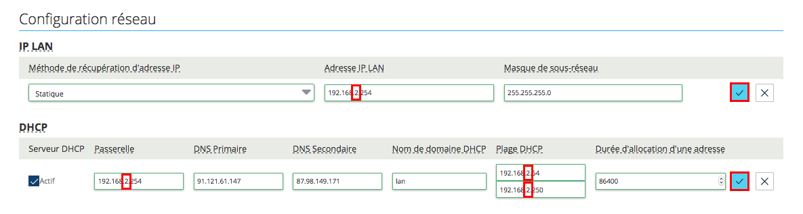

## Modifier l'adresse IP d'un modem OVH
- Rendez vous sur [l'espace client OVH](https://www.ovhtelecom.fr/espaceclient/login/){.external}
- Cliquez sur **"Telecom"**
- Cliquez sur **"Accès Internet"** dans le menu de gauche
- Cliquez sur **l’accès concerné**
- Cliquez sur **"Mon Modem"**

Si vous obtenez le message “La configuration à distance n’est pas activée pour ce modem!”, veuillez cocher la case **"Activer la configuration à distance"** puis patientez quelques minutes.

Attention, lorsque vous activez cette fonctionnalité, cela écrase la configuration présente sur votre modem et la remplace. Si vous disposiez par exemple de règles NAT ou que vous aviez changé les paramètres de connexion au Wifi, ces derniers seront écrasés et devront être re-paramétrés par le biais de l'espace client.

Si la configuration à distance est déjà activée, veuillez modifier les parties **"IP LAN"** et **"DHCP"** selon l'exemple suivant :

{.thumbnail}

Dans cet exemple nous avons remplacé l'IP du modem 192.168. **1** .254 par 192.168. **2** .254

- Patientez 5 minutes pour que le paramétrage soit correctement pris en compte.