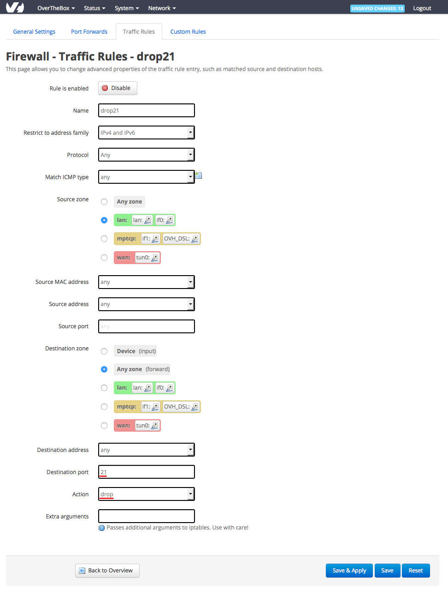

## Créer une &quot;Traffic Rules&quot;
- Rendez-vous dans **Network > Firewall**
- Dans l'onglet **" Traffic Rules "** cliquez sur le bouton **" New forward rule "**
- Indiquez un nom et une zone source (ex : lan) et une zone destination (ex : wan)
- Sur la page suivante, réglez les paramètres pour discriminer le trafic auquel vous devez appliquer une règle. L'exemple ci-dessous montre comment bloquer du trafic FTP sortant.
- Enfin cliquez sur **" Save & Apply "**

{.thumbnail}