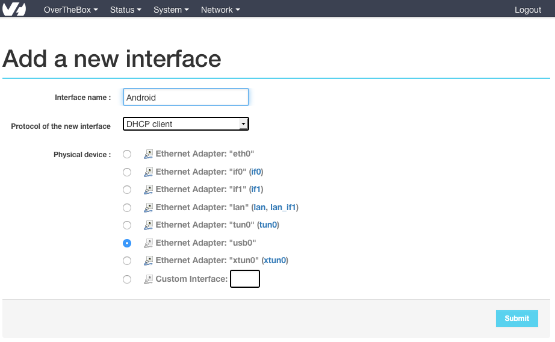
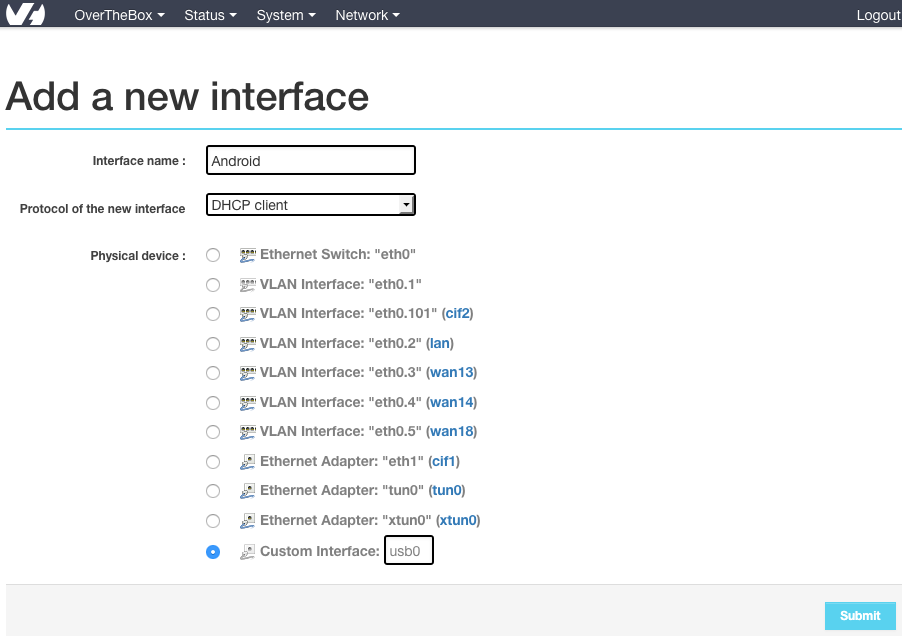
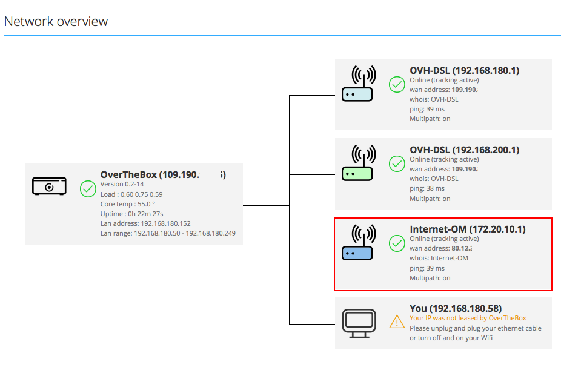

## Préparation de l'OverTheBox

### Pour un téléphone Android (uniquement si première installation)
Les 2 commandes suivantes vont installer les paquets permettant d'utiliser le tethering  **Android**, ces dernières sont inutiles en version **0.6.x** et au delà. En SSH :


```bash
opkg update
opkg install kmod-usb-net kmod-usb-net-rndis kmod-usb-net-cdc-ether
```


### Pour un téléphone IPhone
Les 2 commandes suivantes vont installer les paquets permettant d'utiliser le tethering  **Iphone**, ces dernières sont inutiles en version **0.6.x** et au delà. En SSH :


```bash
opkg update
opkg install kmod-usb-net-ipheth libimobiledevice usbmuxd
```

Ensuite, les commandes suivantes vont permettre à l'OverTheBox de passer l'Iphone en mode Network USB même après chaque reboot. En SSH :


```bash
/usr/sbin/usbmuxd
sed -i '/^exit 0/i/usr/sbin/usbmuxd' /etc/rc.local
```

Votre téléphone vous demandera une confirmation à chaque reconnexion.


## Ajout de la nouvelle interface
Avant de commencer, il est important de connaitre l'interface physique de votre téléphone sur l'OverTheBox

Pour cela, branchez le téléphone en USB sur l'OverTheBox,  **activez le partage de connexion**  puis  **tout de suite** :

- Rendez vous sur [http://overthebox.ovh (192.168.100.1)](http://overthebox.ovh){.external}
- Cliquez sur **"Status"**
- Cliquez sur **"Kernel Log"**
- Descendez tout en bas pour afficher les derniers logs
- Notez le nom de l'interface Ethernet associée à votre clef. Dans notre exemple, l'interface est **usb0**


{.thumbnail}

- Cliquez sur **"Network"**
- Cliquez sur **"Interface"**
- Cliquez sur **"Add New Interface"**
- Cochez la case correspondant à l'interface de la clef (dans notre exemple **usb0**)
- Cliquez sur **"Submit"**
- Cliquez sur **"Save & Apply"**


{.thumbnail}

En fonction du téléphone utilisé, il se peut que l'interface usb0 ne s'affiche pas automatiquement. Dans ce cas, vous pouvez la créer manuellement en cochant la case **"Custom Interface"** et en y inscrivant l'information retrouvée dans les logs (dans notre exemple **usb0**)


{.thumbnail}


## Vérification
Une nouvelle interface sera visible. Cette dernière sera disponible après quelque minutes.


{.thumbnail}