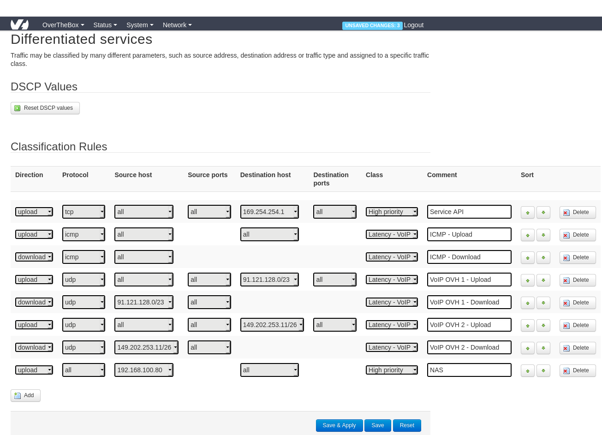

**Dernière mise à jour le 28/04/2021**

## Objectif

Découvrez comment modifier la QoS sur votre équipement OverTheBox, afin de prioriser certain flux réseaux et ainsi améliorer la gestion de votre bande passante.

## Prérequis

- Une **OverTheBox** fournie par OVHcloud

## En pratique

Certaines règles sont déjà présente par défaut, elle permettent notamment de prioriser les services de VoIP proposés par OVHcloud.

### Étape 1 : préparation

> [!primary]
>
> Le débit descendant est la bande passante de l'internet vers votre réseaux local, c'est à dire votre débit de réception.
> Le débit montant est la bande passante de votre réseau vers l'internet, c'est à dire votre débit d'émission.
>

Avant de configurer la  **QoS**, il est conseillé de connaitre le débit maximum **montant et descendant** de chaque connexion utilisée par votre **OverTheBox**. Pour cela, vous pouvez utiliser l'outil [http://proof.ovh.net/](http://proof.ovh.net/){.external} afin de déterminer les débits maximum de chacune de vos connexions.

**A titre d'exemple**  pour ce guide, voici les débits obtenus sur chaque connexion :

- **OVH-DSL1**: Débit descendant : **10 Mbps** / Débit montant : **1.2 Mbps**
- **OVH-DSL2**: Débit descendant : **5 Mbps** / Débit montant : **0.6 Mbps**

### Étape 1 : activer le traffic control

> [!alert]
>
> Le traffic control, ne bride pas votre connexion, il est utile pour mieux répartir le traffic en cas de saturation de la bande passante.
>

Nous allons maintenant pouvoir activer le _traffic control_ grâce à ces débits maximums. Cela va permettre à votre **OverTheBox** de connaitre le débit attendu pour chaque interface et ainsi correctement estimer la saturation de chaque lien.

Pour ce faire :

- Rendez vous sur [http://overthebox.ovh (192.168.100.1)](http://overthebox.ovh){.external}
- Cliquez sur **Network**
- Cliquez sur **Interfaces**
- Cliquez sur l'onglet qui porte le nom de la connexion sur laquelle vous voulez activer le traffic control, **IF1** dans l'exemple.
- Cliquez sur l'onglet **Traffic Control**
- Configurez le _Traffic Control_ en **Static** à l'aide du menu déroulant
- Inscrivez le **débits maximum** de cette connexion en **kbps** pour le débit descendant (**Download**) et montant (**Upload**), 1 Mbps = 1000 kbps, dans notre exemple le débit 10Mbps/1,2Mbps devient 10000/1200
- Cliquez sur **"Save & Apply"**

{.thumbnail}

Refaites cette procédure complète pour chacune de vos connexions (**IF2**, **IF3**, etc.)

> [!warning]
>
> Une fois en place, si vous éprouvez des perturbations, vous pouvez essayer de configurer le traffic control en fixant les débits à 80% de votre débit maximum
> Dans notre exemple, on remplacerait les valeurs 10000/1200 par 8000/960
>

### Étape 2 : créer une nouvelle règle QoS

> [!alert]
>
> La configuration par défaut est déjà optimisée pour une utilisation
> générique ( Upload , VoIP  OVH  etc.), la customisation n'est
> conseillée que si vous souhaitez prioriser une application particulière.
>

Dans notre exemple, nous souhaitons que le débit montant de notre serveur NAS soit priorisé afin d'améliorer la stabilité pour récupérer nos fichier à distance lorsque nous sommes en déplacement.

Pour ce faire :

- Rendez vous sur [http://overthebox.ovh (192.168.100.1)](http://overthebox.ovh){.external}
- Cliquez sur **OvertheBox**
- Cliquez sur **DSCP Settings**

{.thumbnail}

- L'écran de configuration listant toutes les règles QoS s'affiche, comme ci dessous :

{.thumbnail}

- Cliquez sur **"Add"**

_Une nouvelle ligne apparait_

- Dans notre, exemple nous voulons que le NAS ayant pour IP 192.168.100.80 soit prioritaire pour l'upload peut importe l'IP distante. Il faut donc ajouter la règle comme ci-dessous

{.thumbnail}

- Une fois votre règle configurée, vous devez cliquer sur **Save & Apply** pour qu'elle soit correctement sauvegardée.

> [!warning]
>
> Il est possible que cette configuration ne soit pas prise en compte immédiatement.
> Si c'est le cas, veuillez procéder à un redémarrage électrique de l'OverTheBox ou déconnecter/reconnecter le réseau de l'appareil concerné par la règle.
>

> [!primary]
>
> Pour un détails complet des différentes options de cette page, voir la section "Aller plus loin" à la fin de ce guide
>

### Étape 3 : vérifier le bon fonctionnement

Pour vérifier le bon fonctionnement de votre règle :

- Cliquez sur **OverTheBox**
- Cliquez sur **QoS Graphs**

Lorsque le NAS génère du débit montant, le trafic correspondant apparait en orange sur la courbe, le NAS est donc bien identifié comme prioritaire.

{.thumbnail}

## Aller plus loin

### Détails des paramètres de la page DSCP Settings

{.thumbnail}

| Paramètre | Description |
| ------------- | ------------- |
| Direction  | Permet de choisir le sens du traffic sur laquelle la règle s'applique, montant ou descendant |
| Protocol  | Permet d'appliquer la règle uniquement sur un certain type de flux, comme les connexions TCP ou les connexions UDP |
| Source Host  | La plage d'addresse IP d'où proviens le trafic  |
| Source Port  | La plage de port d'où proviens le trafic |
| Destination Hosts | La plage d'addresse IP destinataire du trafic |
| Destination Ports  | La plage de port destinataire du trafic |
| Class | La priorité à attribuer au trafic, voir plus bas |
| Comment | Un commentaire, utile pour l'organisation des règles |
| Sort | Permet de classer la règle. Lorsqu'un paquet arrive, les règles sont testés une par une dans l'ordre depuis le haut du tableau |

### Les différentes classes de trafic

Il existe quatre classes de trafic, qui vous permet de classer le trafic par priorités.

| Paramètre | Description |
| ------------- | ------------- |
| Latency - VoIP  | Pour un trafic très prioritaire et nécessitant une faible latence, comme la VoIP |
| High Priority  | Pour un trafic prioritaire |
| Normal | Pour la majorité du trafic, le traffic n'a pas de priorité particulière |
| Low Priority | Pour un trafic jugé non prioritaire |

N'hésitez pas à échanger avec notre communauté d'utilisateurs sur vos produits Télécom sur notre site [OVHcloud Community](https://community.ovh.com/c/telecom)
