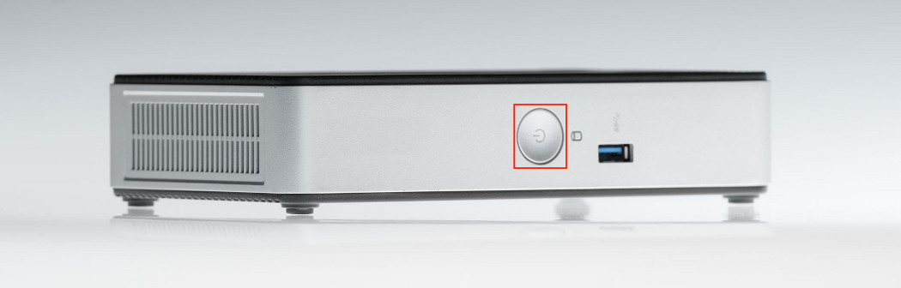
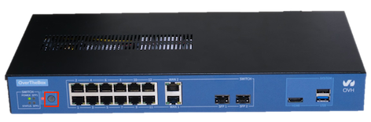
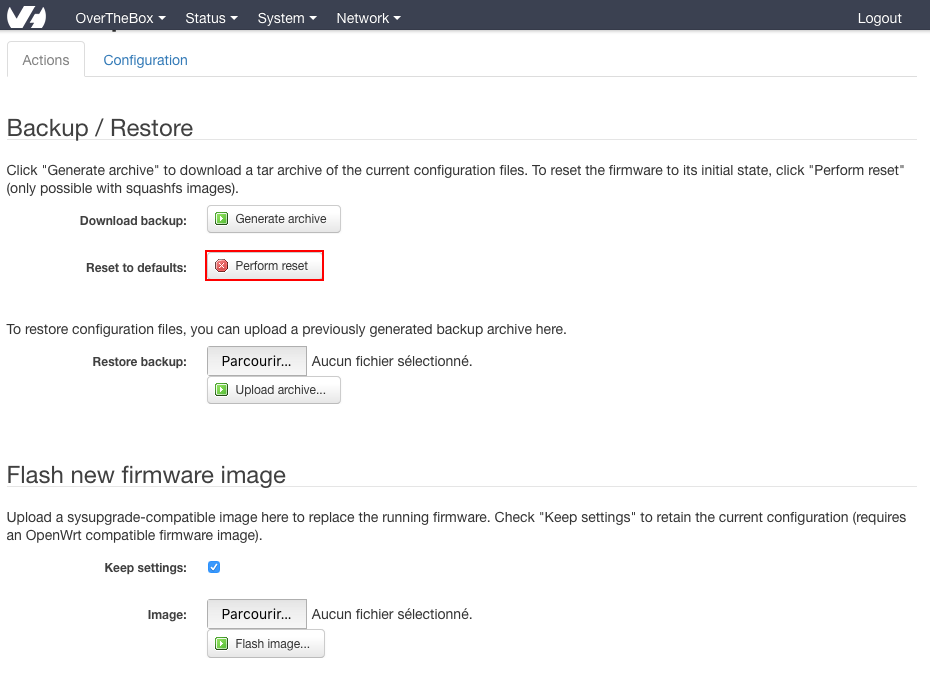

**Dernière mise à jour le 14/11/2022**

## Objectif

Découvrez comment réinitialiser votre équipement OverTheBox afin de revenir à la configuration par défaut.

## Prérequis

- Une **OverTheBox** fournie par OVHcloud

## En pratique

Plusieurs méthodes sont possibles. Le résultat final étant identique, vous pouvez donc choisir celle qui vous convient le mieux.

### Méthode 1 : réinitialisation physique

Appuyez de façon répétée, en moins de 2 secondes, 5 fois sur le bouton Power ON/OFF.

- Dans le cas d'une OverTheBox Intel :

{.thumbnail}

- Dans le cas d'une OverTheBox IT v1 :

{.thumbnail}

- Dans le cas d'un OverTheBox Plus :

{.thumbnail}

- Dans le cas d'un OverTheBox IT v2 :

Appuyez de façon répétée, en moins de 2 secondes, 5 fois sur le bouton Reset.

{.thumbnail}

Attendez quelques minutes afin qu'**OverTheBox** soit de nouveau opérationnelle.

> [!success]
>
> Votre OvertheBox est maintenant réinitialisée, vous pouvez la réinstaller en suivant la procédure décrite dans les guides suivants :
>
> [Installation OverTheBox Intel ou IT v1](../intel-itv1-installation/)
>
> [Installation OverTheBox Plus ou IT v2](../plus-itv2-installation/)
>

### Méthode 2 : réinitialisation par l'interface

> [!warning]
>
> Cette méthode n'est disponible que si le firmware de votre OverTheBox est en version 0.6 ou supérieure.
>

- Rendez-vous sur [http://overthebox.ovh (192.168.100.1)](http://overthebox.ovh){.external}
- Cliquez sur **"System"**
- Cliquez sur **"Backup/Flash Firmware"**
- Cliquez sur **"Perform Reset"**

{.thumbnail}

- Attendez quelques minutes afin qu' **OverTheBox** soit de nouveau opérationnelle.

> [!success]
>
> Votre  OvertheBox  est maintenant réinitialisée, vous pouvez la réinstaller en suivant la procédure décrite dans les guides suivants :
>
> [Installation OverTheBox Intel ou IT v1](../intel-itv1-installation/)
>
> [Installation OverTheBox Plus ou IT v2](../plus-itv2-installation/)
>

### Méthode 3 : réinitialisation par le CLI

> [!warning]
>
> Cette méthode n'est disponible que si le firmware de votre OverTheBox est en version 0.6 ou supérieure.
>

Il est possible de réinitialiser l'**OverTheBox** depuis le CLI, accessible depuis une connexion SSH.

- Connectez vous en SSH à votre **OverTheBox** :

```bash
ssh root@overthebox.ovh
```

- Une fois connecté, entrez la commande suivante :

```bash
firstboot -y
```

- Attendez quelques minutes afin qu'**OverTheBox** soit de nouveau opérationnelle.

> [!success]
>
> Votre OvertheBox est maintenant réinitialisée, vous pouvez la réinstaller en suivant la procédure décrite dans les guides suivants :
>
> [Installation OverTheBox Intel ou IT v1](../intel-itv1-installation/)
>
> [Installation OverTheBox Plus ou IT v2](../plus-itv2-installation/)
>

### Méthode n°4 : réinitialisation par clé USB

> [!warning]
>
> Cette méthode n'est pas recommandée et n'est utile uniquement que pour certains usages avancés.
>

Vous pouvez suivre le guide « [Installer l’image OverTheBox sur votre matériel](../installer-limage-overthebox-sur-votre-materiel/) » pour installer manuellement la dernière image du système OverTheBox.

## Aller plus loin

N'hésitez pas à échanger avec notre communauté d'utilisateurs sur vos produits Télécom sur notre site [OVHcloud Community](https://community.ovh.com/c/telecom)
