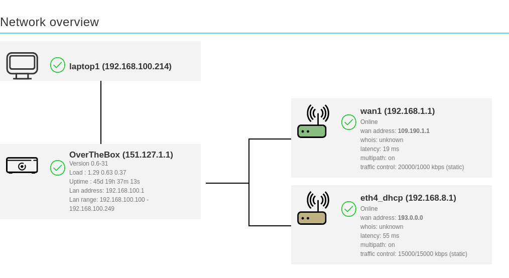

**Dernière mise à jour le 14/06/2021**

## Objectif

Découvrez comment ajouter une route statique sur votre équipement OverTheBox, afin qu'un flux réseau ne passe pas par le tunnel chiffré mais par une interface WAN précise.

## Prérequis

- Une **OverTheBox** fournie par OVHcloud

## En pratique

### Étape 1 : préparation

Dans notre cas notre OverTheBox à deux interfaces WAN, une interface VDSL avec comme IP de gateway **192.168.1.1** et une clé LTE avec comme IP de gateway **192.168.8.1**.
Nous souhaitons que notre service de VoIP OVH accessible sur la range d'IP **91.121.129.0/23** ne passe pas par le tunnel de notre OverTheBox est uniquement par l'interface VDSL.
Nous allons donc créer un route statique pour que la range **91.121.129.0/23** passe uniquement par notre gateway **192.168.1.1**.

{.thumbnail}

### Étape 2 : ajout de la route statique

- Dans le menu, allez sur l'onget **network**, puis sélectionnez **firewall**.
- Cliquez ensuite sur l'onglet **Custom Rules** en haut à droite, dans l'encart de texte, ajouter la règle suivante :
    - **ip route add 91.121.129.0/23 via 192.168.1.1**
- Cliquez sur summit

{.thumbnail}

### Étape 3 : redémarrer le firewall

Pour que les changements soit appliqués, il faut redémarrer le firewall. Pour ce faire :

- Dans le menu, allez sur l'onglet **system**, puis sélectionnez **startup**
- Choisissez l'init script **firewall** et cliquez sur le bouton **restart**

Le firewall va redémarrer et la règle sera correctement appliqué.

{.thumbnail}

## Aller plus loin

N'hésitez pas à échanger avec notre communauté d'utilisateurs sur vos produits Télécom sur notre site [OVHcloud Community](https://community.ovh.com/c/telecom)
