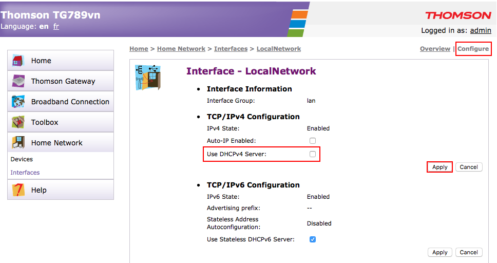
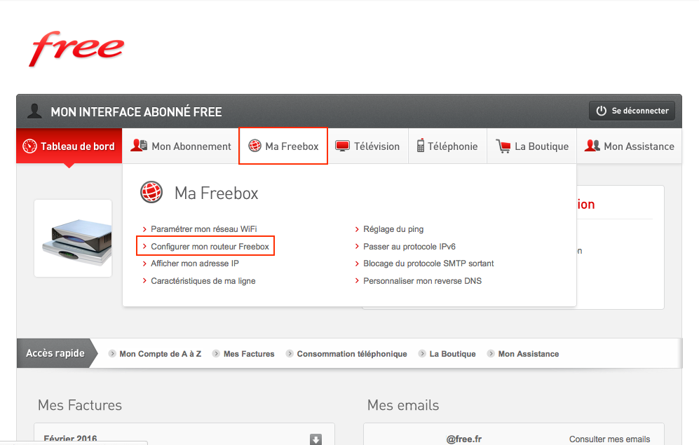

## Préambule

> [!alert]
>
> Cette procédure ne s'applique pas à l'Overthebox "PLUS". Seules les OverTheBox "Intel" et "IT" sont concernées.
> Si vous désactivez le DHCP de vos modems associés à une OverTheBox "PLUS", celle-ci ne fonctionnera pas correctement.
>

Toutes les Box et routeurs distribués par les fournisseurs d'accès Internet possèdent par défaut un  **serveur DHCP actif** . Ce serveur permet de distribuer intelligemment une adresse IP à chaque appareil réseau, leur permettant ainsi de communiquer sur Internet.

Dans un réseau géré par  **OverTheBox** , plusieurs Box ou routeurs sont directement interconnectés, or il ne faut qu' **un seul serveur DHCP**  sur un réseau afin d'éviter les conflits. Il est donc nécessaire de désactiver le serveur DHCP de chaque Box et routeurs gérés par  **OverTheBox** .

Ce guide montre comment effectuer cette opération sur les différentes Box grand public.

> [!alert]
>
> Si votre Box n'est pas présente ci dessous ou si vous rencontrez une quelconque difficulté, veuillez vous rapprocher de votre administrateur ou de votre fournisseur d'accès afin d'effectuer cette manipulation.
>
> La désactivation des serveurs DHCP des Box doit être effectuée à une étape précise de l'installation d'OverTheBox . Il est donc préférable, avant d'effectuer cette manipulation, de suivre la procédure d'installation en vous aidant des documentations « [Mes 10 premières minutes avec OverTheBox Intel](https://docs.ovh.com/fr/overthebox/mes-10-premieres-minutes-avec-overthebox-intel/){.external} » et « [Mes 10 premières minutes avec OverTheBox IT](https://docs.ovh.com/fr/overthebox/mes-10-premieres-minutes-avec-overthebox/){.external} ».
>

## Désactiver le DHCP d'un modem OVH

### Via l'interface Web du Modem
- Connectez-vous à la Box en inscrivant son **adresse IP** dans la barre d'adresse de votre navigateur Internet. Par défaut, cette adresse est [http://192.168.1.254](http://192.168.1.254){.external} .

Si un mot de passe vous est demandé, cela peut être pour deux raisons : Soit vous l'avez changé, soit vous avez activé la configuration du modem via le manager. Dans ce cas, veuillez suivre la procédure via l'espace client ci dessous.

- Cliquez sur **"Home Network"**
- Cliquez sur **"Interfaces"**
- Cliquez sur **"LocalNetwork"**

{.thumbnail}

- Cliquez sur **"Configure"**
- Décochez la case **"Use DHCPv4 Server"**
- Cliquez sur **"Apply"**

{.thumbnail}

### Via l'espace client

- Rendez vous sur Rendez vous sur [l'espace client OVH](https://www.ovhtelecom.fr/espaceclient/login/){.external}
- Cliquez sur **"Telecom"**
- Cliquez sur **l'accès concerné**
- Cliquez sur **"Mon Modem"**

{.thumbnail}

Si, comme sur l'image précédente, vous obtenez le message  "La configuration à distance n'est pas activée pour ce modem!"  Veuillez suivre la procédure expliquée dans cet encadré.

Dans le cas contraire, vous pouvez passer directement à l'étape suivante.

- Cochez la case "Activer la configuration à distance"
- Confirmez en cliquant sur "OK"

Veuillez ensuite patienter quelques minutes le temps que l'information se propage sur le modem. Vous pourrez passer à l'étape suivante lorsque le message ne s'affichera plus après rechargement de la page.

{.thumbnail}

- Cliquez sur le symbole **"Modifier"** dans la partie **DHCP**

{.thumbnail}

- Décochez la case **"Actif"**
- Cliquez sur le symbole **"Valider"**

{.thumbnail}

Veuillez ensuite patienter quelques minutes le temps que l'information se propage sur le modem

## Désactiver le DHCP d'une Box Free

### Freebox v5 et antérieures

- Authentifiez-vous sur votre espace client [https://subscribe.free.fr/login/](https://subscribe.free.fr/login/){.external} grâce à vos identifiants client Free
- Cliquez sur **"Ma Freebox"**
- Cliquez sur **"Configurer mon routeur Freebox"**

{.thumbnail}

- Configurer l'état du DHCP sur **"INACTIF"**

{.thumbnail}

### Freebox v6

- Connectez-vous à la Box en inscrivant **son adresse IP** dans la barre d'adresse de votre navigateur Internet. Par défaut, cette adresse est [http://192.168.1.254](http://192.168.1.254){.external}
- Identifiez-vous avec le login et mot de passe interne de votre Box, Si vous ne le connaissez pas, vous pouvez suivre la procédure de changement sur [http://free.fr/assistance/5056.html](http://free.fr/assistance/5056.html){.external}
- Cliquez sur **"Paramètres de la Freebox"**

{.thumbnail}

- Cliquez sur **"DHCP"**

{.thumbnail}

- Cochez la case **"Activer le serveur DHCP"**
- Cliquez sur **"OK"**

{.thumbnail}

## Désactiver le DHCP d'une Box Orange

- Connectez-vous à la Box en inscrivant **son adresse IP** dans la barre d'adresse de votre navigateur Internet. Par défaut, cette adresse est [http://192.168.1.1](http://192.168.1.1){.external}
- Identifiez-vous avec le login et mot de passe interne de votre Box (par défaut login = **admin** et mot de passe = **8 premiers caractères de la clef wifi**
- Cliquez sur **"configuration avancée"**
- Cliquez sur **"configuration réseau"**
- Configurer le serveur DHCP sur **"désactiver"**
- Cliquez sur **"enregistrer"**

{.thumbnail}

## Désactiver le DHCP d'une Box Numericable
- Connectez-vous à la Box en inscrivant **son adresse IP** dans la barre d'adresse de votre navigateur Internet. Par défaut, cette adresse est [http://192.168.0.1](http://192.168.0.1){.external}
- Identifiez-vous avec le login et mot de passe interne de votre Box (par défaut login = **admin** et mot de passe = **password**
- Cliquez sur **"modifier"** dans la partie DHCP

{.thumbnail}

- Configurez le DHCP sur **"Non"**
- Cliquez sur **"Appliquer"**

{.thumbnail}

## Désactiver le DHCP d'une Box SFR

- Connectez-vous à la Box en inscrivant **son adresse IP** dans la barre d'adresse de votre navigateur Internet. Par défaut, cette adresse est [http://192.168.1.1](http://192.168.1.1){.external}
- Identifiez-vous avec le login et mot de passe interne de votre Box (par défaut login = **admin** et mot de passe = votre clef wifi visible sur l'étiquette au dos de la BOX sous l'appellation **"Clé de sécurité WIFI"**
- Cliquez sur **"Réseau v4"**
- Cliquez sur **"DHCP"**

{.thumbnail}

- Configurez le DHCP sur **"Off"**
- Cliquez sur **"Valider"**

{.thumbnail}

## Désactiver le DHCP d'une Box Bouygues Telecom

- Connectez-vous à la Box en inscrivant **son adresse IP** dans la barre d'adresse de votre navigateur Internet. Par défaut, cette adresse est [http://192.168.1.254](http://192.168.1.254){.external}
- Identifiez-vous avec le login et mot de passe interne de votre Box (par défaut login = **admin** et mot de passe = **admin**
- Cliquez sur **"CONFIGURATION AVANCÉE"**
- Cliquez sur **"Configuration du routeur"**
- Cliquez sur **"DHCP"**
- Cliquez sur **"DÉSACTIVER LE SERVICE"**
- Cliquez sur **"VALIDER"**

{.thumbnail}
