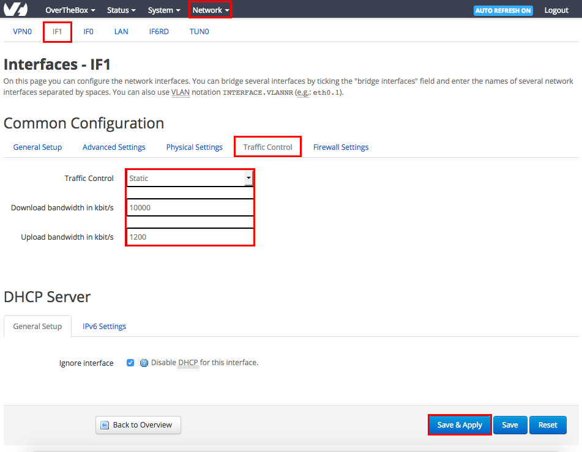
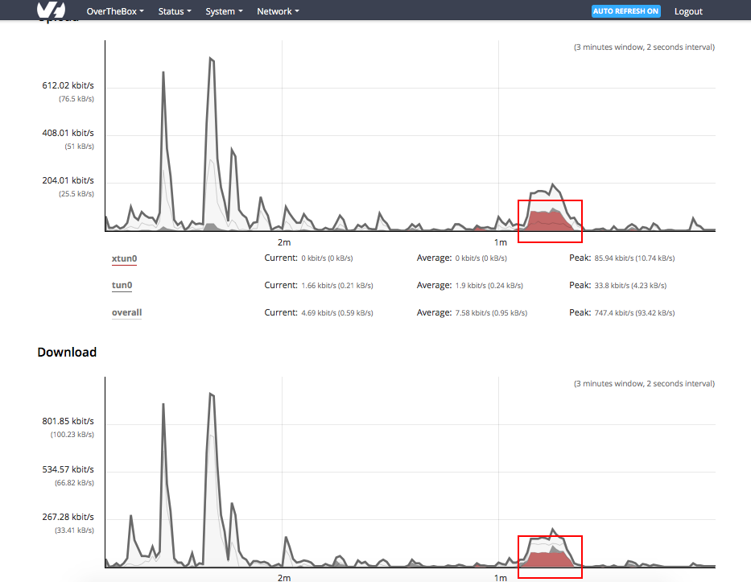

## 1. Préparation
Avant de commencer l'activation et la configuration de la  **QoS** , il est obligatoire de connaitre le débit maximum  **montant et descendant**  de chaque connexion utilisée par votre  **OverTheBox** . Pour cela, vous pouvez utiliser l'outil [http://proof.ovh.net/](http://proof.ovh.net/){.external}

> [!alert]
>
> Il est conseillé, pendant la période de test, de brancher l'ordinateur directement sur le modem et de débrancher tout autre équipement de ce modem (même l' OverTheBox ).
> Avec ce branchement, Il sera certainement nécessaire de reconfigurer manuellement les paramètres réseau de l'ordinateur. En effet, le DHCP du modem doit être désactivé.
> 

**A titre d'exemple**  pour ce guide, voici les débits obtenus sur chaque connexion :

- **OVH-DSL1** (Débit descendant : **10 Mbps** / Débit montant : **1.2 Mbps** )
- **OVH-DSL2** (Débit descendant : **5 Mbps** / Débit montant : **0.6 Mbps** )

## 2. Activation de la QoS
Nous allons maintenant pouvoir activer et configurer la QoS grâce à ces débits maximums. Cela va permettre à  **OverTheBox**  de prioriser la téléphonie tout en limitant sa bande passante et ainsi assurer un bon équilibre en cas de saturation du réseau.

Pour ce faire :

- Rendez vous sur [http://overthebox.ovh (192.168.100.1)](http://overthebox.ovh){.external}
- Cliquez sur **"Network"**
- Cliquez sur **"Interfaces"**
- Cliquez sur l'onglet **"IF1"**
- Cliquez sur l'onglet **"Traffic Control"**
- Configurez le Traffic Control en **"Static"**
- Inscrivez le **débits maximum** de cette connexion en **kbps** pour le débit montant (**Upload**) et descendant (**Download**), 1 Mbps = 1000 kbps

> [!alert]
>
> Cette valeur est primordiale pour le bon fonctionnement de la QoS. Elle ne sera
> pas utilisée pour brider votre connexion mais plutôt pour répartir
> correctement la charge en cas de saturation de la bande passante. Il est
> impératif  d'inscrire votre débit exacte (voir le premier point)
> 

- Cliquez sur **"Save & Apply"**

{.thumbnail}

Refaites cette procédure complète pour chacune de vos connexions (**IF2**, **IF3**, etc.)

> [!success]
>
> Une fois en place, si vous éprouvez encore des perturbations de la QoS en VoIP,
> nous vous conseillons d'adapter le réglage des débits download et upload à
> 80% du débit maximum de chacune de vos connexions.
> 

## 3. Vérifier la mise en place
Vous pouvez vérifiez la bonne prise en compte de la QoS sur la téléphonie :

- Cliquez sur **"OverTheBox"**
- Cliquez sur **"TUN Graphs"**

Passez un appel téléphonique, vous devriez alors voir en direct une partie du graphique en  **rouge**  :

{.thumbnail}

Cette partie en  **rouge**  symbolise la bande passante consommée par vos téléphones. Sa présence indique que la  **QoS**  est bien fonctionnelle.

## 4. Personnaliser la QoS
Vous pouvez personnaliser la **QoS** de votre **OverTheBox** pour que cette dernière soit parfaitement adaptée à l'utilisation de vos différentes applications réseau.

Pour cela, veuillez consulter le guide suivant : [Fonctionnement et Customisation de la QoS](../middle_fonctionnement_et_customisation_de_la_qos/guide.fr-fr.md){.ref}