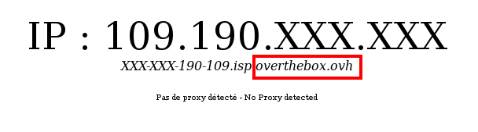

## 1. Enregistrement du service


> [!alert]
>
> Les opérations qui suivent doivent être effectuées depuis un ordinateur
> connecté directement sur le modem principal  afin que votre  OverTheBox
> soit reconnue.
> 

- Rendez-vous sur [http://overthebox.ovh (192.168.100.1)](http://overthebox.ovh){.external} depuis votre ordinateur connecté au modem principal.
- Cliquez sur **"Register"**.


{.thumbnail}

- Identifiez vous sur l'espace client.
- Cliquez sur le **service OverTheBox** que vous souhaitez associer à votre boitier.


{.thumbnail}

- Faites au préalable un copier/coller du nouveau **Device ID** sur l'interface **OverTheBox**.


{.thumbnail}

- Modifiez l' **Identifiant du périphérique**, il faut alors indiquer le **"Device ID"**.


{.thumbnail}

- Validez.

L'enregistrement est terminé, patientez quelques minutes avant de passer à l'étape suivante.


## 2. Activation et Configuration de l'OverTheBox sur la connexion principale
- Retournez sur [http://overthebox.ovh (192.168.100.1)](http://overthebox.ovh){.external} depuis votre ordinateur connecté au modem principal.
- Cliquez sur le bouton **"Activate"**.


{.thumbnail}

Votre  **OverTheBox**  est maintenant prête à la configuration :


{.thumbnail}

- Connectez-vous au modem principal sur une nouvelle page du navigateur grâce à l'IP indiquée (dans notre exemple **http://192.168.0.1** ) et désactivez le DHCP de ce modem :


> [!success]
>
> Comment désactiver le serveur DHCP des principaux modems grand public ? : Désactiver votre serveur DHCP <docs/telecom/overthebox/desactiver_votre_serveur_dhcp/>
> 

- Revenez ensuite sur [http://overthebox.ovh (192.168.100.1)](http://overthebox.ovh){.external} et cliquez sur **"Recheck"**.


{.thumbnail}

Cette opération dure 30 secondes, le DHCP sera ensuite géré par votre **OverTheBox**.


{.thumbnail}

- Rafraichissez ensuite la configuration réseau de votre ordinateur afin que ce dernier soit désormais pris en charge par l' **OverTheBox**, pour ce faire :
    - En **Ethernet RJ45** : débranchez et rebranchez le câble RJ45.
    - En **Wifi** : coupez le Wifi et réactivez-le.
- Assurez vous que l'installation se soit bien déroulée en vérifiant votre **IP publique** sur le site [http://monip.org/](http://monip.org/){.external}. Vous devez obtenir une IP similaire à la suivante :


{.thumbnail}

- Si vous ne voyez pas le domaine **overthebox.ovh**, veuillez renouveller manuellement la configuration réseau de votre ordinateur. Pour ce faire :
    - Sous **Windows**, ouvrez une invite de commande grâce au raccourci clavier **Windows + R** puis en tapant **cmd** dans la zone d'execution.
    - Tapez dans l'invite de commande :


```bash
ipconfig /release
ipconfig /renew
```

- Puis patientez 30 secondes.


> [!alert]
>
> Si malgré cette opération, le site http://monip.org/
> ne retourne toujours pas les bonnes informations, veuillez recommencer
> l'intégralité de cette dernière étape point par point.
> 


## 3. Ajout d'une connexion supplémentaire
- Avant de brancher le modem supplémentaire, vérifiez que ce dernier possède **un sous réseau différent** des autres modems.

**Exemple** : Le premier modem possède l'IP 192.168. **0** .1 et le deuxième 192.168. **1** .1


> [!alert]
>
> Cette vérification est obligatoire afin de s'assurer du bon fonctionnement en fin d'installation.
> Afin de connaître l'adresse IP d'un modem non fourni par OVH, veuillez vous rapprocher de votre administrateur ou de votre fournisseur d'accès.
> 

**Cas d'un modem Technicolor fourni par OVH :** l'adresse IP par défaut d'un modem OVH Technicolor (Type TG788 ou TG789) est 192.168. **1** .254.

Il n'est donc pas possible de le cumuler avec un autre modem en 192.168. **1** .XXX.

Dans ce cas, vous devez modifier l'adresse IP de l'un des deux modems.


> [!primary]
>
> Modification de l'adresse IP d'un modem fourni par OVH <docs/telecom/overthebox/advanced/advanced_modifier_l_adresse_ip_d_un_modem_ovh/>
> 

- Branchez votre deuxième modem **sur le modem principal** (comme sur l'image ci-dessous avec le câble vert).


{.thumbnail}

- Retournez sur [http://overthebox.ovh (192.168.100.1)](http://overthebox.ovh){.external} depuis l'ordinateur toujours **branché sur le modem principal**.

Votre  **OverTheBox**  va détecter le deuxième modem :


{.thumbnail}

- Connectez-vous au deuxième modem sur une nouvelle page du navigateur grâce à l'IP indiquée (dans notre exemple **http://192.168.1.1** ) et désactivez le DHCP de ce modem :


> [!success]
>
> Comment désactiver le serveur DHCP des principaux modems grand public ? : Désactiver votre serveur DHCP <docs/telecom/overthebox/desactiver_votre_serveur_dhcp/>
> 

- Revenez ensuite sur [http://overthebox.ovh (192.168.100.1)](http://overthebox.ovh){.external} et cliquez sur " recheck ".

Cette opération dure 30 secondes.


{.thumbnail}

La configuration est terminée. Votre  **OverTheBox**  utilise à présent les 2 connexions simultanées comme indiqué à l'accueil de [http://overthebox.ovh](http://overthebox.ovh){.external} :


{.thumbnail}


> [!success]
>
> Ce dernier paragraphe est à répéter pour  chaque connexion
> supplémentaire . L' OverTheBox est capable d'en agréger 4.
> 