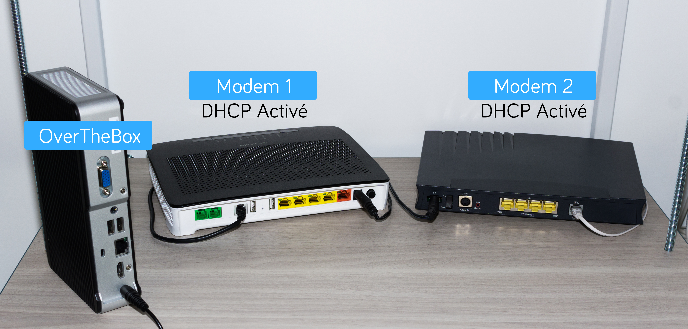
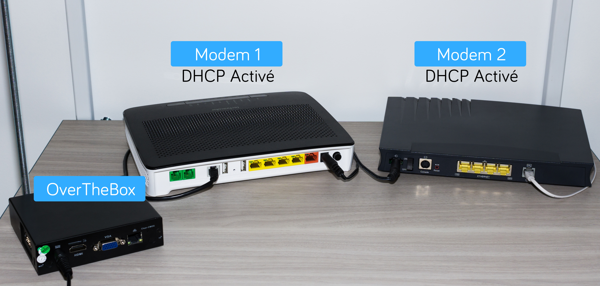
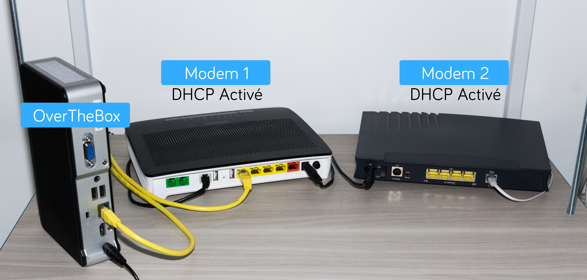
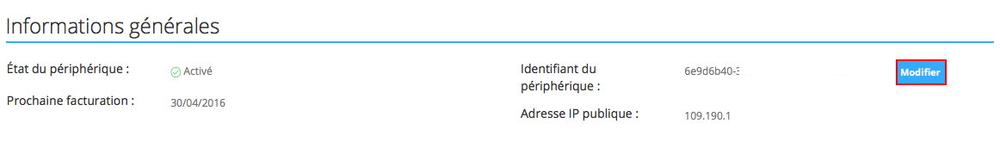
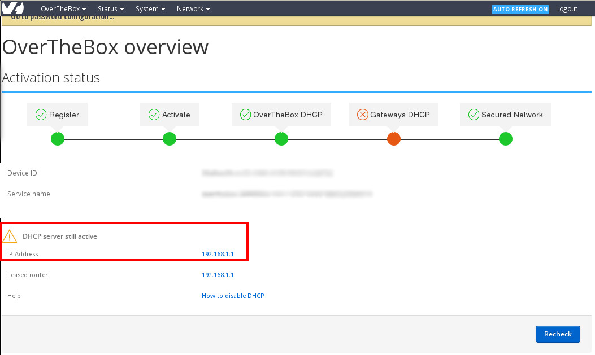

**Dernière mise à jour le 14/04/2021**

> [!warning]
>
> Ce guide est déprécié et concerne la configuration d'équipements OverTheBox qui ne sont plus disponibles à la vente.
> Veuillez vous reporter au guide suivant pour les offres OverTheBox actuelles : [Installation OverTheBox Plus ou IT v2](../plus-itv2-installation)
>

## Objectif

Découvrez comment installer et configurer votre équipement OverTheBox Intel ou IT v1 afin de profiter de votre offre OverTheBox

## Prérequis

- Au moins un modem ayant accès à Internet sur lequel vous devez être en capacité de modifier la configuration réseau (IP et DHCP). **Exemple** : Box fournie par un fournisseur d'accès Internet comme OVHcloud ou un opérateur national.
- Une **OverTheBox** fournie par OVHcloud ou une installation depuis le projet Open Source ([installer l'image overthebox sur votre materiel](../installer-limage-overthebox-sur-votre-materiel/))

> [!alert]
>
> A ce stade, aucun branchement ne doit être fait entre les modems et l'OverTheBox.
> Il est aussi impératif d'utiliser uniquement les modems et l'OverTheBox pendant toute la durée de l'installation.
> Si votre installation doit comprendre un switch, il est préférable d'intégrer ce dernier une fois la procédure terminée.
>

## En pratique

### Étape 1 : préparation de vos modems

Pour le bon déroulement de la procédure d'installation, il est impératif que vos modems répondent à 2 conditions :

- Le serveur DHCP de de vos modems doit être **activé**.
- Les modems doivent être sur des réseaux locaux différents les uns des autres.

> [!success]
>
> Rassurez-vous, cette fonction est déjà activée sur les Box des principaux opérateurs grand public. Si vous pouvez aller sur Internet en passant directement par le modem sans avoir effectué de configuration spécifique préalable sur l'ordinateur, cela veut dire que le DHCP est activé.
>

Dans le cas d'une OverTheBox Intel :
{.thumbnail}

Dans le cas d'une OverTheBox IT v1 :
{.thumbnail}

**Exemple** : Le premier modem possède l'IP 192.168.**0**.1 et le deuxième 192.168.**1**.1

> [!primary]
>
> Afin de connaître l'adresse IP d'un modem non fourni par OVHcloud, veuillez vous rapprocher de votre administrateur ou de votre fournisseur d'accès.
>

**Cas d'un modem Technicolor TG788 ou TG789 fourni par OVHcloud :** l'adresse IP par défaut d'un modem OVHcloud Technicolor TG788 ou TG789 est 192.168.**1**.254.
**Cas d'un modem Technicolor TGTG799vac ou Zyxel fourni par OVHcloud :** l'adresse IP par défaut d'un modem OVHcloud Technicolor TG799vac ou Zyxel VMG8924-B10D est 192.168.**1**.1.

Il n'est donc pas possible de le cumuler avec un autre modem en 192.168.**1**.0/24

Dans ce cas, vous devez modifier l'adresse IP de l'un des deux modems, ce guide détaille la procédure à suivre en fonction de votre fournisseur d'accès : [Désactiver le serveur DHCP de votre modem](../intel-itv1-desactiver-dhcp-modem/)

Les modems et l'**OverTheBox** ne doivent toujours pas être reliés entre eux.

### Étape 2 : branchements au modem principal

- Parmi vos modems, choisissez celui qui sera le **"modem principal"**, c'est sur ce dernier que seront branchés tous vos équipements ainsi que l'**OverTheBox**.

> [!primary]
>
> Si vous utilisez la Télévision via l'un de vos modems (Box TV), il est préférable de le sélectionner comme modem principal.
>

- Branchez votre  **OverTheBox** sur le courant électrique et sur le **"modem principal"** via un **câble RJ45** (câble jaune sur l'image ci-dessous).

> [!warning]
>
> Le deuxième modem doit pour l'instant rester isolé, nous nous occuperons de ce dernier à l'étape 5 de ce guide.
>

Dans le cas d'une OverTheBox Intel :
{.thumbnail}

Dans le cas d'une OverTheBox IT v1 :
{.thumbnail}

> [!success]
>
> Votre  OverTheBox  peut maintenant contacter nos serveurs via le modem principal et va se mettre à jour automatiquement. Veuillez patienter  5 Minutes  avant de passer à l'étape suivante.
>

### Étape 3 : enregistrement du service

> [!alert]
>
> Les opérations qui suivent doivent être effectuées depuis un ordinateur connecté directement sur le modem principal afin que votre OverTheBox
> soit reconnue (câble noir sur l’image ci-dessous).
>

Dans le cas d'une OverTheBox Intel :
{.thumbnail}

Dans le cas d'une OverTheBox IT v1 :
{.thumbnail}

- Rendez-vous sur [http://overthebox.ovh (192.168.100.1)](http://overthebox.ovh){.external} depuis votre ordinateur connecté au modem principal.

#### Automatiquement

Lors de votre première connexion, un assistant d'installation se lance, **nous vous invitons à suivre toutes les étapes sans exception**.

#### Manuellement

- Cliquez sur **"Register"**.

{.thumbnail}

- Identifiez vous sur l'espace client.
- Cliquez sur le **service OverTheBox** que vous souhaitez associer à votre boitier.

{.thumbnail}

- Faites au préalable un copier/coller du nouveau **Device ID** sur l'interface **OverTheBox**.

{.thumbnail}

- Modifiez l' **Identifiant du périphérique**, il faut alors indiquer le **"Device ID"**.

{.thumbnail}

- Validez.

> [!success]
>
> L'enregistrement est terminé, patientez quelques minutes avant de passer à l'étape suivante.
>

### Etape 4 : activation et configuration de l’OverTheBox sur la connexion principale

> [!alert]
>
> Les opérations qui suivent doivent être effectuées depuis un ordinateur
> connecté directement sur le modem principal afin que votre OverTheBox
> soit reconnue (câble noir sur l’image ci-dessous).
>

- Retournez sur [http://overthebox.ovh (192.168.100.1)](http://overthebox.ovh){.external} depuis votre ordinateur connecté au modem principal.
- Cliquez sur le bouton **"Activate"**.

{.thumbnail}

Votre **OverTheBox** est maintenant prête à la configuration :

{.thumbnail}

- Connectez-vous au modem principal sur une nouvelle page du navigateur grâce à l'IP indiquée (dans notre exemple **http://192.168.0.1** ) et désactivez le DHCP de ce modem :

> [!primary]
>
> Comment désactiver le serveur DHCP des principaux modems grand public ?
> Voir le guide [Désactiver le serveur DHCP de votre modem](../intel-itv1-desactiver-dhcp-modem)
>

- Revenez ensuite sur [http://overthebox.ovh (192.168.100.1)](http://overthebox.ovh){.external} et cliquez sur **recheck**.

{.thumbnail}

Cette opération dure 30 secondes, le DHCP sera ensuite géré par votre **OverTheBox**.

{.thumbnail}

- Rafraichissez ensuite la configuration réseau de votre ordinateur afin que ce dernier soit désormais pris en charge par l' **OverTheBox**. Pour ce faire :
    - En **Ethernet RJ45** : débranchez et rebranchez le câble RJ45.
    - En **Wifi** : coupez le WiFi et réactivez-le.
- Assurez vous que l'installation se soit bien déroulée en vérifiant votre **IP publique** sur notre site [http://proof.ovh.net/](http://proof.ovh.net/){.external}. Vous devez obtenir une IP similaire à 109.190.x.y ou 151.127.x.y:

{.thumbnail}

- Si vous ne voyez pas le domaine **overthebox.ovh**, veuillez renouveller manuellement la configuration réseau de votre ordinateur. Pour ce faire :
    - Sous **Windows**, ouvrez une invite de commande grâce au raccourci clavier **Windows + R** puis en tapant **cmd** dans la zone d'execution.
    - Tapez dans l'invite de commande :
```bash
ipconfig /release
ipconfig /renew
```
- Puis patientez 30 secondes.

> [!alert]
>
> Si malgré cette opération, le site [http://proof.ovh.net/](http://proof.ovh.net/){.external} ne retourne toujours pas les bonnes informations, veuillez recommencer
> l'intégralité de cette dernière étape point par point.
>

### Étape 5 : ajout d'une connexion supplémentaire

Avant de brancher le modem supplémentaire, vérifiez que ce dernier possède **un sous réseau différent** des autres modems.

**Exemple** : Le premier modem possède l'IP 192.168.**0**.1 et le deuxième 192.168.**1**.1

> [!alert]
>
> Cette vérification est obligatoire afin de s'assurer du bon fonctionnement en fin d'installation.
> Afin de connaître l'adresse IP d'un modem non fourni par OVHcloud, veuillez vous rapprocher de votre administrateur ou de votre fournisseur d'accès.
>

**Cas d'un modem Technicolor TG788 ou TG789 fourni par OVHcloud :** l'adresse IP par défaut d'un modem OVHcloud Technicolor TG788 ou TG789 est 192.168.**1**.254.
**Cas d'un modem Technicolor TGTG799vac ou Zyxel fourni par OVHcloud :** l'adresse IP par défaut d'un modem OVHcloud Technicolor TG799vac ou Zyxel VMG8924-B10D est 192.168.**1**.1.

Il n'est donc pas possible de le cumuler avec un autre modem en 192.168.**1**.0/24

Dans ce cas, vous devez modifier l'adresse IP de l'un des deux modems, ce guide détaille la procédure à suivre en fonction de votre fournisseur d'accès : [Désactiver le serveur DHCP de votre modem](../intel-itv1-desactiver-dhcp-modem/)

- Branchez votre deuxième modem **sur le modem principal** (comme sur l'image ci-dessous avec le câble vert).

Dans le cas d'une OverTheBox Intel :
{.thumbnail}

Dans le cas d'une OverTheBox IT v1 :
{.thumbnail}

- Retournez sur [http://overthebox.ovh (192.168.100.1)](http://overthebox.ovh){.external} depuis l'ordinateur toujours **branché sur le modem principal**.

Votre **OverTheBox** va détecter le deuxième modem :

{.thumbnail}

- Connectez-vous au deuxième modem sur une nouvelle page du navigateur grâce à l'IP indiquée (dans notre exemple **http://192.168.1.1** ) et désactivez le DHCP de ce modem :

> [!primary]
>
> Comment désactiver le serveur DHCP des principaux modems grand public ?
> Voir le guide [Désactiver le serveur DHCP de votre modem](../intel-itv1-desactiver-dhcp-modem)
>

- Revenez ensuite sur [http://overthebox.ovh (192.168.100.1)](http://overthebox.ovh){.external} et cliquez sur **recheck**.

Cette opération dure 30 secondes.

{.thumbnail}

La configuration est terminée. Votre  **OverTheBox**  utilise à présent les 2 connexions simultanées comme indiqué à l'accueil de [http://overthebox.ovh](http://overthebox.ovh){.external} :

{.thumbnail}

> [!primary]
>
> L'OverTheBox est capable d'agréger jusque 4 connexions, il faut répéter cette étape pour chaque connexion supplémentaire.
>

## Aller plus loin

### Ajouter un décodeur TV

Si vous devez utiliser la télévision via l'un des modems pris en charge par **OverTheBox**, veuillez suivre la procédure décrite sur le guide suivant : [Intégration d'un Décodeur TV](../intel-itv1-integration-decodeur-tv/){.external}.

### Brancher l'OverTheBox sur un switch

Pour utiliser votre **OverTheBox** sur un **switch réseau**, la configuration ne doit pas être modifiée (hormis celle de votre switch s'il est manageable), il vous suffit de modifier les branchements et tout connecter sur le switch.


N'hésitez pas à échanger avec notre communauté d'utilisateurs sur vos produits Télécom sur notre site [OVHcloud Community](https://community.ovh.com/c/telecom)
