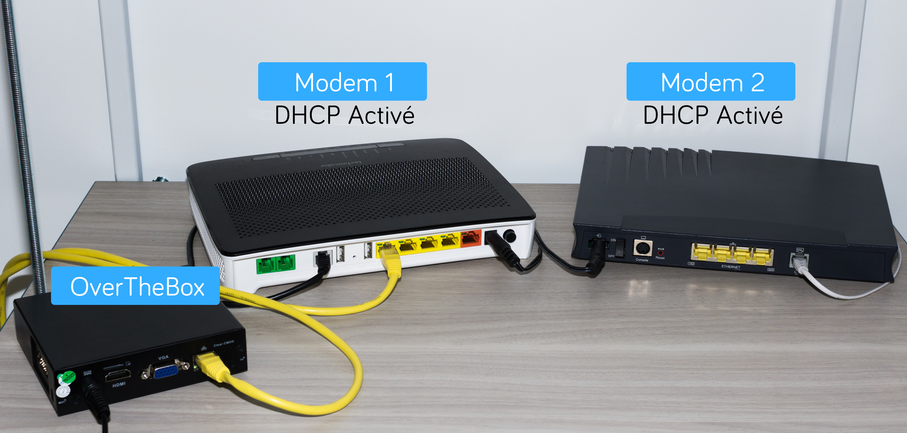

## Prérequis
- **Deux modems basiques** ou plus, parfaitement fonctionnels et indépendants. **Exemple** : Box fournie par un opérateur Internet national.

Vous devez être en capacité de modifier la configuration réseau de ces derniers (IP et DHCP).

- Une **OverTheBox** fournie par OVH ou une installation depuis le projet. Open Source ([installer l'image overthebox sur votre materiel](https://docs.ovh.com/fr/overthebox/installer-limage-overthebox-sur-votre-materiel/){.ref})

> [!alert]
>
> A ce stade, aucun branchement ne doit être fait entre les modems et l'OverTheBox.
> Il est aussi impératif d'utiliser uniquement les modems et l'OverTheBox pendant toute la durée de l'installation.
> Si votre installation doit comprendre un switch, il est préférable d'intégrer ce dernier une fois la procédure terminée.
> 

## 1. Préparation de vos modems
Pour le bon déroulement de la procédure d'installation, il est impératif que vos modems répondent à 2 conditions :

- Le serveur DHCP de chacun de vos modems soit **activé**.

> [!success]
>
> Rassurez-vous, cette fonction est déjà activée sur les Box des principaux opérateurs grand public.
> Si vous pouvez aller sur Internet en passant directement par le modem sans
> avoir effectué de configuration spécifique préalable sur l'ordinateur, cela
> veut dire que le DHCP est activé.
> 

{.thumbnail}

- Les modems doivent être sur des réseaux locaux différents les uns des autres

**Exemple** : Le premier modem possède l'IP 192.168. **0** .1 et le deuxième 192.168. **1** .1

> [!alert]
>
> Afin de connaître l'adresse IP d'un modem non fourni par OVH, veuillez vous rapprocher de votre administrateur ou de votre fournisseur d'accès.
> 

**Cas d'un modem Technicolor fourni par OVH :** l'adresse IP par défaut d'un modem OVH Technicolor (Type TG788 ou TG789) est 192.168. **1** .254.

Il n'est donc pas possible de le cumuler avec un autre modem en 192.168. **1** .XXX.

Dans ce cas, vous devez modifier l'adresse IP de l'un des deux modems.

> [!primary]
>
> Modification de l'adresse IP d'un modem fourni par OVH <docs/telecom/overthebox/advanced/advanced_modifier_l_adresse_ip_d_un_modem_ovh/>
> 

Les modems et l'**OverTheBox** ne doivent toujours pas être reliés entre eux.

## 2. Branchements au modem principal
- Parmi vos modems, choisissez celui qui sera le **"modem principal"**, c'est sur ce denier que seront branchés tous vos équipements ainsi que l'**OverTheBox**.

> [!success]
>
> Si vous utilisez la Télévision via l'un de vos modems (Box TV), il est préférable de le sélectionner comme modem principal.
> 

- Branchez votre  **OverTheBox**  sur le courant électrique et sur le **"modem principal"** via un  **câble RJ45**  (câble jaune sur l'image ci-dessous).

> [!alert]
>
> Le deuxième modem doit pour l'instant rester isolé, nous nous occuperons de ce dernier plus tard.
> 

{.thumbnail}

> [!alert]
>
> Votre  OverTheBox  peut maintenant contacter nos serveurs via le modem principal et va se mettre à
> jour automatiquement. Veuillez patienter  5 minutes  avant de passer à
> l'étape suivante.
> 

## 3. Installation

> [!alert]
>
> Les opérations qui suivent doivent être effectuées depuis un ordinateur
> connecté directement sur le modem principal  afin que votre  OverTheBox
> soit reconnue. (câble noir sur l’image ci-dessous)
> 

{.thumbnail}

- Rendez-vous sur [http://overthebox.ovh (192.168.100.1)](http://overthebox.ovh){.external} depuis votre ordinateur connecté au modem principal.

Un assistant d'installation se lance, **nous vous invitons à suivre toutes les étapes sans exception**.

> [!primary]
>
> Si vous ne passez pas l'assistant de configuration ou que vous rencontrez la
> moindre difficulté avec ce dernier, un protocole d'installation manuelle est
> disponible afin de le remplacer : Installation Manuelle <docs/telecom/overthebox/installation_manuelle/otbv2a/>.
> 

## Décodeur TV
Si vous devez utiliser la Télévision via l'un des modems pris en charge par **OverTheBox**, veuillez suivre la procédure décrite sur le guide suivant : [Créer un bail DHCP permanent / Intégration d'un Décodeur TV](../../middle_creer_un_bail_dhcp_permanent/guide.fr-fr.md){.ref}.

## Branchements de l'OverTheBox sur un switch
Cette section est facultative, elle vous explique comment utiliser votre **OverTheBox**  sur un  **switch réseau**. Pour ce faire, la configuration n'est pas à changer (hormis celle de votre switch), il vous suffit de modifier les branchements et tout connecter sur le switch.