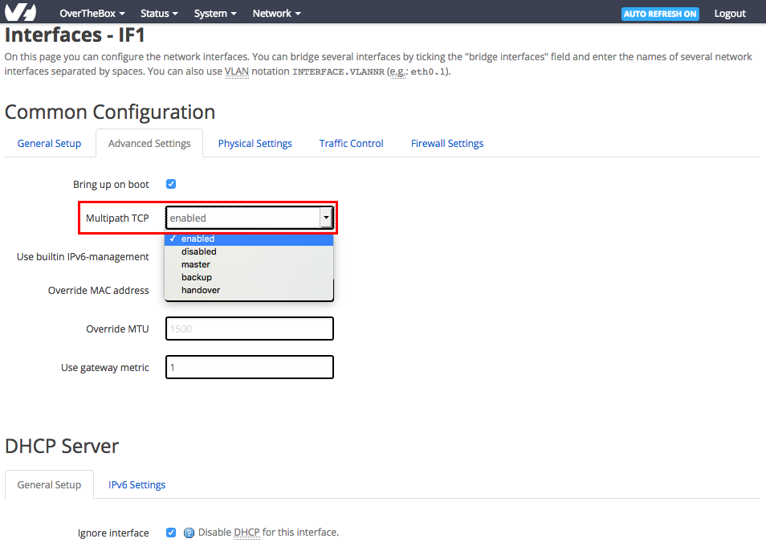

## Réglage de l'agrégation
Pour chacune de vos connexions internet, Vous pouvez régler la politique d'agrégation sur [http://overthebox.ovh (192.168.100.1)](http://overthebox.ovh){.external} en cliquant sur :  **Network**  >  **Interfaces**  >  **IFx**  >  **Advanced Settings** Dans la partie **Multipath TCP**, voici les 3 options qui vont nous intéresser :

{.thumbnail}

- **Enabled** : Permet d'inclure la connexion internet concernée dans l'agrégation de liens.
- **Disabled** : La connexion internet concernée ne sera pas prise en compte dans l'agrégation de liens.
- **Backup** : La connexion internet concernée ne sera utilisée qu'en cas de perte de tous les autres liens **"enabled"**.

**Mise en situation :**

> [!success]
>
> Besoin :
> - 
> Vous possédez une connexion ADSL ainsi qu'une connexion 4G.
> - 
> Vous souhaitez que la connexion 4G ne soit utilisée qu'en cas d'extreme nécessité (perte du premier lien ADSL) afin de garantir une continuité de service en toute circonstance sans surconsommer au quotidien votre abonnement 4G.
> 
> Configuration :
> - 
> Configurez la connexion ADSL (IF1) en "enabled".
> - 
> Configurez la connexion 4G (IF2) en "backup".
> 
> 