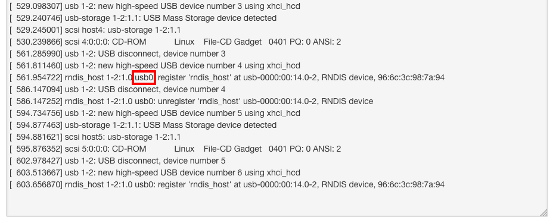
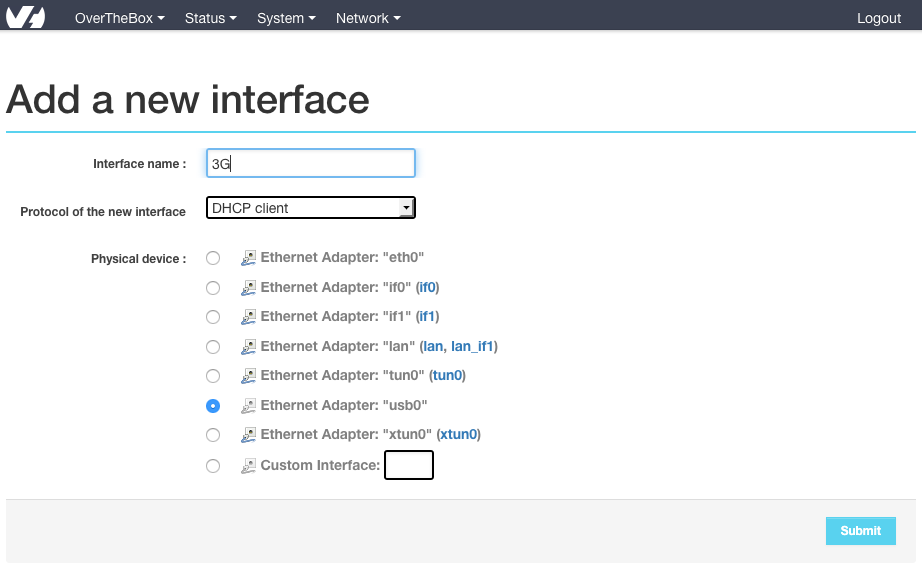
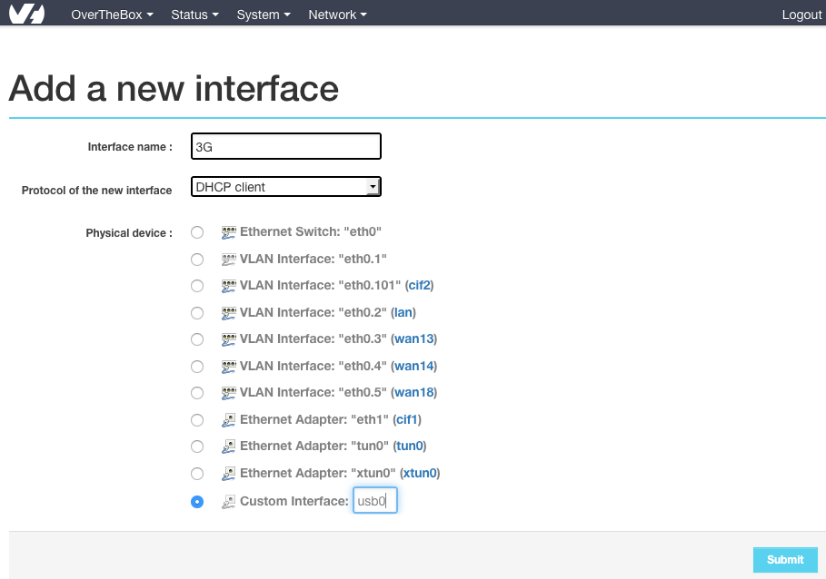
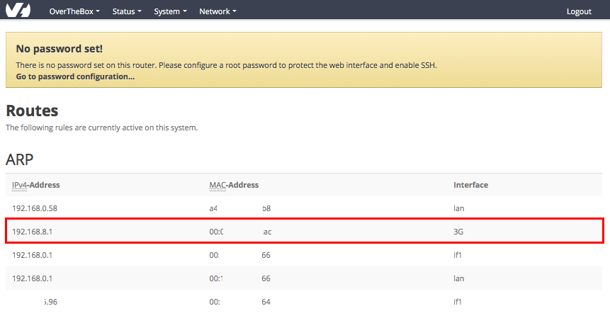
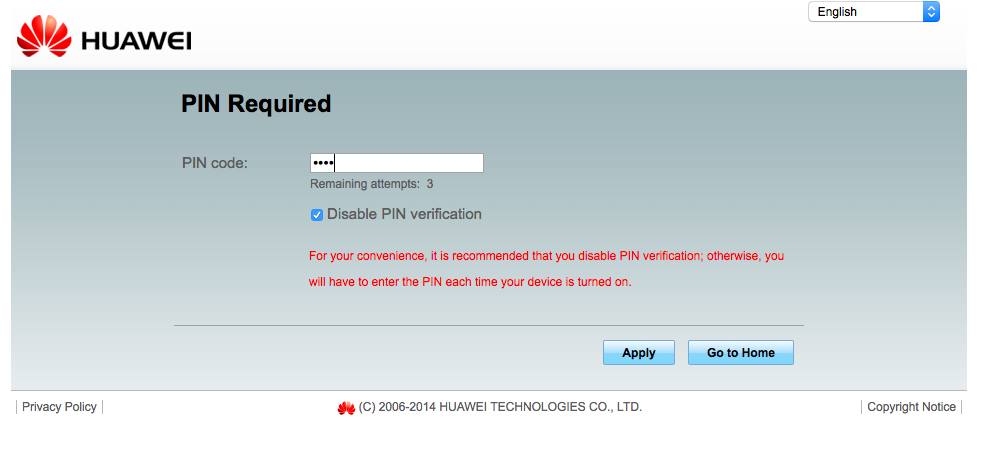
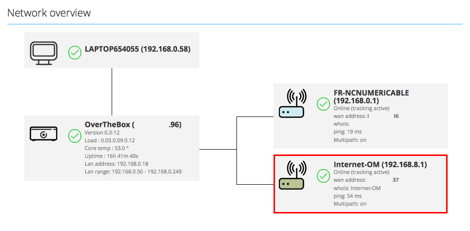

Pour la préparation de ce guide, les 3 clefs suivantes ont été testées

- **Huawei E3372H** (4G)
- **Huawei E3131** (3G)
- **Huawei E303** (3G)

Ces 3 clefs sont donc parfaitement compatibles et adaptées à ce guide

Pour ce guide nous utilisons une carte SIM Orange Mobile mais la procédure reste identique pour tous les opérateurs.

## 1. Branchement de la clef
Insérer votre clef 3G/4G contenant votre carte sim sur n'importe quel port USB de votre boitier  **OverTheBox**

## 2. Vérifier l'association d'une interface Ethernet à votre clef
Juste après avoir branché la clef :

- Rendez vous sur [http://overthebox.ovh (192.168.100.1)](http://overthebox.ovh){.external}
- Cliquez sur **"Status"**
- Cliquez sur **"Kernel Log"**
- Descendez tout en bas pour afficher les derniers logs
- Notez le nom de l'interface Ethernet associée à votre clef. Dans notre exemple, l'interface est **usb0**

{.thumbnail}

## 3. Création de l'interface WAN sur l'OverTheBox
- Restez sur [http://overthebox.ovh (192.168.100.1)](http://overthebox.ovh){.external}
- Cliquez sur **"Network"**
- Cliquez sur **"Interface"**
- Cliquez sur **"Add New Interface"**
- Cochez la case correspondant à l'interface de la clef (dans notre exemple **usb0**)
- Cliquez sur **"Submit"**
- Cliquez sur **"Save & Apply"**

{.thumbnail}

En fonction de la clef utilisée, il se peut que l'interface usb0 ne s'affiche pas automatiquement. Dans ce cas vous pouvez la créer manuellement en cochant la case **"Custom Interface"** et en y inscrivant l'information retrouvée dans les logs (dans notre exemple **usb0**)

{.thumbnail}

## 4. Retrouvez l'IP de votre clef 3G-4G
- Restez sur [http://overthebox.ovh (192.168.100.1)](http://overthebox.ovh){.external}
- Cliquez sur **"Status"**
- Cliquez sur **"Routes"**
- Retrouvez l'IP affichée sur l'interface que vous venez de créer, dans notre exemple cette adresse est **192.168.8.1**

{.thumbnail}

## 5. Configurez votre clef 3G-4G

> [!alert]
>
> L'association de votre clef avec la carte sim est obligatoire, cette section
> vous guide pour effectuer cela uniquement sur les clefs de marque  Huawei
> citées en exemple
> 

- Tapez l' **adresse IP obtenue** précédemment dans la barre d'adresse de votre navigateur, dans notre exemple : [https://192.168.8.1](https://192.168.8.1){.external}
- Inscrivez le **code PIN** de votre carte SIM
- Cliquez sur **"Apply"**

{.thumbnail}

- Vérifiez que la connexion 3G ou 4G est bien montée

{.thumbnail}

## 6. Vérifier l'agrégation avec la clef 3G-4G
- Retournez sur [http://overthebox.ovh (192.168.100.1)](http://overthebox.ovh){.external}
- Vérifier sur le schéma logique du réseau que votre connexion 3G ou 4G est bien agrégée.

{.thumbnail}

## Politique d'agrégation
Afin de ne pas dépasser votre **quota de DATA** 3G/4G, vous pouvez utiliser cette connexion en mode **backup** afin qu'elle ne soit solicitée qu'en cas de coupure des autres liens.

Pour ce faire, veuillez suivre ce guide : [Désactivez ou passez une de vos connexions en backup](../middle_desactivez_ou_passez_une_de_vos_connexions_en_backup/guide.fr-fr.md){.ref}