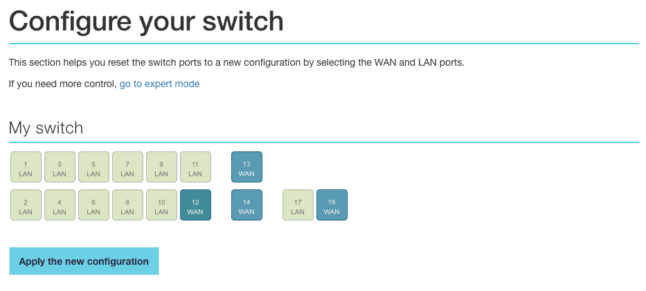

**Dernière mise à jour le 14/04/2021**

## Objectif

Découvrez comment installer et configurer votre équipement OverTheBox Plus ou IT v2 afin de profiter de votre offre OverTheBox

## Prérequis

- Au moins un modem ayant accès à Internet sur lequel vous devez être en capacité de modifier la configuration réseau (IP et DHCP). **Exemple** : Box fournie par un fournisseur d'accès Internet comme OVHcloud ou un opérateur national.
- Une **OverTheBox** fournie par OVHcloud ou une installation depuis le projet Open Source ([installer l'image overthebox sur votre materiel](/pages/telecom/overthebox/advanced_installer_limage_overthebox_sur_votre_materiel))

> [!alert]
>
> A ce stade, aucun branchement ne doit être fait entre les modems et l'OverTheBox.
> Il est aussi impératif d'utiliser uniquement les modems et l'OverTheBox pendant toute la durée de l'installation.
> Si votre installation doit comprendre un switch, il est préférable d'intégrer ce dernier une fois la procédure terminée.
>

## En pratique

### Étape 1 : préparation de vos modems

Pour le bon déroulement de la procédure d'installation, il est impératif que le modem réponde à 2 conditions :

- Le serveur DHCP du modem doit être **activé**.
- Si vous avez plus d'un modem, ils doivent être sur des réseaux locaux différents les uns des autres.

> [!success]
>
> Rassurez-vous, cette fonction est déjà activée sur les Box des principaux opérateurs grand public. Si vous pouvez aller sur Internet en passant directement par le modem, sans avoir effectué de configuration spécifique préalable sur l'ordinateur, cela veut dire que le DHCP est activé.
>

> [!primary]
>
> Afin de connaître l'adresse IP d'un modem non fourni par OVHcloud, veuillez vous rapprocher de votre administrateur ou de votre fournisseur d'accès.
>

**Cas d'un modem Technicolor TG788 ou TG789 fourni par OVHcloud :** l'adresse IP par défaut d'un modem OVHcloud Technicolor TG788 ou TG789 est 192.168.**1**.254.
**Cas d'un modem Technicolor TGTG799vac ou Zyxel fourni par OVHcloud :** l'adresse IP par défaut d'un modem OVHcloud Technicolor TG799vac ou Zyxel VMG8924-B10D est 192.168.**1**.1.

Il n'est donc pas possible de le cumuler avec un autre modem en 192.168.**1**.0/24

### Étape 2 : branchements des modems

Il est impératif de brancher les modems sur les port **WAN** afin qu'ils soient correctement identifiés comme liens vers internet. Branchez ensuite votre ordinateur sur un des ports LAN de votre **OverTheBox**. Vous pouvez alors raccorder votre **OverTheBox** sur le courant électrique.

Dans le cas d'une OverTheBox Plus :

{.thumbnail}

**Exemple** : Le premier modem possède l'IP 192.168.**0**.1 et le deuxième 192.168.**1**.1

Dans le cas d'une OverTheBox IT v2 :

{.thumbnail}

**Exemple** : Le premier modem possède l'IP 192.168.**0**.1 et le deuxième 192.168.**1**.1

> [!success]
>
> Votre OverTheBox peut maintenant contacter nos serveurs et va se mettre à jour automatiquement. Veuillez patienter 5 Minutes avant de passer à l'étape suivante.
>

### Étape 3 : enregistrement du service

> [!alert]
>
> Les opérations qui suivent doivent être effectuées depuis un ordinateur connecté directement sur un des ports LAN de l'OverTheBox (câble gris sur l’image ci-dessus).
>

- Rendez-vous sur [http://overthebox.ovh (192.168.100.1)](http://overthebox.ovh){.external}

#### Automatiquement

Lors de votre première connexion, un assistant d'installation se lance, **nous vous invitons à suivre toutes les étapes sans exception**.

#### Manuellement

- Cliquez sur **"Register"**.

{.thumbnail}

- Identifiez vous sur l'espace client.
- Cliquez sur le **service OverTheBox** que vous souhaitez associer à votre boitier.

{.thumbnail}

- Faites au préalable un copier/coller du nouveau **Device ID** sur l'interface **OverTheBox**.

{.thumbnail}

- Modifiez l' **Identifiant du périphérique**, il faut alors indiquer le **"Device ID"**.

{.thumbnail}

- Validez.

> [!success]
>
> L'enregistrement est terminé, votre offre est désormais activée.
>

### Étape 4 : vérifier le bon fonctionnement de votre service

> [!alert]
>
> Les opérations qui suivent doivent être effectuées depuis un ordinateur connecté directement sur un des ports LAN de l'OverTheBox (câble gris sur l’image ci-dessous).
>

- Assurez vous que l'installation se soit bien déroulée en vérifiant votre **IP publique** sur notre site [http://proof.ovh.net/](http://proof.ovh.net/){.external}. Vous devez obtenir une IP similaire à 109.190.x.y ou 151.127.x.y:

{.thumbnail}

> [!alert]
>
> Si malgré cette opération, le site [http://proof.ovh.net/](http://proof.ovh.net/){.external} ne retourne toujours pas les bonnes informations, veuillez recommencer l'intégralité de l'étape 3 point par point.
>

### Étape 5 : ajouter une connexion supplémentaire sur une OverTheBox Plus 

> [!warning]
>
> Ces configurations ne sont possibles que sur l'OverTheBox Plus.
>

Pour le bon déroulement de la procédure d'installation, il est impératif que le modem de votre nouvelle connexion réponde aux mêmes conditions que dans l'étape 1 :

- Le serveur DHCP du modem doit être **activé**.
- Si vous avez plus d'un modem, ils doivent être sur des réseaux locaux différents les uns des autres.

> [!alert]
>
> Les opérations qui suivent doivent être effectuées depuis un ordinateur connecté directement sur un des ports LAN de l'OverTheBox.
>

- Rendez-vous sur [http://overthebox.ovh (192.168.100.1)](http://overthebox.ovh){.external}
- Cliquez sur **"Network"**
- Cliquez sur **"Switch"**
- Cliquez sur le port du switch qui sera utilisé pour brancher le modem (dans notre exemple le **12**), assurez vous bien qu'il est en mode **WAN**
- Cliquez sur **"Apply the new Configuration"**

{.thumbnail}

- Branchez simplement votre modem sur le port concerné (dans notre exemple le **12**) puis patientez quelques minutes.

> [!success]
>
> Votre système OverTheBox intégre maintenant la nouvelle connexion dans son agrégation de débit.
>

## Aller plus loin

### Ajouter un décodeur TV

Si vous utilisez la télévision par Internet via l'un de vos fournisseurs d'accès, veuillez laisser le décodeur TV branché sur votre modem (si ce dernier n'est pas directement intégré dedans) afin d'éviter tout blocage du flux vidéo par votre opérateur si celui-ci passe par le service OverTheBox.

### Réutiliser le WiFi de votre modem Zyxel

Pour l'OverThebox Plus ou l'OverTheBox IT v2, les modems sont isolés dans leurs propre VLAN, le WiFi des modems est donc indisponible depuis le réseau LAN de l'OverTheBox. Il est possible de réutiliser le WiFi d'un modem Zyxel fourni avec l'une de nos offres Internet, voir [Comment réutiliser le wifi d'un modem Zyxel avec OverTheBox](/pages/telecom/xdsl/comment_reutiliser_wifi_zyxel_otb){.external}.
Dans les autres cas de figure, il faudra utiliser un point d'accès WiFi dédié. Le WiFi de vos modems reste fonctionnel mais les équipements connectés ne profiteront pas de l'agrégation, ni du tunnel chiffré.

N'hésitez pas à échanger avec notre communauté d'utilisateurs sur vos produits Télécom sur notre site [OVHcloud Community](https://community.ovh.com/c/telecom)
